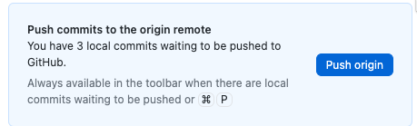
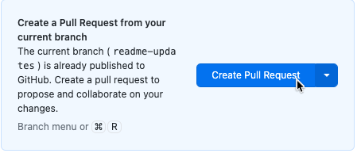

<!--
*** Thanks for checking out creatorworkflowsnow.github.io. If you have a suggestion
*** that would make this better, please fork the repo and create a pull request
*** or simply open an issue with the tag "enhancement".
*** Don't forget to give the project a star!
*** Thanks again! Now go create something AMAZING! :D
-->


<!-- PROJECT SHIELDS -->
<!--
*** I'm using markdown "reference style" links for readability.
*** Reference links are enclosed in brackets [ ] instead of parentheses ( ).
*** See the bottom of this document for the declaration of the reference variables
*** for contributors-url, forks-url, etc. This is an optional, concise syntax you may use.
*** https://www.markdownguide.org/basic-syntax/#reference-style-links
*** Go here to learn more about the shields
*** https://shields.io/
-->
[![Contributors][contributors-shield]][contributors-url]
[![Forks][forks-shield]][forks-url]
[![Stargazers][stars-shield]][stars-url]

[![Source Build][source-build-shield]][source-build-url]

[![Pages Build][pages-build-shield]][pages-build-url]


<!-- PROJECT LOGO -->
<br />
<div align="center">
  <a href="https://github.com/CreatorWorkflowsNow/CreatorWorkflowsNow.github.io">
    
  </a>

  <h3 align="center">Creator Workshops Lab Guides</h3>

  <p align="center">
    An awesome repository of Lab Guides for ServiceNow Creator Workflows!
    <br />
    <a href="https://github.com/CreatorWorkflowsNow/creatorworkflowsnow.github.io"><strong>Explore the docs »</strong></a>
    <br />
    <br />
    <a href="https://github.com/CreatorWorkflowsNow/creatorworkflowsnow.github.io">View Demo</a>
    ·
    <a href="https://github.com/CreatorWorkflowsNow/creatorworkflowsnow.github.io/issues">Report Bug</a>
    ·
    <a href="https://github.com/CreatorWorkflowsNow/creatorworkflowsnow.github.io/issues">Request Feature</a>
  </p>
</div>

<!-- TABLE OF CONTENTS -->
# Table of Contents
- [Table of Contents](#table-of-contents)
- [About The Project](#about-the-project)
  - [Built With](#built-with)
- [Getting Started](#getting-started)
  - [Pre-requisites](#pre-requisites)
  - [Creating or Updating content](#creating-or-updating-content)
- [Examples](#examples)
  - [Example Lab Guide](#example-lab-guide)
  - [Admonitions](#admonitions)
  - [Front Matter](#front-matter)
- [FAQs](#faqs)
  - [How do I install Node.js and NPM on MacOS?](#how-do-i-install-nodejs-and-npm-on-macos)
  - [How do I install Node.js and NPM on Windows?](#how-do-i-install-nodejs-and-npm-on-windows)
- [How are the new changes published?](#how-are-the-new-changes-published)
  - [1. Source build and deploy to gh-pages](#1-source-build-and-deploy-to-gh-pages)
  - [2. pages build and deployment](#2-pages-build-and-deployment)
- [Who do I talk to?](#who-do-i-talk-to)
- [Maintainers](#maintainers)


<!-- ABOUT THE PROJECT -->
# About The Project

[![creatorworkflowsnow.github.io Screen Shot][creatorworkflowsnow.github.io-screenshot]](https://creatorworkflowsnow.github.io)

A lab guide website for ServiceNow Creator Workflow Workshops. The lab guides are designed to be used with a pre-configured ServiceNow instance provided to you at a live Workshop event. Results may vary trying on your own instance. 

## Built With
[![Docusaurus][Docusuarus-tiny]][Docusaurus-url]<br/>
[Docusaurus][Docusaurus-url]

[Back to top](#table-of-contents)


<!-- GETTING STARTED -->
# Getting Started

This is of how to list things you need to know to contribute to the lab guides. 

## Pre-requisites 
- **Knowledge of Markdown**
  - _New to Markdown? Try the [Communicate using Markdown](https://github.com/skills/communicate-using-markdown) GitHub Skills course_
  - _In this course you will work with pull requests as well as edit files. If these things aren't familiar to you, we recommend you take the [Introduction to GitHub](https://github.com/skills/introduction-to-github) course, first!_
- **Code editor ([Visual Studio Code](https://code.visualstudio.com/Download) is recommended)**
- **[GitHub Desktop](https://desktop.github.com/)**
- **[Node.js](#how-do-i-install-nodejs-and-npm-on-macos)**


## Creating or Updating content

_Below is an example of how setup your local system to edit the lab guides and contribute back to this project ._

1. Clone this repo by clicking the green code button above, then click **Open with GitHub Desktop**.

   

2. In GitHub Desktop, Create a new Branch.

   

3. Pick a unique name for your branch, then click Create Branch.

   ;

4. In GitHub Desktop, go to Repository >> Open in Visual Studio Code

   

5. Open a terminal in VS Code. 

   

6. Install NPM packages with this command: 
   ```sh
   npm install
   ```

7. Run a local server to see your changes locally before you publish back to the repo:
   ```sh
   npm run start
   ```

8. Your desktop should open a new browser tab to the URL: http://localhost:3000/

9. Edit the markdown files in the labs/ folder as needed. Pay close attention to the frontmatter at the top of the file. Refer to to existing lab files for guidance or the [Docusuarus documentation](https://docusaurus.io/docs/markdown-features).

10. When you are done editing and ready to commit back to the repo, go back to GitHub Desktop.

11. Check the blue box next to each file and add a cool commit message like this:
    
    

12. Push your commits back to the GitHub repo. 

    

13. Create a Pull Request. _This pulls your code to the target branch when it gets approved._

    ;

14. Patiently wait for one of the [maintainers](#maintainers) below to approve your Pull Request. 

[Back to top](#table-of-contents)


# Examples

## Example Lab Guide

Check out this [Example Lab Guide](https://creatorworkflowsnow.github.io/labs/example-lab/overview) for how to lay out the files in your lab and basic styling guidelines.

## Admonitions

[How to use the Admonitions on this site in your lab guide](https://creatorworkflowsnow.github.io/labs/example-lab/3.0-additional-resources/admonitions)

## Front Matter

The information at the top of your markdown file is important for helping the site understand how to present your page.  [Guide to Front Matter on this site](https://creatorworkflowsnow.github.io/labs/example-lab/3.0-additional-resources/front-matter)

[Back to top](#table-of-contents)


# FAQs

## How do I install Node.js and NPM on MacOS?
Here are the steps to install Node.js and NPM on macOS:

1. **Install Homebrew**: Homebrew is a package manager for macOS that simplifies the installation of software. You can install it by visiting the [Homebrew's official website](https://www.youtube.com/watch?v=0i-gstqgjuE) and following the instructions.

2. **Install Node.js and NPM**: Once you have Homebrew installed, you can install Node.js and NPM by typing the following command in your terminal: `brew install node`. This command will download and install the dependencies.

3. **Verify Installation**: After the installation finishes, you can confirm that you successfully installed Node.js by checking its version with the command: `node -v`. Similarly, you can check the installed version of NPM by typing: `npm -v`.

*Please note that Node.js has a PKG installer for macOS available on its website. However, installing with Homebrew is the recommended approach.*

## How do I install Node.js and NPM on Windows?
1. **Download the installer**: Download the Windows Installer from the Node.js official website. [https://nodejs.org/en/download](https://nodejs.org/en/download)

2. **Run the installer**: Double-click the .msi binary files to initiate the installation process.

3. **Verify Installation**: After the installation finishes, you can confirm that you successfully installed Node.js by checking its version with the command: `node -v`. Similarly, you can check the installed version of NPM by typing: `npm -v`.

[Back to top](#table-of-contents)

# How are the new changes published?

When new the pull request to 'source' is approved and code gets merged, this kicks off a series of [GitHub Actions](https://docs.github.com/en/actions).

## 1. [Source build and deploy to gh-pages](https://github.com/CreatorWorkflowsNow/creatorworkflowsnow.github.io/blob/source/.github/workflows/source-build-deployment.yml) 
[](https://github.com/CreatorWorkflowsNow/creatorworkflowsnow.github.io/actions/workflows/source-build-deployment.yml)
   - Uses a GitHub runner to build a new npm site and then deploy to the branch 'gh-pages'

## 2. pages build and deployment
[](https://github.com/CreatorWorkflowsNow/CreatorWorkflowsNow.github.io/actions/workflows/pages/pages-build-deployment)
   - Built-in GitHub Action. When changes are pushed to the branch 'gh-pages', then GitHub will publish these changes to the site [https://creatorworkflowsnow.github.io/](https://creatorworkflowsnow.github.io/).

[Back to top](#table-of-contents)


# Who do I talk to?

If you have any questions or problems, please [open an issue](https://github.com/CreatorWorkflowsNow/CreatorWorkflowsNow.github.io/issues) on GitHub and we will do our best to give you a timely answer.


# Maintainers
The lab guides are maintained by:

- Dale Stubblefield - https://github.com/dalestubblefield
- Kristy Merriam - https://github.com/KristyS96
- Marc Mouries - https://github.com/marcmouries
- Sarah Yao - https://github.com/syaosnow

[Back to top](#table-of-contents)


<!-- MARKDOWN LINKS & IMAGES -->
<!-- https://www.markdownguide.org/basic-syntax/#reference-style-links -->
[contributors-shield]: https://img.shields.io/github/contributors/CreatorWorkflowsNow/creatorworkflowsnow.github.io?style=for-the-badge
[contributors-url]: https://github.com/CreatorWorkflowsNow/creatorworkflowsnow.github.io/graphs/contributors
[forks-shield]: https://img.shields.io/github/forks/CreatorWorkflowsNow/creatorworkflowsnow.github.io.svg?style=for-the-badge
[forks-url]: https://github.com/CreatorWorkflowsNow/creatorworkflowsnow.github.io/network/members
[stars-shield]: https://img.shields.io/github/stars/CreatorWorkflowsNow/creatorworkflowsnow.github.io?style=for-the-badge
[stars-url]: https://github.com/CreatorWorkflowsNow/creatorworkflowsnow.github.io/stargazers
[source-build-shield]: https://img.shields.io/github/actions/workflow/status/CreatorWorkflowsNow/creatorworkflowsnow.github.io/source-build-deployment.yml?label=Source%20branch%20build%20and%20deploy%20to%20gh-pages%20branch
[source-build-url]: https://github.com/CreatorWorkflowsNow/creatorworkflowsnow.github.io/actions/workflows/source-build-deployment.yml
[pages-build-shield]: https://github.com/CreatorWorkflowsNow/CreatorWorkflowsNow.github.io/actions/workflows/pages/pages-build-deployment/badge.svg?branch=gh-pages
[pages-build-url]: https://github.com/CreatorWorkflowsNow/creatorworkflowsnow.github.io/actions/workflows/pages/pages-build-deployment
[creatorworkflowsnow.github.io-screenshot]: static/img/creatorworkflowsnow.github.io_site.png

[Docusuarus]: https://docusaurus.io/img/docusaurus.svg
[Docusuarus-tiny]: static/img/docusaurus_tiny.png
[Docusaurus-url]: https://docusaurus.io/