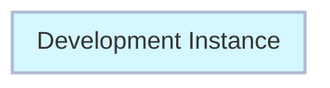
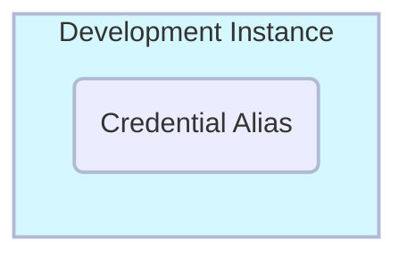

# Exercise: Create Credential Alias

##### Estimated Time to Complete: 10 minutes

## Overview 

A **<a href="https://docs.servicenow.com/csh?topicname=create-pipeline-credentials.html&version=latest" target="_blank">Credential Alias ↗</a>** is a username and password used by ServiceNow to log into a remote system. 

In this case, it will be used by App Engine Studio to access the Controller Instance.

You will create the Credential Alias with a user account that has already been created for you. 

### Before Exercise


### After Exercise


## Instructions

:::caution
For this exercise, the specific Application Scope is not critical - Global is acceptable. Always check with your Platform Administrator for any company policies around **<a href="https://docs.servicenow.com/csh?topicname=connection-alias.html&version=latest" target="_blank">Connection and Credential Aliases ↗</a>**.
:::

:::warning
Complete this section in **DEV**.
:::

1. Log in to **DEV**.


2. Navigate to **All** >> type **Connection & Credential Aliases** >> click either **Connection & Credential Aliases**.


3. Click **New** in the top-right to create a new Credential Alias record. 


4. Set the **Type** to **Credential**. 

 

5. Set the **Name** to 'Pipeline Credentials' and click **Submit**.

```
Pipeline Credentials
```


6. Click **Pipeline Credentials** to open the record. 

 

7. Navigate to the **Credentials** Related List and click **New** to add a credential. 


8. Select **Basic Auth Credentials**.


:::caution
You will now input credentials for AES to log into the Controller instance.
 
The password for this remote user account is pre-configured. 
 
Errors will occur if you do not use the specified password provided below.
:::

9. On the **Basic Auth Credentials** form, fill in the following values and click **Submit**.

:::info
Remember to use the copy button to copy the text below.
:::

```jsx title="Name"
Pipeline Service Account 
```

```jsx title="Username"
svc_pipeline
```

```jsx title="Password"
ILoveHyperAutomationTimes500!
```


:::note
The dots in the password field will be shorter after you save the password.  This is normal
:::

## Lessons Learned

In completing this exercise, you have successfully achieved the following milestones:

- Gained experience in creating and managing Connection & Credential Aliases in ServiceNow.

- Familiarized yourself with Basic Authentication Credentials setup.