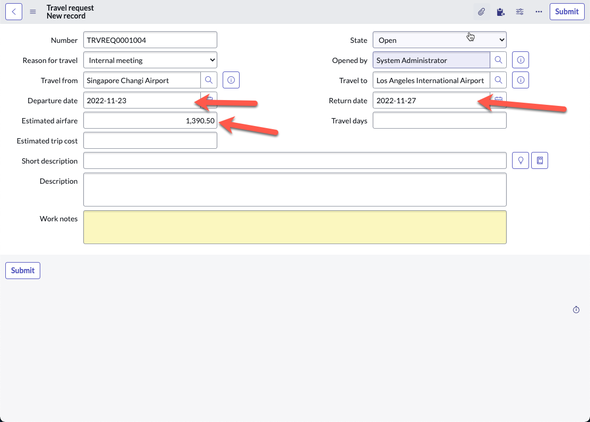

# Bonus Exercise 2: Adding calculations

**Duration: 30 minutes**

In this bonus exercise, you will learn how to use Excel like formulas to add cost calculations for a travel request. Our goal here is to use a per diem rate multiplied by number of days, added to the estimated airfare cost to get an estimated trip total cost.

## Part 1: Creating our formulas

1. Navigate back to your **App Home** screen if you are not currently on it, then click the **Travel request** table to open table builder

    

1. Click the **Forms** button to get to form builder

1. Click **Add a field in the table**

    

1. In the pop-up, enter **Travel days** in **Column label**, and change **Type** to **Integer**. Leave the auto-populated field under **Column name**

    

1. Click **Add**

1. Click **Add another one**

    

1. Enter **Estimated trip cost** in **Column label**, and change **Type** to **Decimal**. Leave the auto-populated field under **Column name**

    

1. Click **Add**

1. Click **Done**

1. You should notice now on the left sidebar two form elements highlighted with a purple left border. These are your new fields you added

1. Drag and drop the **Travel days** and **Estimated trip cost** form elements onto your form

    

1. Click **Save**

1. Click the **Travel days** form element

1. On the rightside bar, you should see the options change

1. Click **Formula**

1. Click **Add**

    

1. In the pop-up Formula box, enter the following formula:

    `TIMEDIFF(return_date,departure_date)`

    

1. Click **Submit**

1. On the top right, click **Save**

1. Click **Estimated trip cost**

1. Click **Formula**, then **Add**

1. In the pop-up Formula box, enter the following formula:

    `SUM(estimated_airfare,MULTIPLY(travel_days, 150))`

    

    >Our formula here takes into account that each travel day, the employee is given a $150 per diem

1. Click **Submit**

1. On the top right, click **Save**

## Part 2: Testing our formulas

1. Go back to **App Home**

    

1. Click **PREVIEW** on the **Travel request** row

1. A new tab opens up to show the list of **Travel requests**

    

1. We did not format this list view back in Exercise 1, so let's go ahead to do that quickly

1. Right-click anywhere on one of the column headers

1. Click **List Layout** under **Configure**

    

1. On the right **Selected** section, remove everything except **Number** and **State**. Do this by double-clicking on each line to be removed

    

1. Add **Opened by, Reason for travel, Departure date, Estimated trip cost** from the left **Available** section onto the right **Selected** section

    

1. Click **Save**

1. You should now return to the list layout (your records will be slightly different based on what you entered in the exercise 4)

    

1. Click **New** on the top right

1. Fill up the form, ensure that you enter information for **Departure date**, **Return date** and any numerical figure for **Estimated airfare**

    

1. Right-click on the form header, then click **Save**

    

1. Notice that the **Travel days** and **Estimated trip cost** fields are automatically populated, ensure that the values are correct

1. In the screenshot above, the following was calculated

    `(4 * 150) + 1,390.50 = 1,990.50`

Well done, you now understand how to build excel-like formulas into your application! Here are some other possible formulas that are currently supported, but more are on the way:

1. **AND** Performs a logical AND operation on the arguments.
1. **AVERAGE** Returns the average value of the arguments.
1. **CONCATENATE** Joins one or more input strings into a single string.
1. **DIVIDE** Returns the quotient value after dividing argument 2 by argument 1.
1. **IF** Executes the specified statements based on the Boolean output of the conditional expression.
1. **ISBLANK** Finds white spaces or blank values in the string and returns true if there are any.
1. **LENGTH** Returns the total number of characters in the input string.
1. **LOWERCASE** Converts the input string to all lowercase characters.
1. **MAX** Returns the highest value in the specified arguments.
1. **MIN** Returns the lowest value in the specified arguments.
1. **MULTIPLY** Returns the multiplied value of the arguments.
1. **NOW** Returns the current date and time of the instance in ISO format.
1. **OR** Performs logical OR operation on the arguments.
1. **POWER** Returns the result of the base value raised to the power of the exponent value.
1. **REPLACE** Replaces characters in the source string with the characters in the target string.
1. **SUBTRACT** Returns the result value after subtracting argument 2 from argument 1.
1. **SUM** Returns the sum of all the arguments.
1. **TIMEDIFF** Finds difference between 2 dates for Duration field.
1. **TITLECASE** Converts the input string to all title case characters.
1. **UPPERCASE** Converts the input string to all uppercase characters.

[OldTravelRequestLabLink]: https://shaoservicenow.github.io/travelrequest
[TravelRequestLabLink]: https://creatorworkflowsnow.github.io/lab_travelrequest
[TravelRequestLabHome]: https://creatorworkflowsnow.github.io/lab_travelrequest

[Exercise1]: https://creatorworkflowsnow.github.io/lab_travelrequest/Exercise%201.html
[Exercise2]: https://creatorworkflowsnow.github.io/lab_travelrequest/Exercise%202.html
[Exercise3]: https://creatorworkflowsnow.github.io/lab_travelrequest/Exercise%203.html
[Exercise4]: https://creatorworkflowsnow.github.io/lab_travelrequest/Exercise%204.html
[Exercise5]: https://creatorworkflowsnow.github.io/lab_travelrequest/Exercise%205%20(Bonus).html
[Exercise6]: https://creatorworkflowsnow.github.io/lab_travelrequest/Exercise%206%20(Bonus).html
[Exercise7]: https://creatorworkflowsnow.github.io/lab_travelrequest/Exercise%207%20(Bonus)%20Chatbot.html