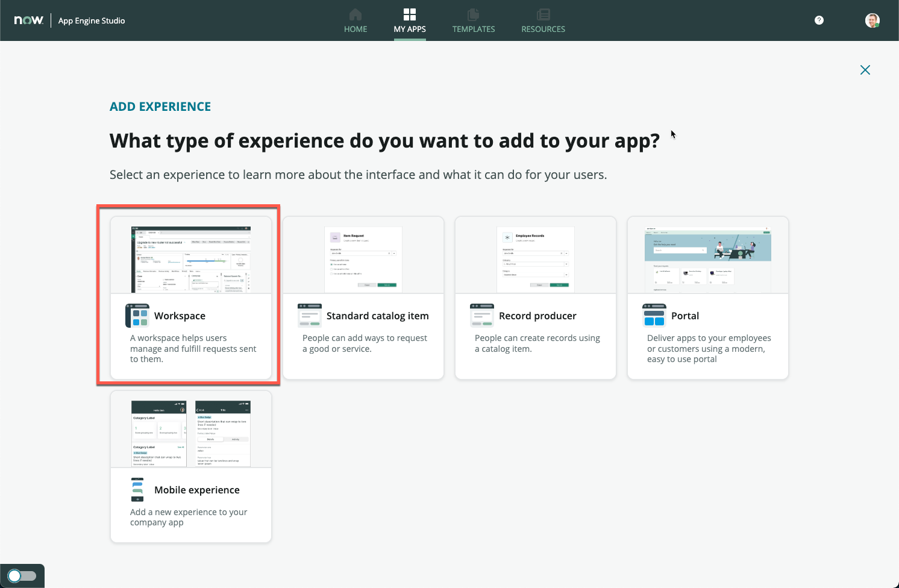
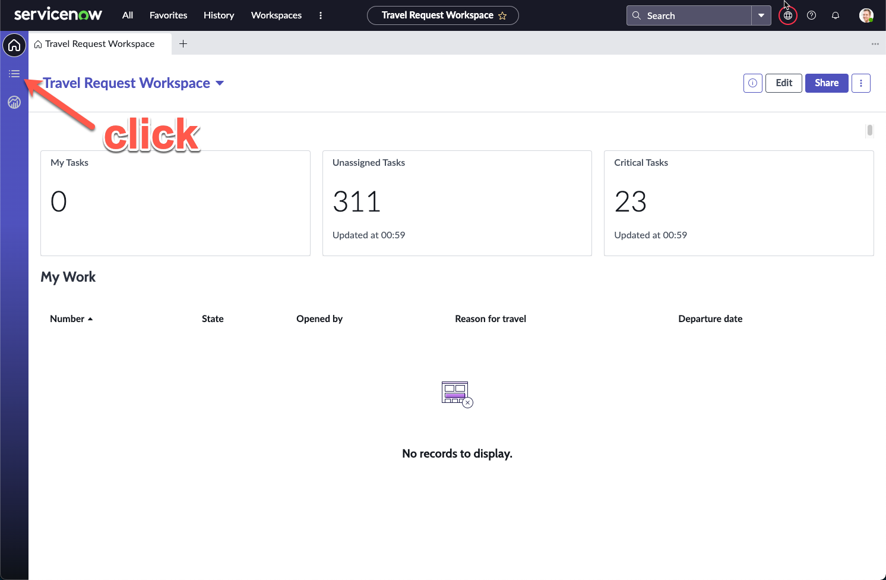
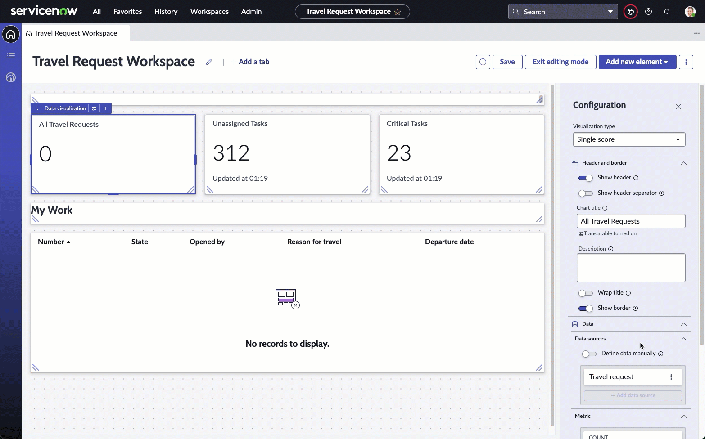
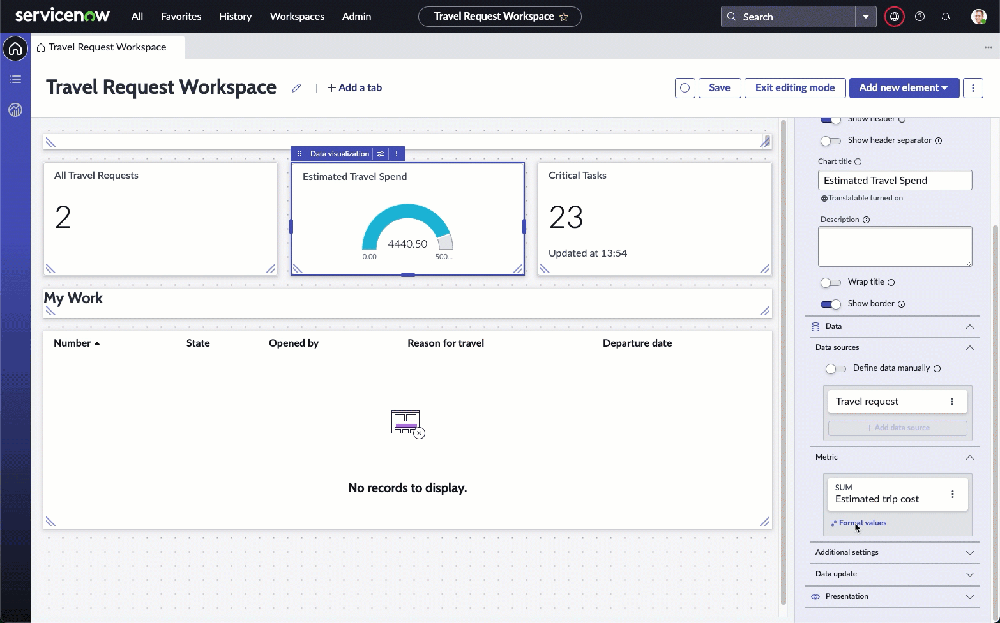

# Bonus Exercise 3: Adding a workspace for travel requests

**Duration: 30 minutes**

>Pre-requisite(s): 
 **Bonus Exercise 2** - Some screens will show forms that were configured in Bonus Exercise 2. These are minor changes that will not affect the completion of this exercise.

In this bonus exercise, you will learn how to create an interactive workspace for your users to process travel requests. You will also learn how to build a dashboard with custom reports in the workspace.

## Part 1: Creating a workspace for our form

1. Navigate back to your **App Home** screen if you are not currently on it, then click **Add** under **Experience**

    

1. Click **Workspace**

    

1. Click **Add a field in the table**

    

1. Click **Begin**

1. Change **Name** to **Travel Request Workspace**, **Description** to **A central workspace to manage all travel requests**

    

1. Leave the rest default and click **Continue**

1. Your screen should show **Airport** as the primary table, and **Travel request** in the secondary tables, we will need to swap these two around

1. Search and select **Travel request** under **Primary table**

1. Search and select **Airport** under **Secondary tables**

    

1. Click **Continue** and wait for a short loading time. The experience is getting built based on your application configurations so far

1. On the next screen, click **Done**

1. You should be brought back to **App Home**

1. Click **Preview** on the new **Travel Request Workspace** row

    

1. A new browser tab will open and the workspace will be loaded

1. Click on the **list** icon on the left sidebar

    

1. Notice that on the **Lists**, your **Travel request** and **Airport** tables appear

1. Click **All** under **Travel request**, notice that this removes all filters and shows all your created travel requests

1. Click **New** on the top right

1. The form view appears. This should be the same as what you had configured in Exercise 1. There are the additional fileds **Travel days** and **Estimated trip cost** from Bonus Exercise 2

1. Fill in the form with data of your liking, then click **Save**

    

1. On the right, **Attachments** can be added at any time. Attachments submitted together with our form in Exercise 2 will also appear here for viewing and download

## Part 2: Creating a dashboard

### Widget 1: All travel requests

1. Click on the **Home** icon on the left sidebar to return to the workspace home page

1. On the top right, click **Edit**

    

1. Click **My Tasks**, then the **Configure** button on the highlighted **Data visualization**

1. The right sidebar appears showing the Vizualization type **Single score**

    

    >If you face issues with the screen not loading, change to a different Vizualization type, then change it back to **Single score**

1. Expand **Header and border**, then change **Chart title** to **All Travel Requests**. Here are all the steps so far:

    

1. Under the **Data sources** section, click the 3 dot icon next to **Travel request**, then click **Edit**

1. On the **Edit data source** screen, click **Edit** under **Filters**

1. Remove the **Assigned to** condition by clicking the **X** icon

1. Click **Apply**

    

1. Confirm that the **All Travel Requests** widget now refreshes to show the number of Travel requests that you have created

    

1. Click **Save** on the top right

### Widget 2: Estimated travel spend vs budget

This widget can only be configured if you completed Bonus Exercise 2. If you have not completed that, please skip this widget.

1. Click and configure the next widget, **Unassigned Tasks**

1. Change the **Visualization type** to **Dial**

1. Under **Header and border** change **Chart title** to **Estimated Travel Spend**

    

1. Under **Data sources**, edit the **Task** data source

1. On the next **Edit data source** screen, click on **Travel request [x_snc_travel_req_0_travel_request]** under **Suggested** on the left sidebar

1. Click **Add custom conditions**, then set the following condition: `Opened` on `Months -> This month`

1. Refer to the video below for a walkthrough:

    

1. Back on the Edit dashboard view, on the right sidebar, click **Edit** for **Travel request** under **Metric**

    

1. On the pop-up box, change **Count** under **Select an aggregation** to **Sum**

1. Change **Field** to **Estimated trip cost**

    

1. Click **Apply**

1. Click **Format values** under the **Estimated trip cost** metric

1. In the pop-up box, toggle **Use custom formatting**

1. Change **Rounding** to **Up**

1. Toggle **Enable abbreviation**

1. Click **Save**

    

1. On the right Configuration sidebar, expand **Presentation**, then expand **Display settings**

1. Change **Max value** to a budget you think fits your current Estimated Travel Spend. e.g. here the Estimated Travel Spend is currently **4.45K** for the month, so we will put the Max value at **10K**

    

1. On the top right, click **Save**

1. Your middle **Estimated Travel Spend** widget should have been dynamically updating based on all the changes that we have been making

### Widget 3: Outstanding Approvals

This widget will appear different if you have not completed Bonus Exercise 2, but will not impact completing the widget.

1. Click the middle heading bar which says **My Work**

1. On the right configuration sidebar, change **Label** from **My Work** to **Outstanding travel requests**

    

1. Click on the bigger **List - Simple** widget at the bottom of the screen

1. On the right configuration sidebar, click **Edit filter**

1. On the pop-up box, remove **Assigned to is (dynamic) Me** by clicking **X** on the far right of the row

1. Click the **and** button

1. In the new **and** row that appears, set the following condition

    `State is one of Pending, Open, Work in Progress`

    Refer to the video below:

    

1. On the top right of the screen, click **Save**

1. Click **Exit editing mode**

1. Your dashboard should look similar to this

    

1. We have left the final **Critical Tasks** widget for you to experiement with. Feel free to make any changes that you would like with the different Vizualizations available by repeating the steps in this exercise.

1. All widgets are also built with the drill-down capability. You can click on any of the widgets created to get to the underlying data supporting that widget.

Well done once again! In this exercise, you have built a dashboard purely through drag and drop. This is obviously just a short snippet into the possibilities here, and there is so much more that can be done to give data-rich vizualizations to those who need easy access to data as fulfillers and admins, all in a single workspace.

[OldTravelRequestLabLink]: https://shaoservicenow.github.io/travelrequest
[TravelRequestLabLink]: https://creatorworkflowsnow.github.io/lab_travelrequest
[TravelRequestLabHome]: https://creatorworkflowsnow.github.io/lab_travelrequest

[Exercise1]: https://creatorworkflowsnow.github.io/lab_travelrequest/Exercise%201.html
[Exercise2]: https://creatorworkflowsnow.github.io/lab_travelrequest/Exercise%202.html
[Exercise3]: https://creatorworkflowsnow.github.io/lab_travelrequest/Exercise%203.html
[Exercise4]: https://creatorworkflowsnow.github.io/lab_travelrequest/Exercise%204.html
[Exercise5]: https://creatorworkflowsnow.github.io/lab_travelrequest/Exercise%205%20(Bonus).html
[Exercise6]: https://creatorworkflowsnow.github.io/lab_travelrequest/Exercise%206%20(Bonus).html
[Exercise7]: https://creatorworkflowsnow.github.io/lab_travelrequest/Exercise%207%20(Bonus)%20Chatbot.html