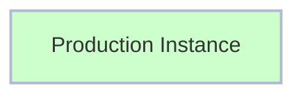
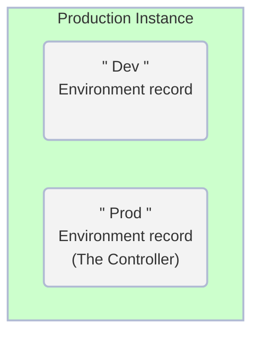

#  Exercise: Create Environments

##### Estimated Time to Complete: 10 minutes

## Overview 

**<a href="https://docs.servicenow.com/csh?topicname=config-pipeline-environments.html&version=latest" target="_blank">Environments ↗</a>** contain information about a ServiceNow instance and how to access it.

Next, you will create an Environment record for both "Production" and "Development" on the Controller instance where AEMC is installed

### Before Exercise

### After Exercise

## Instructions

1. Log in to **Prod**.

2. Click **All** >> type **environment** >> click **Environments**

3. Click **New** in the top-right.

4. Complete the form as below.

|Field | Value 
|---|---
|**Name** | Dev
|**Instance Type** | Development 
|**Dev Instance URL** | 
|**Instance credential** | Pipeline_Credentials 
|**Is Controller?** | **UNCHECKED**
|**Instance Id** | This will auto populate after clicking Validate. 

5. Click **Validate**

6. Click **Submit** to finish creating the environment record.

7. Click **New** in the top right.

8. Complete the form as below.

|Field | Value 
|---|---
|**Name** | Prod 
|**Instance Type** | Production 
|**Prod Instance URL** | 
|**Instance credential** | Pipeline_Credentials 
|**Is Controller?** | **CHECK THE BOX**
|**Instance Id** | This will auto populate after clicking Validate. 

9. Click the "Validate" button. 

10. Click **Submit** to finish creating the environment record.

## Lessons Learned

In this exercise, you have:

- Understood the function and importance of Environment records in the ServiceNow platform.

- Acquired the knowledge of validating these Environment records.

- Successfully configured Environment records for both Development and Production instances in your Prod environment.