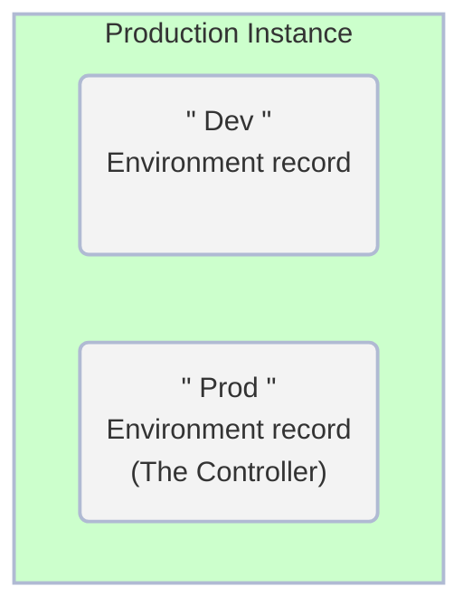
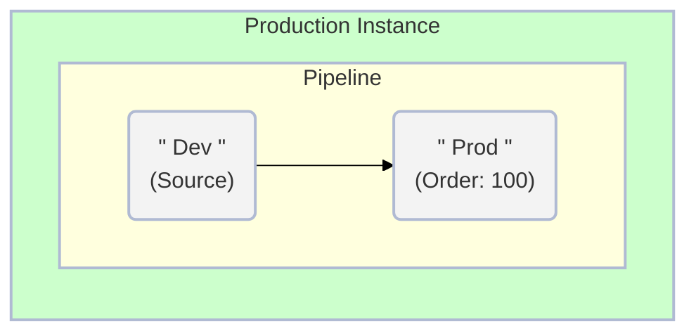
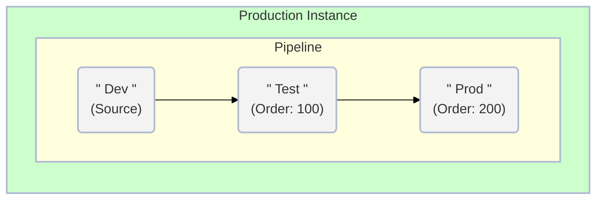

#  Exercise: Configure Pipeline in Prod

##### Estimated Time to Complete: 15 minutes

## Overview

**<a href="https://docs.servicenow.com/csh?topicname=config-pipeline.html&version=latest" target="_blank">Pipelines ↗</a>** establish the path an application takes from Development to Production.

This facilitates administrators' ability to efficiently transfer applications across different instances in the App Engine Management Center.

The process involves setting up and configuring your pipeline, specifying the **<a href="https://docs.servicenow.com/csh?topicname=config-pipeline-environments.html&version=latest" target="_blank">Environments ↗</a>** to include, and determining their position in the pipeline. 

The Pipeline is exclusive to the Controller Environment, which in this case is the Production instance. 

### Before Exercise

### After Exercise

### Example of a Dev->Test->Prod Pipeline

:::info
In this Lab, you will only configure Dev and Prod in the Pipeline.

Pipeline records are only configured in Prod. 
:::

## Instructions
:::info
Complete this exercise in the Global scope. 
:::

1. Click **All** >> type **pipelines** >> click **Pipelines**.
    

2. Initiate a new pipeline: Click **New** in the top-right corner.
    

3. Fill out the form as follows:

    |#|Field | Value                     
    |--|--|--
    |1|**Name** | Main Pipeline
    |2|**Pipeline Type** | Application Deployment
    |3|**Source Environment** | Dev                     
    |4|**Active** | **Checked**

    

4. Submit the form.
    

5. Open the newly created **Main Pipeline** record.
    

6. Click **New** in the **Pipeline Environments Order** related list.
    

7. Complete the new form as shown below and click **Submit** when done.

    |#| Field       | Value           
    |-|-|-
    |1| **Pipeline**    | Main Pipeline
    |2| **Environment** | Prod
    |3| **Order**       | 100

    

8. Click Submit.

    * Your completed Pipeline record will look like this:

     

:::warning
Make sure your Pipeline configuration matches the screenshot above.
 
DO NOT add Dev to the **Pipeline Environments Order** related list. 
 
It is the **Source Environment** and does not get added to the additional environments list. 
:::

## Lessons Learned

Through this exercise, we grasped the importance of correctly configuring the Pipeline in the Production instance.