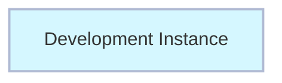
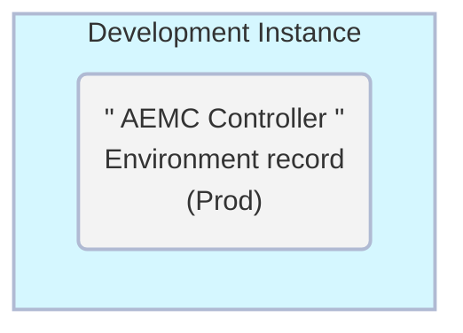

# Exercise: Create Controller Environment

##### Estimated Time to Complete: 10 minutes

## Overview

Next up, you will add a "Controller" Environment record to your Dev instance.  

It will contain the details for Dev to access the Controller Environment which is the Prod instance.

Production is considered the "Controller" Environment as that is where App Engine Management Center is installed and orchestrates activities from. 

### Before Exercise

### After Exercise

## Instructions

1. Log in **DEV**.

2. Click **All** >> type **environment** >> click **Environments** 

3. Click **New** in the top-right.

4. Complete the form using the information below. 

|Field | Value 
|:---|:---
|**Name** | AEMC Controller 
|**Instance Type**| Production 
|**Prod Instance URL** | 
|**Instance credential** | Pipeline_Credentials 
|**Is Controller?** | **CHECK THE BOX**
|**Instance Id** | This will auto populate after clicking Validate.

5. Click **Validate**.

6. Click **Submit** to finish creating the **Prod** environment record.

## Lessons Learned

 **Importance of the Controller Environment**
 
 Setting up the Controller Environment is crucial for the operation of the App Engine Management Center. This exercise emphasizes the vital role of the Production instance, as it's where AEMC is installed and from where it orchestrates activities.
