In this section, we see how an agent works on a complaint in an efficient way using out of the box workflow automation. Note that in the following App Engine session we will see how you can modify this workflow to fit your needs with no-code tools.

1.	Go back to the window where you have logged in as John. Let’s first make sure that you are still impersonated as John Jason. Go to the profile picture on the right-hand side. It should show **John Jason**.
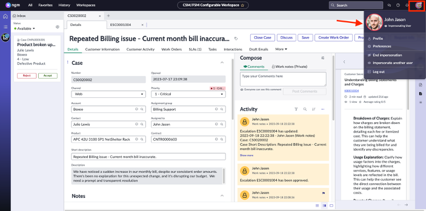

2.	Go to Inbox and see that the complaint request got routed to John Jason. Click **Accept**.
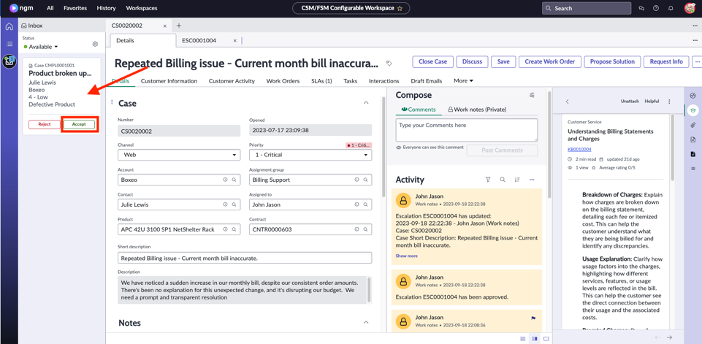

3.	On the complaint record, you’ll see the **Complaint playbook** which is the out of the box complaint process. We will go through this process together. 
:::note
If **Special Handling** notes pops up, simply click on the X to close the box.
:::
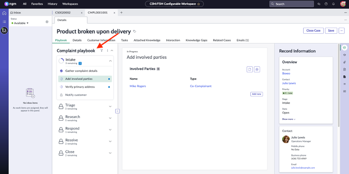

4.	Click on **Gather complaint details** to see the information captured by Julie.
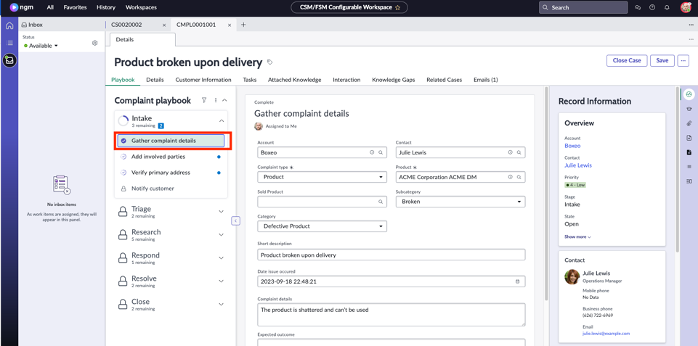

5.	Click on **Add involved parties** to see the co-complainant that Julie already added. See that John can add more here if there is need. For now, we will leave this as is.
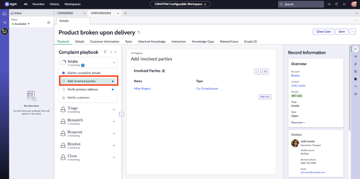

6.	Click on **Verify primary address** and click on the Address field to select the first address that pops up. Once the address is populated, click on **Move to Triage**. 
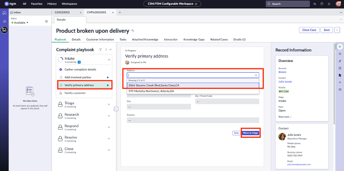
:::info
It may take a second for the complaint to move to next stage
:::
Note that the **Intake** section is now completed, and Complaint is automatically moved to **Triage** stage. There has also been an automated email sent to Julie.

7.	Click on **Verify complaint**.  John wants to see if this is a legitimate complaint or not. First, he will check if there is already a similar open complaint to prevent duplicate effort. Click on the **hat icon** on the right. We call this **Agent Assist**.
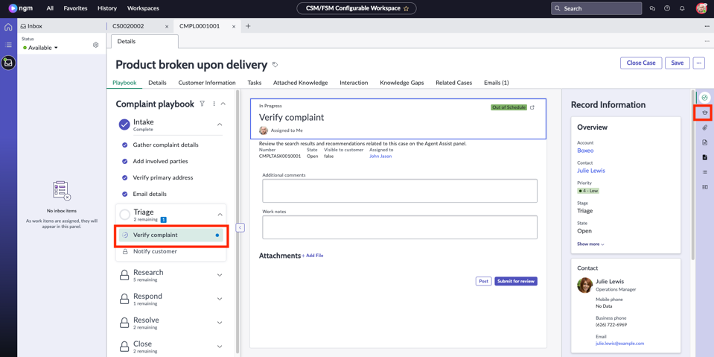

8. On the **Agent Assist** panel see that you can filter for open complaint cases, resolved complaint cases, knowledge articles etc.
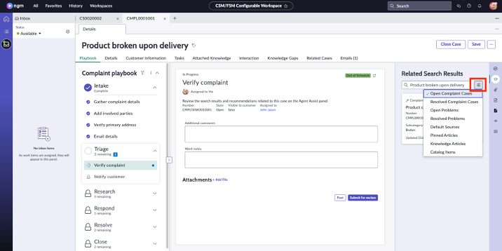

9.	Stay on **Open Complaint Cases** and observe that there is a similar problem occurring for the same customer. So, this is a persisting issue.
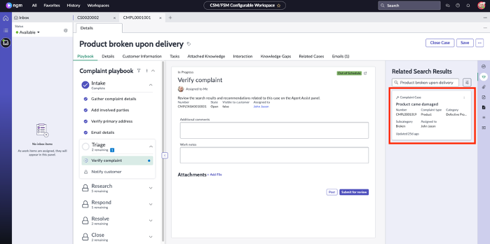
:::note
You can click on the complaint case to see more details. For now, we will leave this as is and move on.
:::

10.	On the Verify complaint, on the **Work notes** section enter **Customer is facing a recurring problem** and click on **Submit for review**.
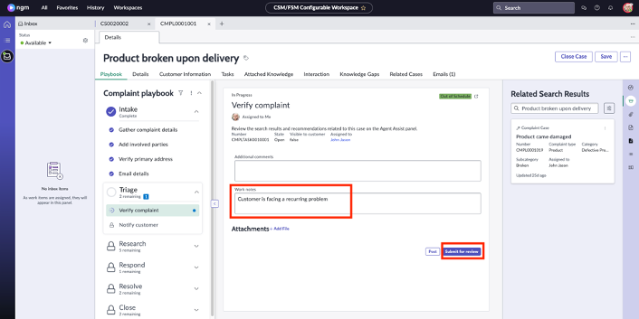

11.	Observe that the triage stage is automatically completed, and complaint is moved to research stage. Now, click on the Emails tab as shown below to see all the automated emails sent to Julie.
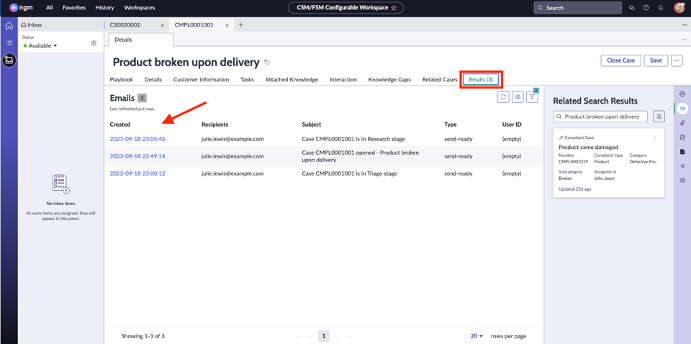

12.	Click on **Playbook** tab. Observe the new tasks that are assigned within the research phase. Click on the **three-dot icon** and then select **Expand All Stages** as shown below:

13.	These are all the remaining out of the box tasks and steps that your team can take to resolve complaints. For this lab, we will stop following the steps here and close this complaint.
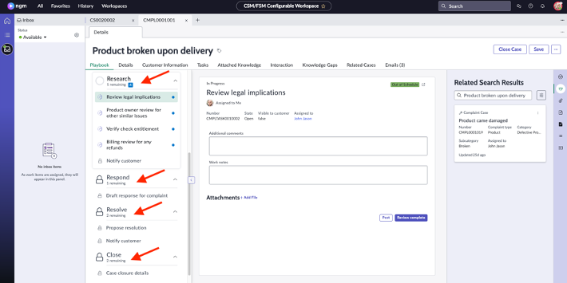

14.	 Click on **Details** tab. Scroll down to the **Resolution Information** section. Fill in these 3 fields:

 |Field Name|Value|
 |---|---|
 |Resolution Code| Solved – Fixed by Support/Guidance provided|
 |Resolution Notes| Full refund|
 |Add resolution notes to comments| CHECK THE BOX|
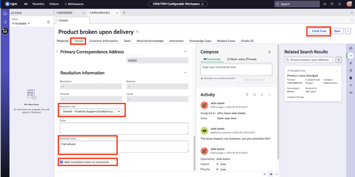
Click on **Close Case**

:::tip
If you go back to the incognito window where you had the external portal open, you can see the updates that Julie can see immediately, such as the case status or comments added by herself or John.
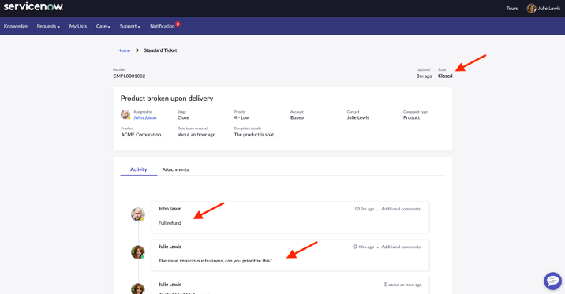
:::

**Congratulations!** John was able to work on the complaint and follow the right steps thanks to out of the box processes.