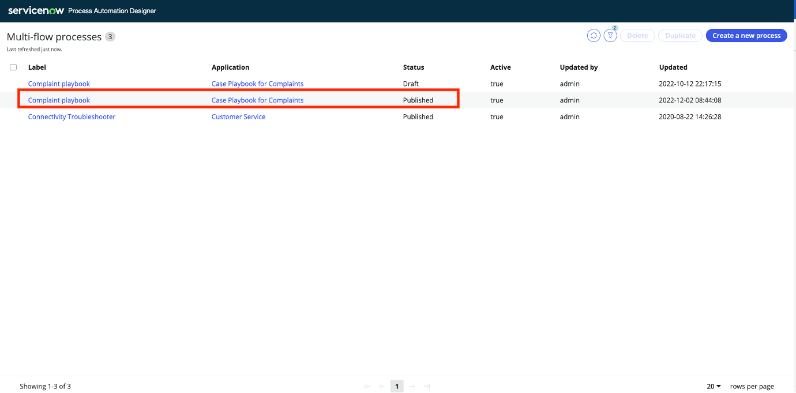
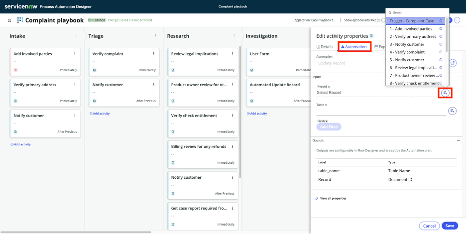

# Create meaningful experiences for your application users

1. First, we need to pick the right user. Click the user profile picture and select **End impersonation** this will take us to admin view where Andy can make his changes.

2. Now let’s go to the right scope to before we start updating the playbook. Go to the **Scope icon** at the top right corner and select **Case Playbook for Complaints**

3.	Now let’s update the process. Go to **All** and type Process automation. Select **Process Automation Designer**.

4.	Click on **Complaint Playbook** that has “Published” status.

:::info
In real life you would use the one in **Draft** status to try and test changes before publishing
:::

5.	Observe the lanes and tasks that were previously presented in the complaint case. This is the out of the box process that we will edit to include the investigation. 

6.	Click on the **three-dot icon** beside Research and select **Add lane after**.

7.	Type **Investigation** under Label and click **Save**.

8.	Under Investigation Lane, click on **Add activity**. Select **User Form**.

9.	Click on the **Automation** tab

10.	Click on the **data pill icon** beside Record. Then click on the arrow beside **Trigger Complaint Case**. Select **Complaint Case Record**

:::info
This allows the process dynamically pull data from the current complaint record that the user is on
:::

11.	Type **padinvestigation** to the Form View field. Click **Save**

:::info
Making this change allows the user to see the investigation required field at the right step of the overall process.
**padinvestigation** is a form view that we have in this instance. The form view may be named differently.
:::

12. Now we will update the complaint status to **Under Investigation** when the user sets the **Investigation Needed** checkbox to True
Click on **Add activity** under **Investigation** Lane. Then select **Automated Update Record**

13. Type **Set complaint status to Under Investigation** to the Label field

14. Click on **Automation** and click on the data pill icon beside the **Record** field

15. Click on the **little arrow** as shown on the screenshot

16. Select **Complaint Case Record**

17. Click on the **Fields** and search for **Stage** and select **Stage**

18. Select **Under Investigation** on the box that appears under **Stage**

19. Now we will add a **Run Condition** to this step so that it only updates the complaint status if the **Required Investigation** is checked. Click on **Details** tab.

20. Click on **Add Condition**

21. Click on the **first field** and click on the **little arrow** beside the **Complaint Case**

22. Scroll down on the fields section and then select **Requires Investigation**

23.	The system will auto populate the rest of the fields as shown below. Leave those as is and click on **Modify**

24.	Click Save.

25.	Finally click on **Activate**. This will activate the new process. It’ll be applied to new complaints created going forward.

**Great job!** You updated the process so that the agents can now flag records for investigation and loop in the Legal Support team. Now let’s see this on action! To see the new complaint process, we will create a new complaint record.

