1.	On your browser, click on the tab that says **Home|ServiceNow**
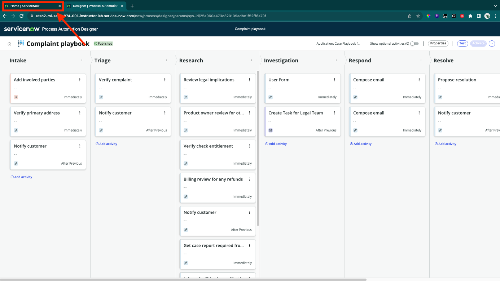

2.	Click on **Workspaces** and select **CSM/FSM Configurable Workspace**
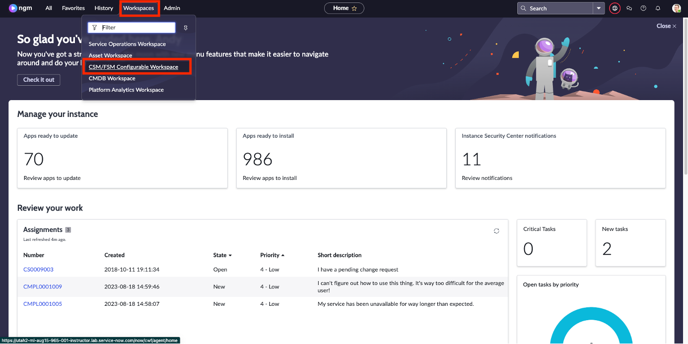

3.	Click on **+** icon and then select **New Complaint**
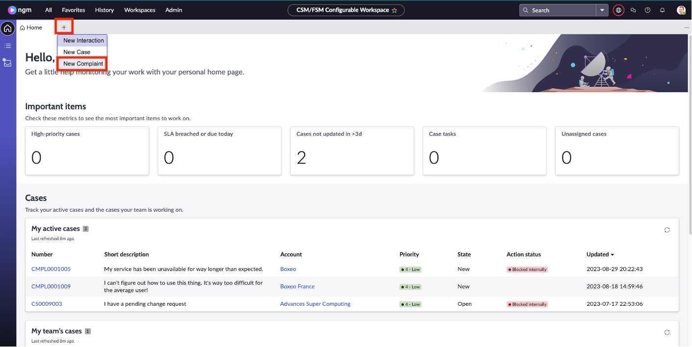
:::info
This is one of the ways your agents can create new records when they need to intake an issue.
:::

4.	You’ll see this screen:
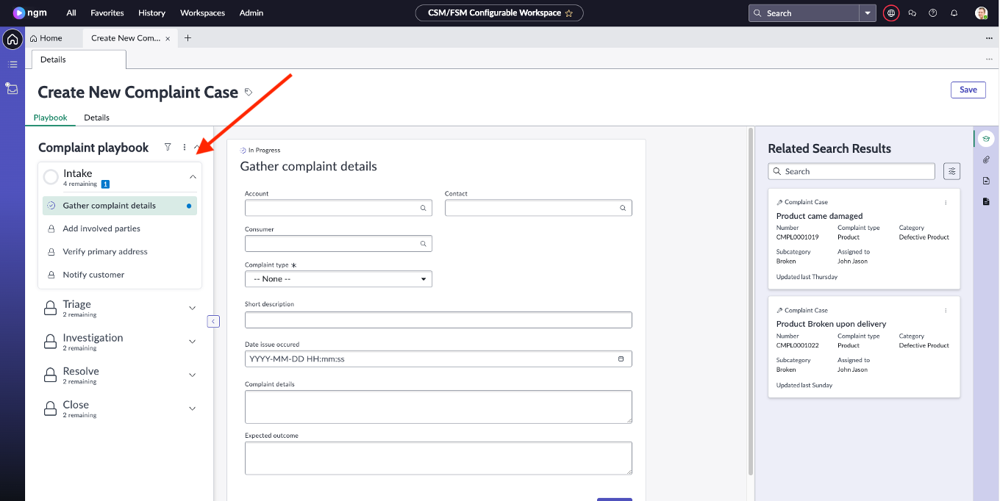

5.	Fill in the details:

 |Field Label|Value
 |--|--|
 |Account|Boxeo
 |Contact|Julie Lewis
 |Complaint Type|Product
 |Product|ACME Corporation ACME DM
 |Short Description|Product Complaint
Click **Continue**
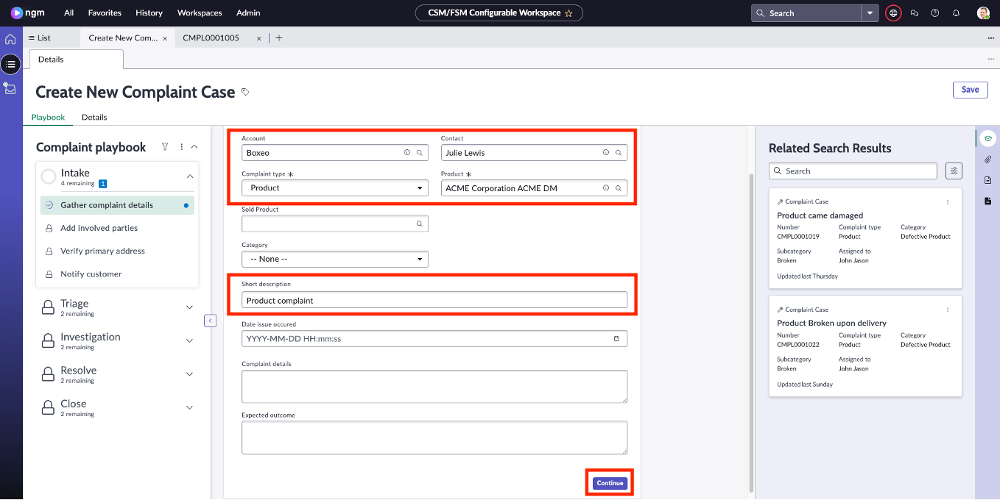

6.	Click on **Assign to me**
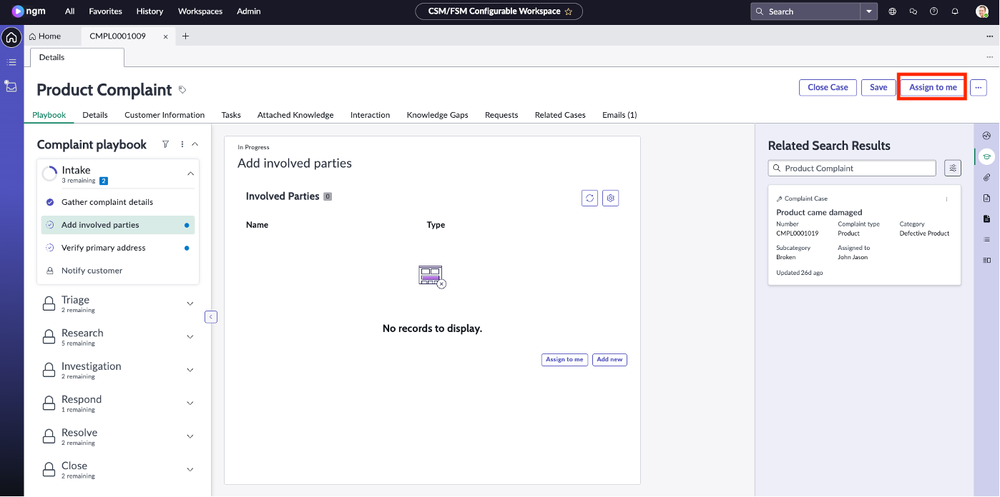

7.	Click on **Verify primary address** and then click on **Move to triage**
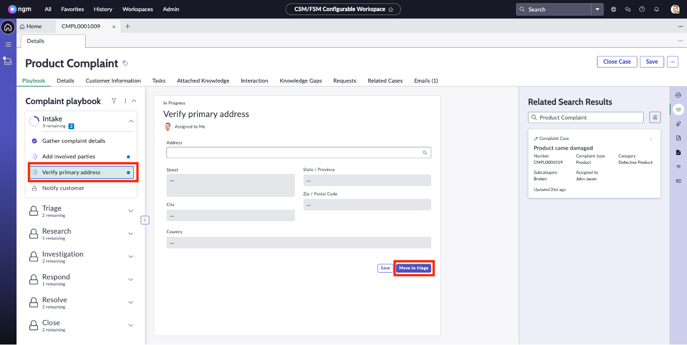

8.	Once the screen is refreshed, click on **Submit for review**
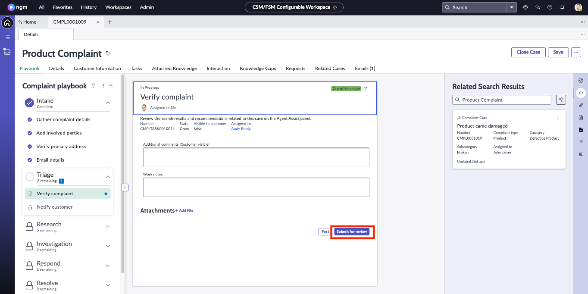

9.	Once the screen is refreshed, you’ll be in the Research stage of the process. Click on **Review Complete** on the next 4 tasks as shown below:
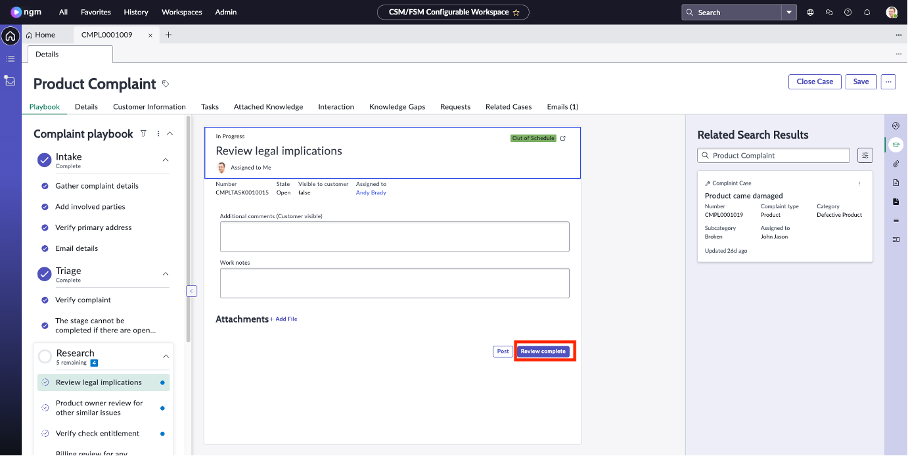
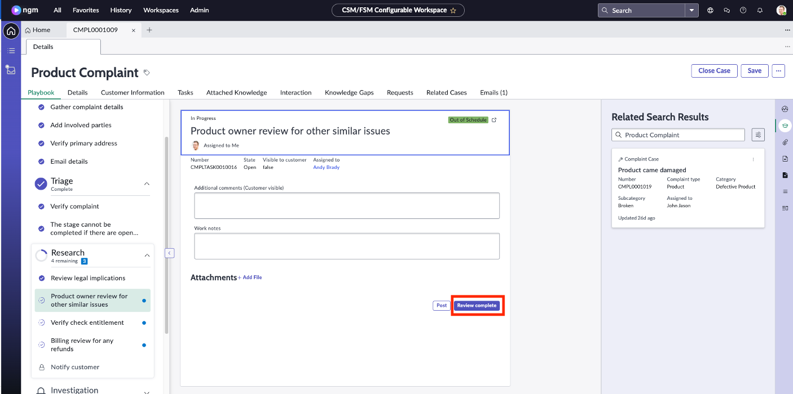
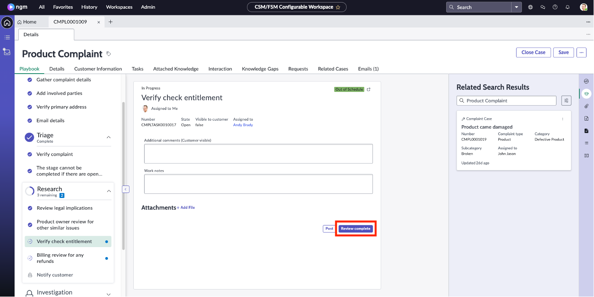
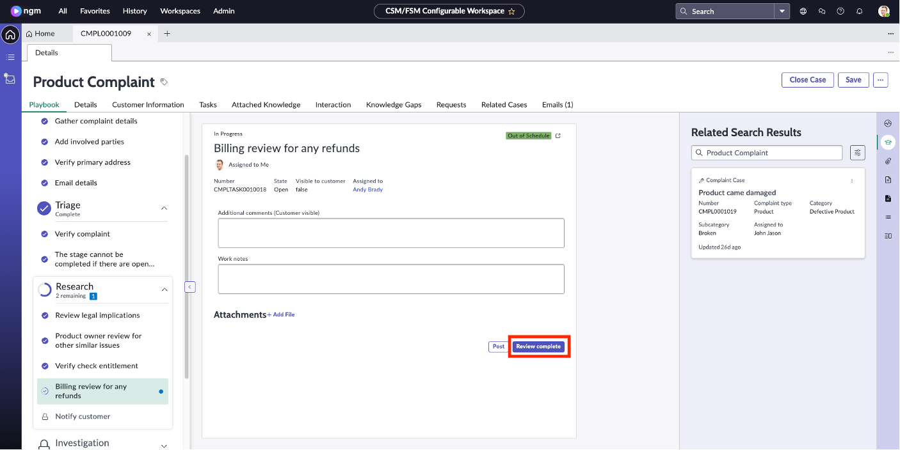

10.	Once the screen is refreshed, you’ll be in the Investigation stage of the process. This is the stage that you just created following the lab. On the form do the following:

 |Field Name|Value|
 |---|----|
 |Requires Investigation| checked
 |Work Notes| Upon the research results, this complaint requires investigation. Please see the previous steps notes for more details.
Click on **Mark Complete**
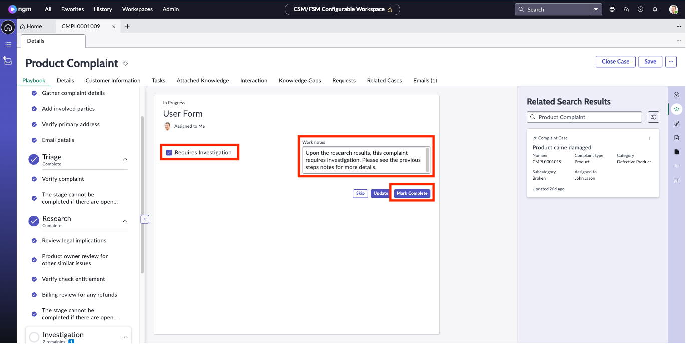

11.	Now, let’s submit the task to the Legal Team. Populate the subject and description as following:

 |Field Name| Value|
 |---|---|
 |Subject|Please investigate
 |Description|See previous notes on the complaint case
Click **Save**
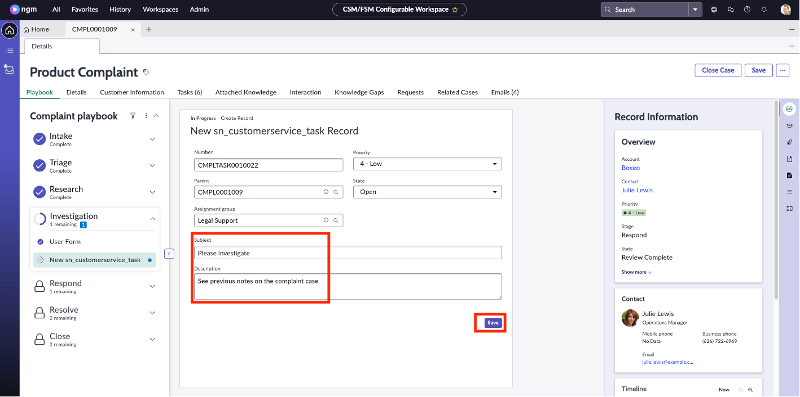

12. Click on **Tasks** tab to observe the task that you just created
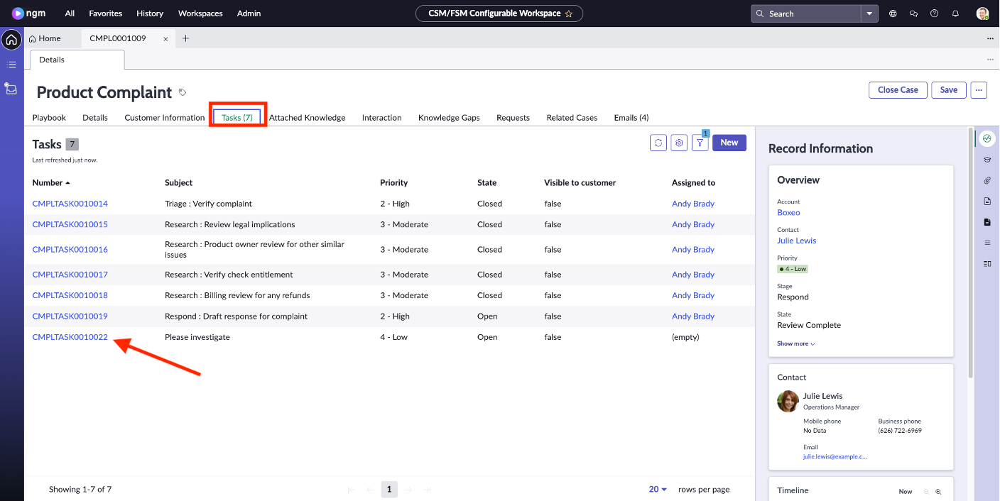

**Congratulations!** You just experienced the investigation stage that you added to the out of the box complaint management process. Let’s stop here.  
Our next section of the lab will focus on creating the “Investigation App” that the Legal Support team will use to execute the investigation.

