We've got our data, now we need to work on the experience for our investigations team. Similar to John Jason in the earlier lab, we'll configure our workspace to ensure we don't miss important investigations and provide our customers with the best customer experience.

1. On the app homepage, click on **+Add** next to **Experience**.
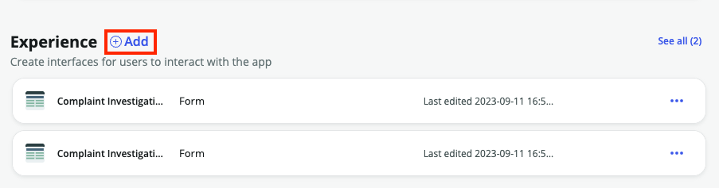


2. Select **Workspace** from the next screen and then **Begin**
    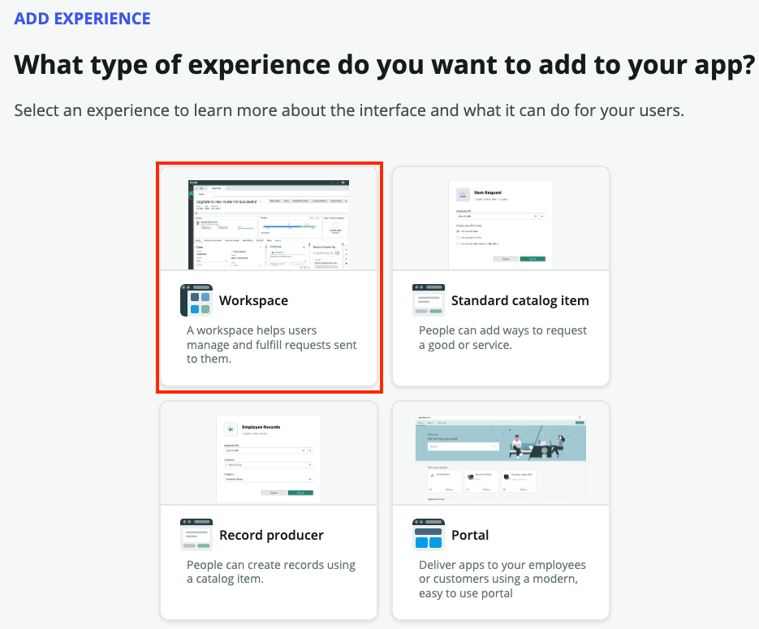
    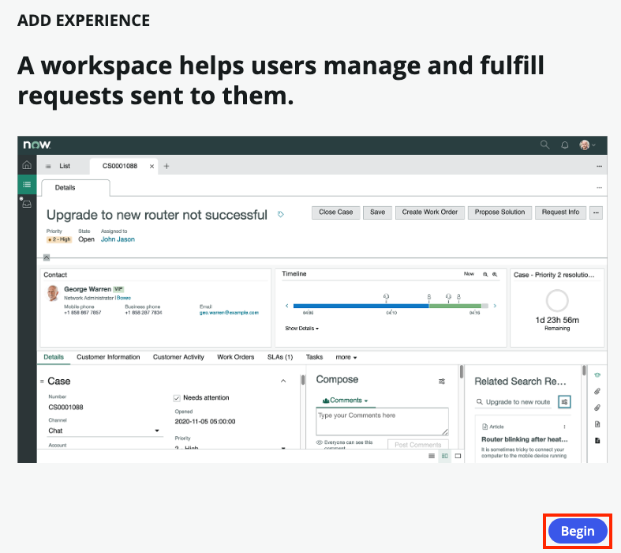


3. Leave everything as default on the next screen
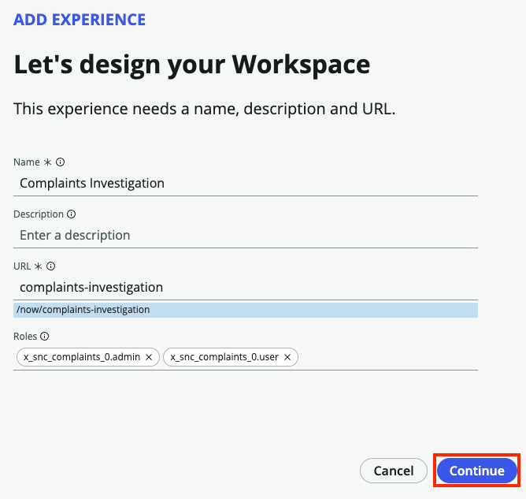


4. Ensure **Complaint Investigation** is listed as the **Primary table**. For **Secondary tables**, choose **Complaint Case** so we can see those on our workspace as well
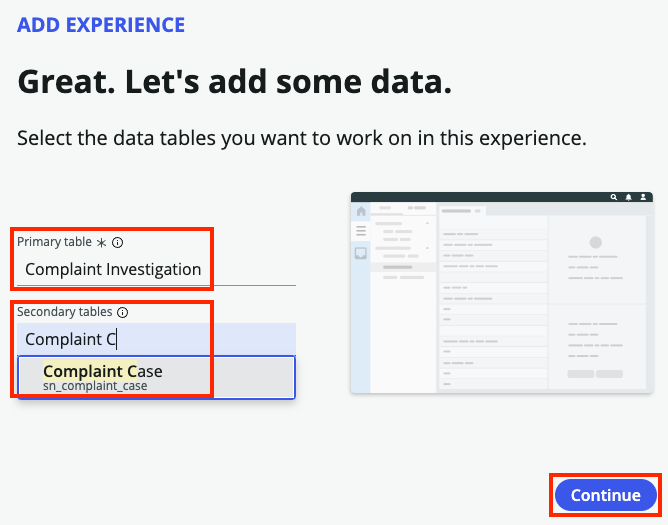


5. Once the Workspace has been completed, click **Done**
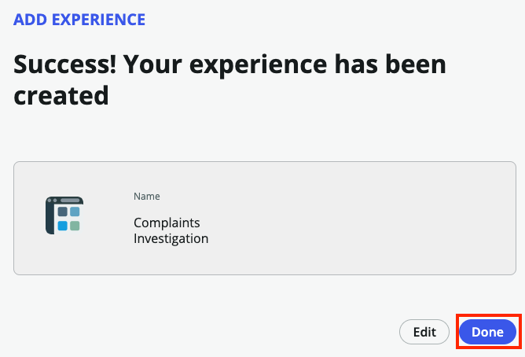


6. Back on our App Home page, click on **Preview** next to our new Complaints Investigation Workspace.
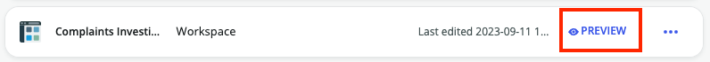


7. Since we uploaded our existing spreadsheet, you should see some existing records in our workspace. Your workspace should look similar to this one:
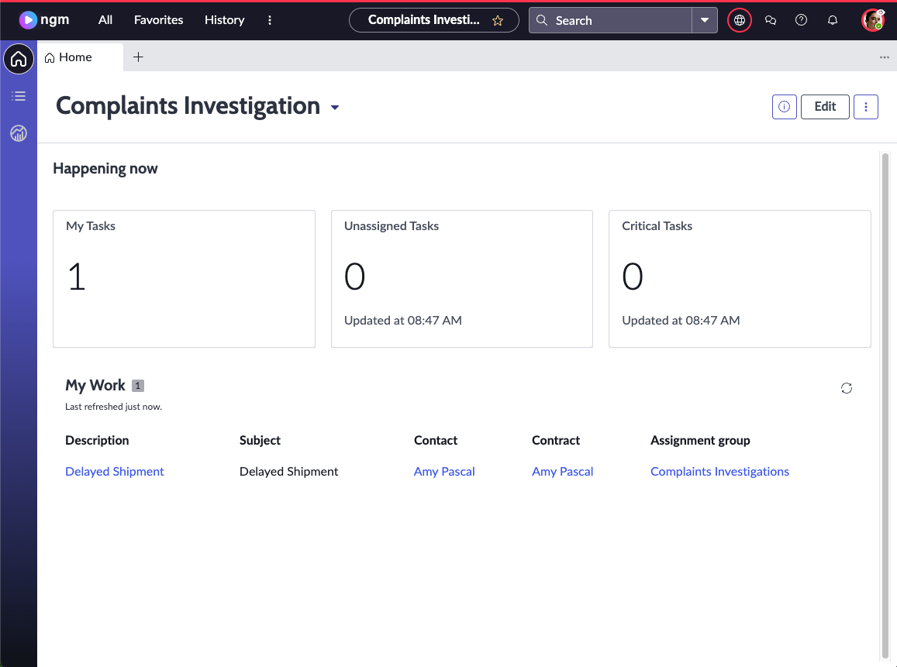


8. Let's use Workspace Builder to configure this workspace to our needs. Click **Edit** at the top of the screen
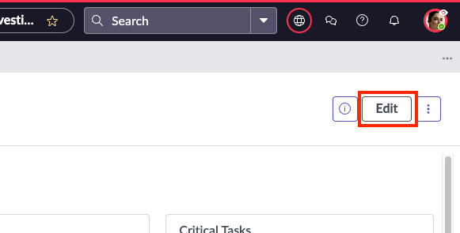


9. Click the **My Tasks** component then click the **Configure** button
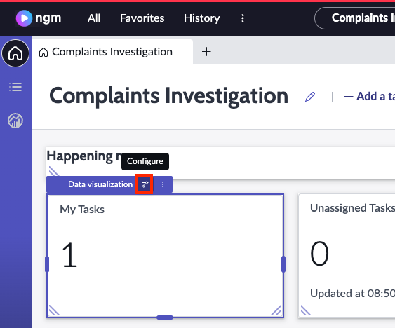


10. On the **Configuration** pane that appears, find the **Header and border** section and click the down arrow to expand it. Change the **Chart title** to **My Investigations** then click **Save**
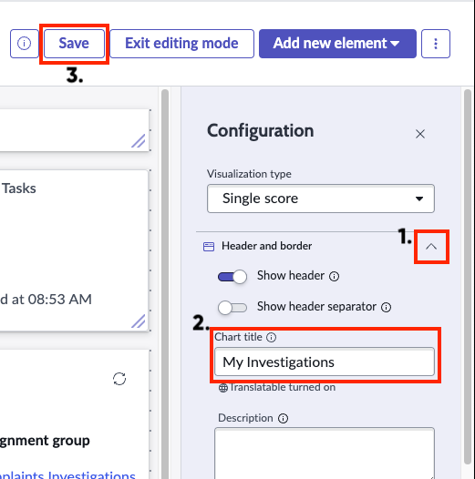


11. Repeat step 10 for the remaining widgets replacing the word Tasks with Investigations. Your workspace should look like similar to the below workspace when complete.
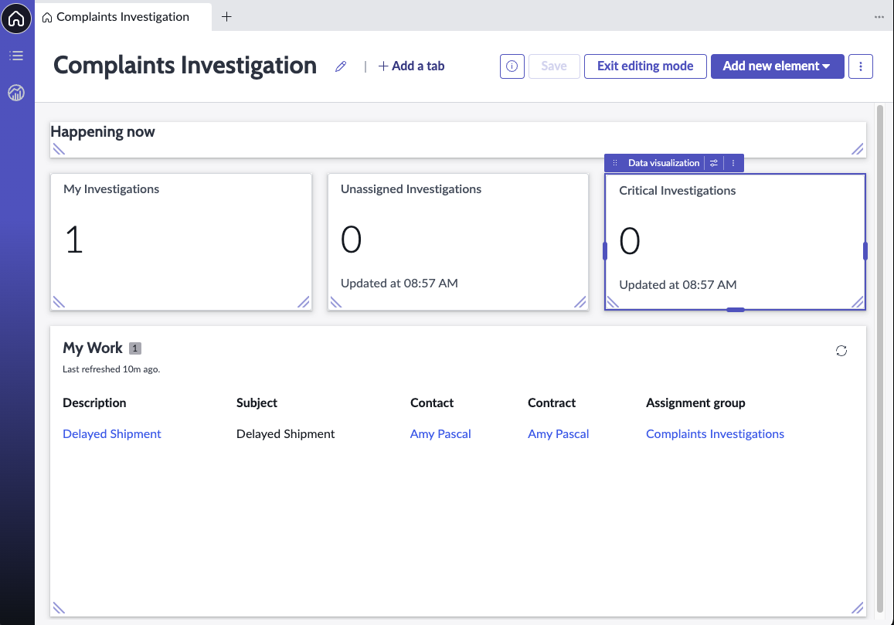
:::warning
Before we move on **SAVE YOUR WORK**!
:::


12. Next, let's add a new Data Visualization widget to our workspace so we have some visability into the overall landscape of Complaints Investigations. Click on **Add new element** at the top and choose **Data visualization**


13. The new component will be added to the bottom of the workspace by default. Drag it up just above **My Work** and resize it to match the **My Work** list below.


14. Now let's configure the new widget. On the configuration pane, choose **Vertical Bar** from the **Visualization type** list.
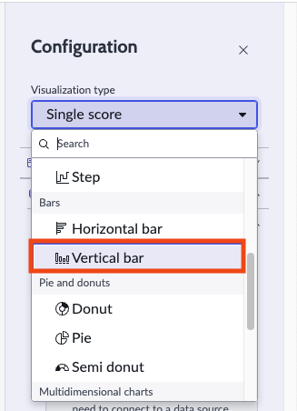


15. Find and expand the **Header and border** section. For the **Chart Title** enter:
    
 ```
 Complaint Cases by Account
 ``` 
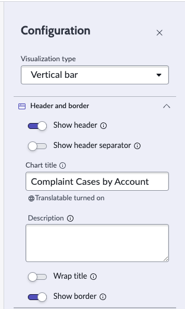


1.  Under the **Data** section, click **Add data source**
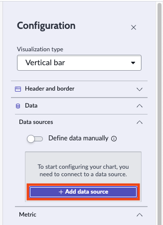


17. On the **Add data source** page, search for **Complaint Case** and click on the option when it appears.
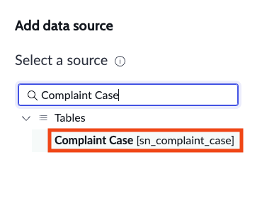


18. Under **Predefined conditions** choose **ComplaintCases.Open** and click **Run**. Ensure that data is displayed then click **Add this source**
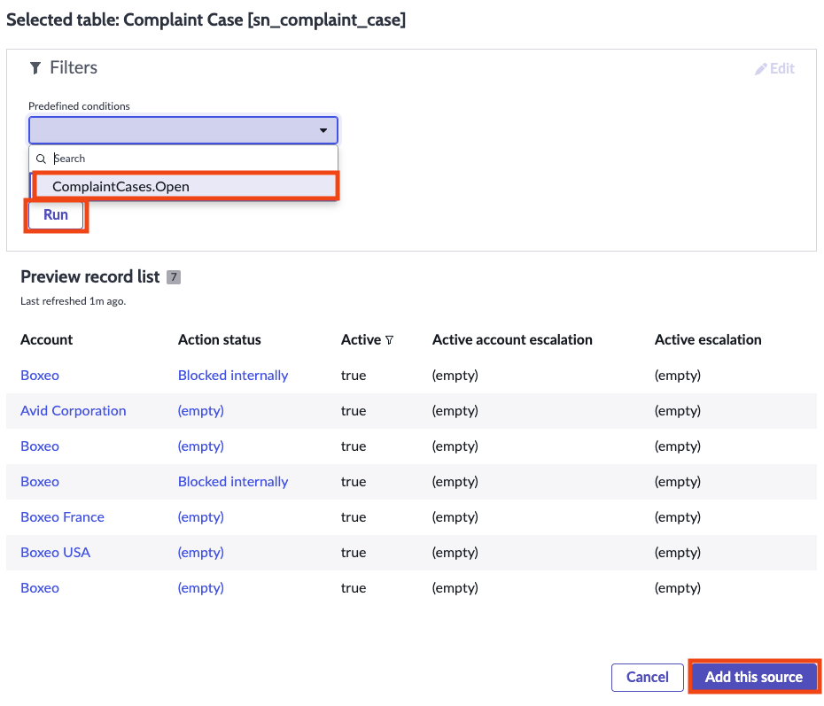


19. Save your work and click **Exit editing mode**
:::info
Before saving, it may be necessary to do some resizing of the compomnents on the screen. Feel free to do so as needed.
:::


20. Your dashboard should look similar to the screenshot below
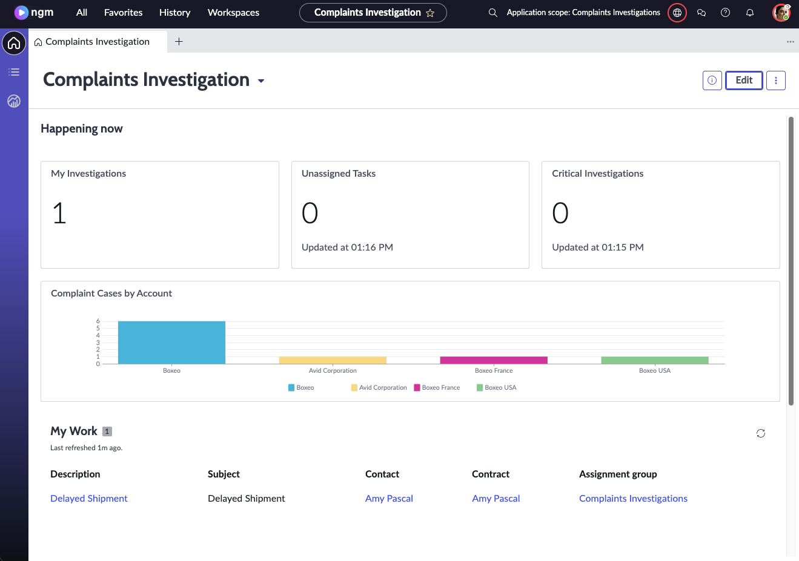


21. Now that we have our homepage complete, let's take a look at the record pages and ensure we can see the activities that take place on these investigation records. Back on your **App Home** screen, find your workspace under the **Experiences** section, click the **...** on the right and click **Edit**
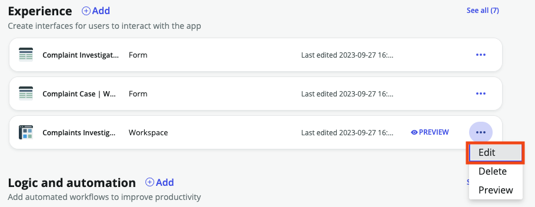


22. This takes us to **Workspace Builder**. Click on **Get started** if you get a pop-up screen welcoming you. At the top under **Record pages** click on **Complaint Investigation**
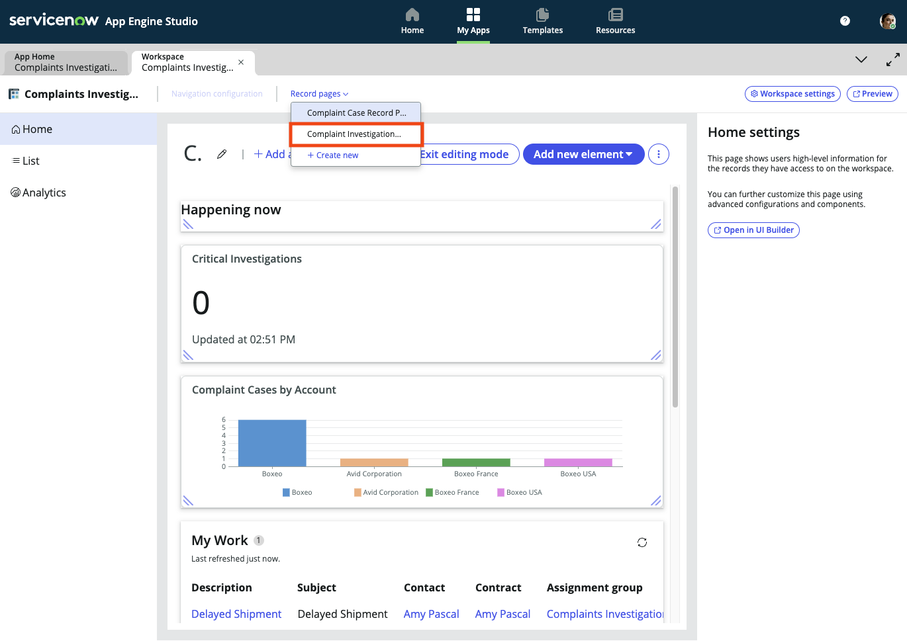


23. Click on **Record details** in the left panel then toggle **Activity Stream** in the right panel. You should see a message indicating that we have successfully activated the activity stream
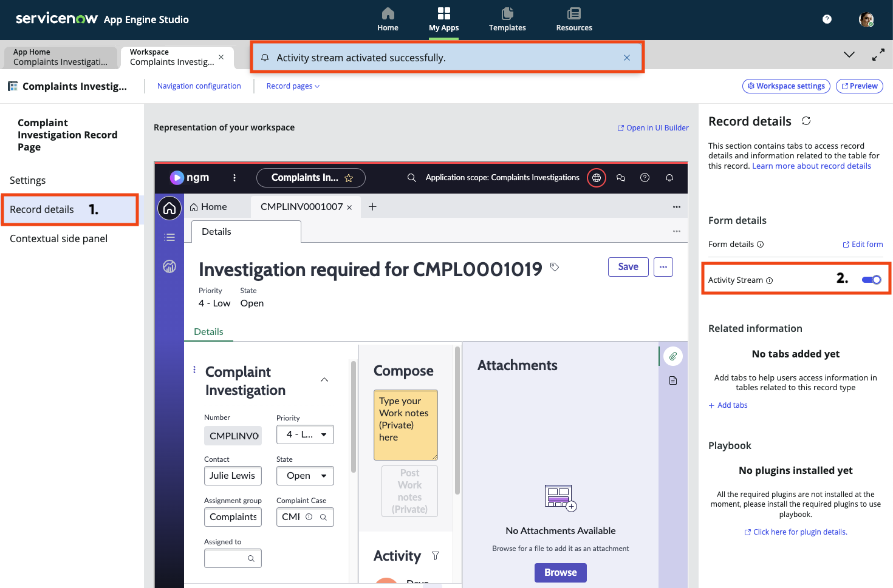


**That's it!** You've just successfully configured a new dashboard for Complaints Investigations team and added features to the form that will help the team work more efficiently in the complaints investigation process!

Feel free to add additional data visulization and components to get a better feel for the flexibility of the dashboards and workspaces.
