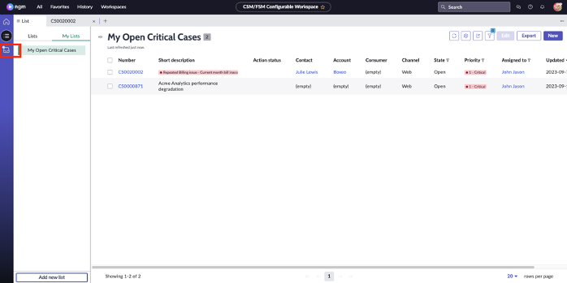
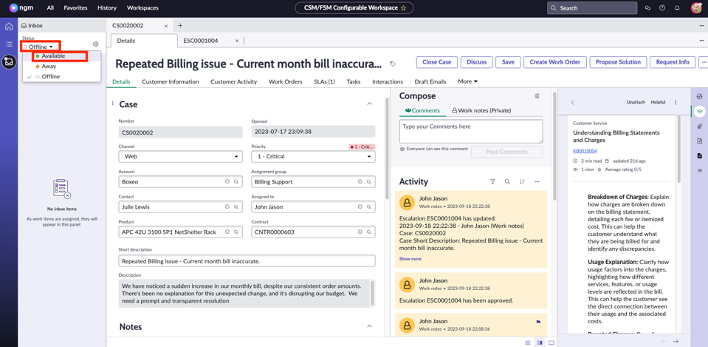

Before we move on to complaint management and portal, let’s set John’s status as **Available** so that when your customer Julie wants to connect to John via live chat, the chat gets routed to him.

1. Click on the inbox icon as shown below:

2. Click on **Offline** and choose **Available** from the list.

Great! With John's status now set to Avaialble, we can move on to the next section!
