In this exercise, we'll tie our investigation process together with the Complaints Management module in CSM so we can wave bye-bye to those spreadsheets! We'll also use Now Assist to help us make decisions on next best actions in our flow.

1. If you haven't done so already, close your workspace and go back to your App Engine Studio window. In the **Logic and Automation** section, click on **Add**
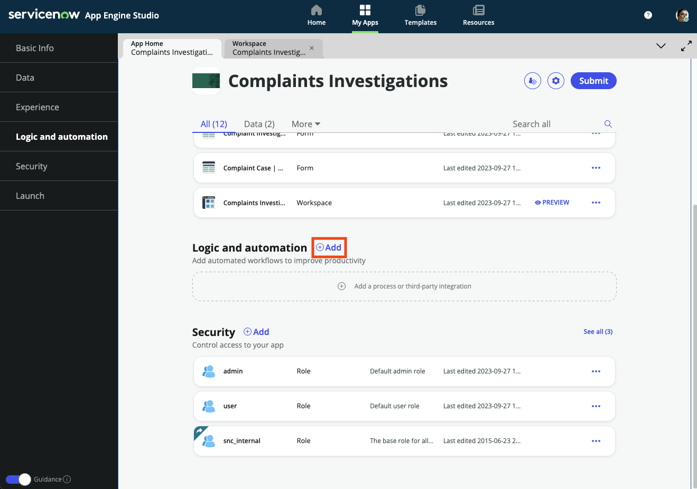


2. There are several options for automation when building an app as a low code developer on the ServiceNow platform, but today we will be focusing on workflow. So on this screen, choose **Flow** from the options
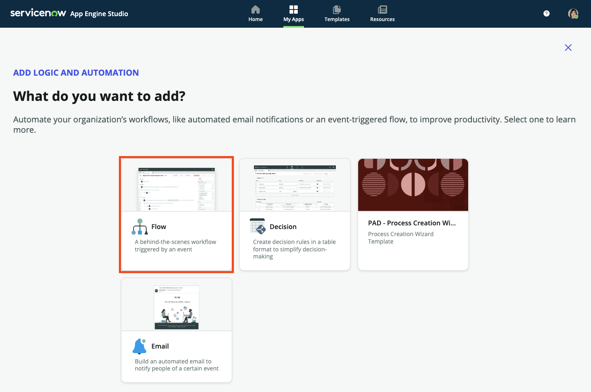


3. To help you get started quickly, we've provided a set of common flows we see our customers building. In addition to that, we've built these flows with pre-existing integrations to collboration tools like Teams. We, however, will be starting from scratch. Click on **Build from scratch**
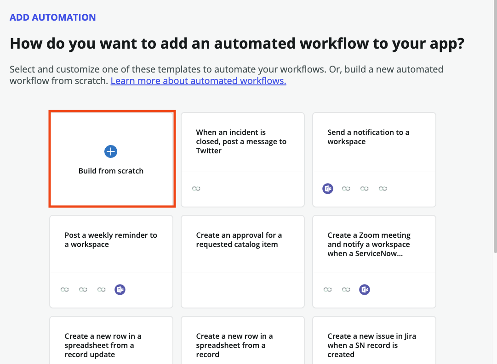


4. Set the following values for your new flow. When complete, click **Continue**:

 **Name**
 ```
 Complaints Investigation Flow
 ```
 **Description**
 ```
 Workflow that is triggered when a new complaint is received and requires investigation.
 ```
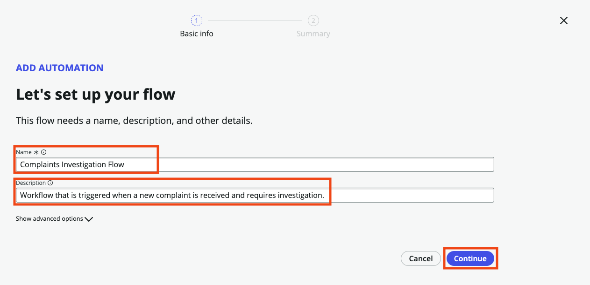


5. On the **Success! Your flow is ready** screen, click **Edit this flow**
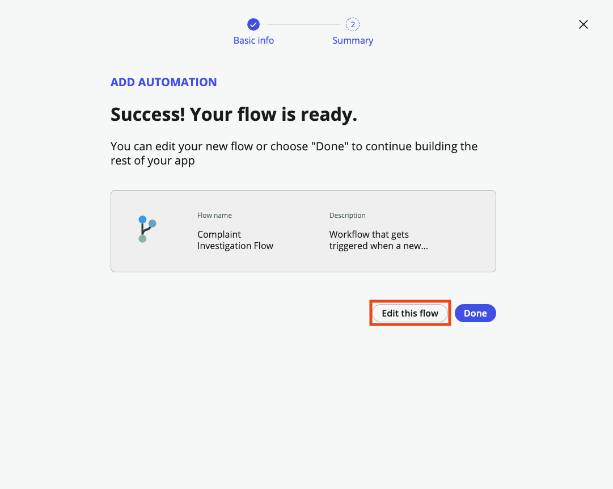


6. This will open **Flow Designer** where we can define our trigger and our resultant actions in our workflow. Before we add our trigger, let's turn on **Flow recommendations** so we can leverage **Now Assist for Creator**. To do so, click on the ... button in the top right corner of Flow Designer and select **Flow preferences** from the dropdown.
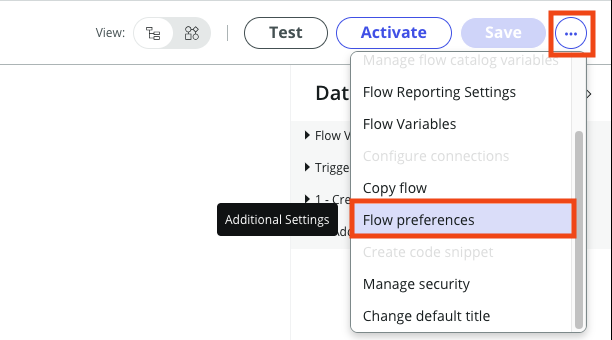


7. On the popup window, select the toggle next to **Show recommendations** to turn on **Now Assist**. Close the window once complete
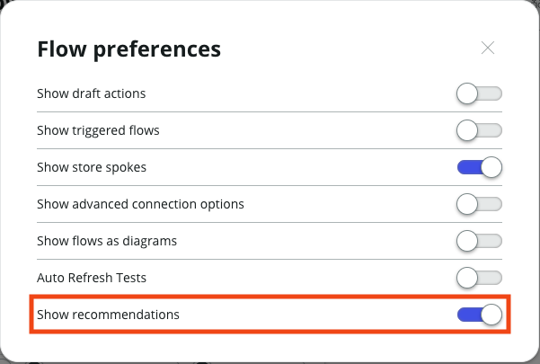
   

8. Now with flow recommendations turned on, click **Add a trigger**
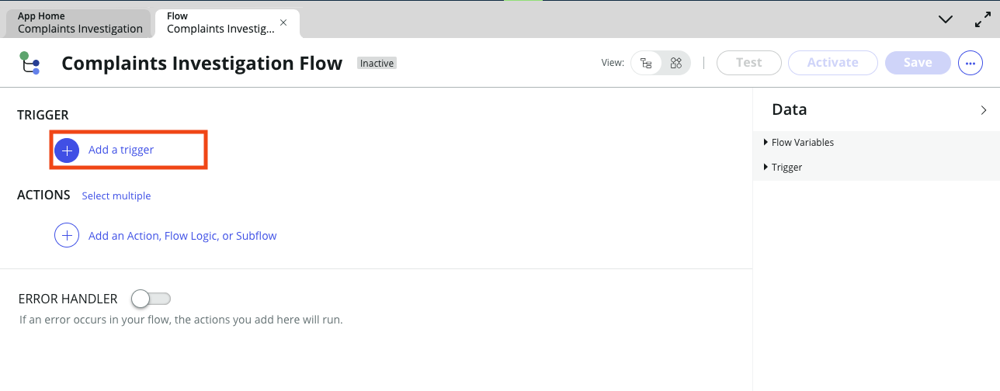


7. Choose **Record** then **Created or Updated** in the dropdown. 
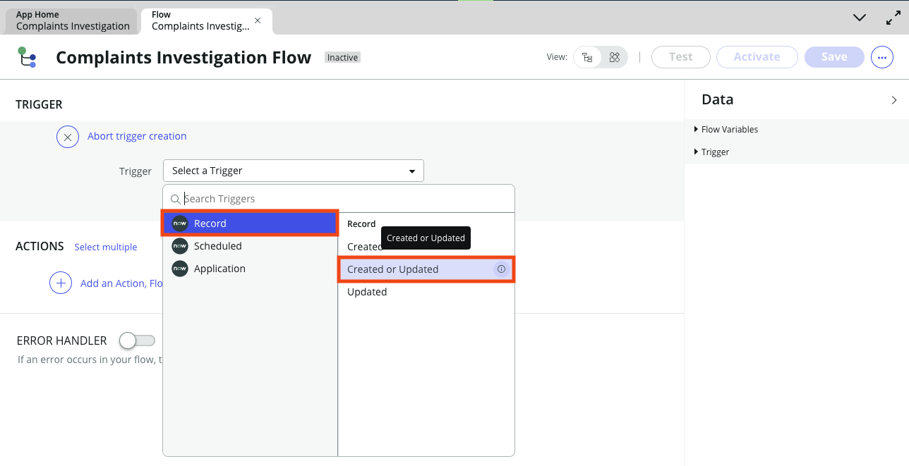


8. To complete the trigger confguration, set the following values and click **Done**:
 
 |Field Name|Value|
 |---|---|
 |Table|Complaint Case [sn_complaint_case]|
 |Condition|Requires Investigation is True|
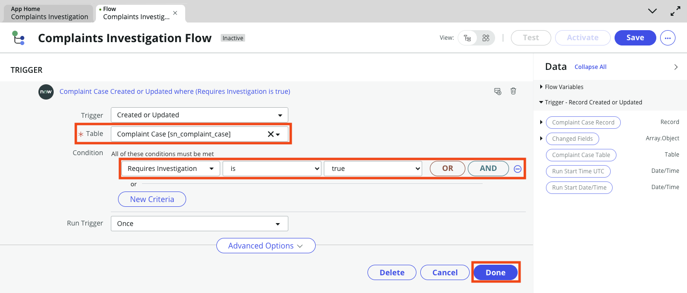


9. Now that we know when our flow is going to execute, let's tell it what we want it to do - or rather.. let's let Now Assist helps us build our flow using **Recommendations**! We want to create a Complaint Investigation record when our Complaint Case requires it. It looks like Now Assist is recommending that as our first step. Click on **Create Record** in the recommendations bar 
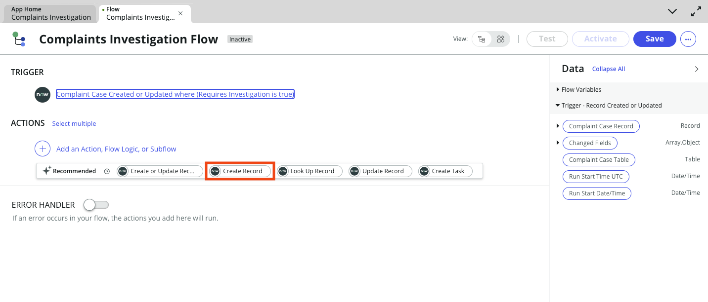


10.  Set the Table field to our **Complaint Investigation** table we created in our first exercise in App Engine Studio. Then set the **Fields** as shown below then click **Done** when complete:
 :::note
 Values highlighted in bold below indicate we are dot walking to the fields we need in our workflow
 :::
 |Field Name|Value|
 |---|---|
 |Parent|**Trigger - Record Created or Updated - Complaint Case Record**|
 |Subject|Investigation required for **Trigger - Record Created or Updated - Complaint Case Record - Number**|
 |Description|**Trigger - Record Created or Updated - Complaint Case Record - Short Description**|
 |Contact|**Trigger - Record Created or Updated - Complaint Case Record - Contact**|
 |Assignment Group|Complaints Investigation|

 When you're finished, your action should look similar to this:
 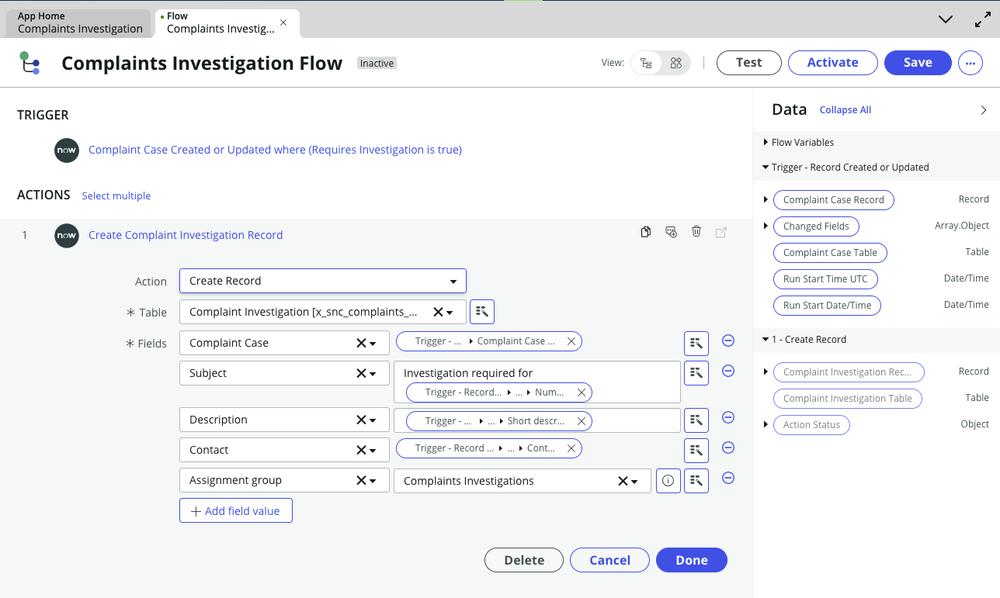


 11. Next, we want to make sure we indicate in the complaint case record that we have automatically created this investigation. This will ensure that anyone who looks at the case later will know we've taken action. Let's add a new action by clicking the **+ Add an Action, Flow Logic, or Subflow** button under the action we just created then click **Action**
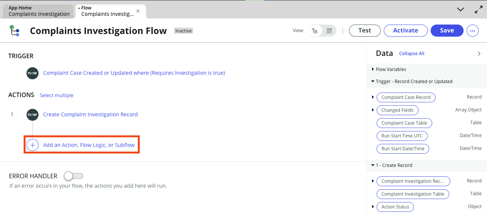


12. This time we're looking for the **Add Comment To Task** action. In the Search field, type **Add comment** and select the option that appears under the **Customer Service** spoke
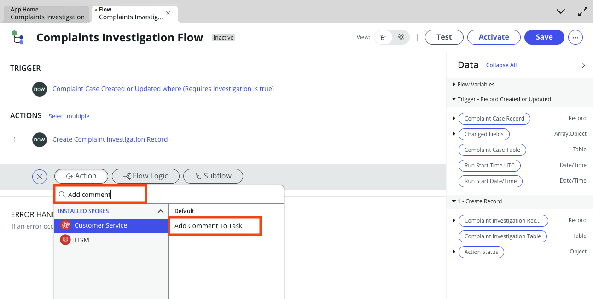


13. Complete the action with the following values then click **Done**:
 :::note
 Values highlighted in bold below indicate we are dot walking to the fields we need in our workflow
 :::
 |Field Name|Value|
 |---|---|
 |Task [task]|**Trigger - Record Created or Updated - Complaint Case Record**|
 |Comment|Created investigation task: **1 - Create Record - Complaint Investigation Record - Number**
 When you're finished, your action should look similar to this:
 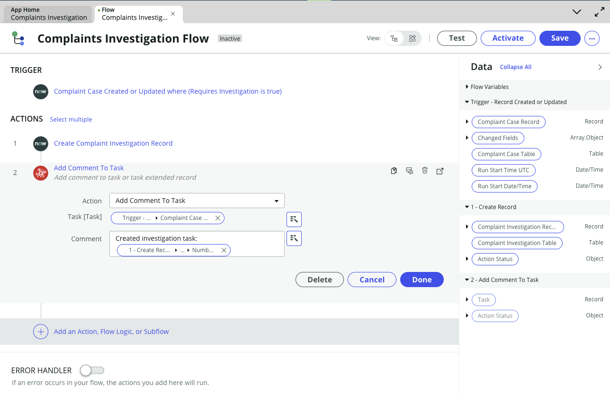


14. Time to test! **Save** your flow and click the **Test** button at the top of the screen. When prompted, choose the complaint case we created earlier in our lab
:::note
Your complaint number may vary from the one reflected in the lab guide.
:::
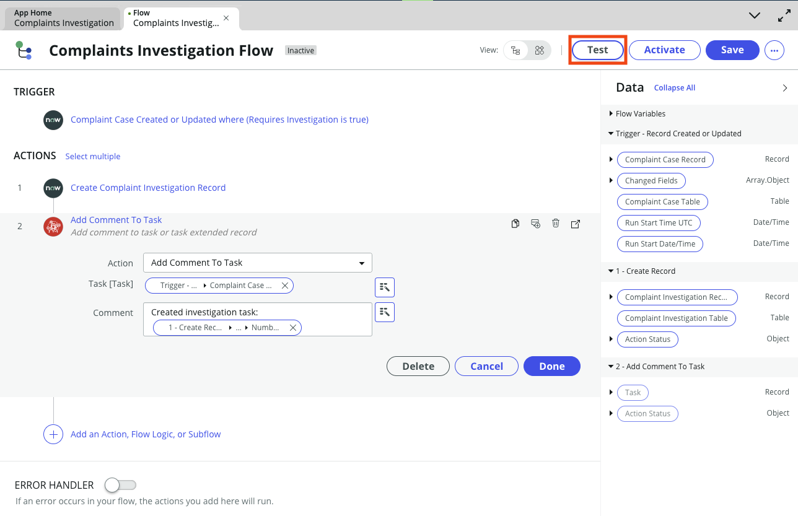


15. To view your test results, click the link on the pop-up
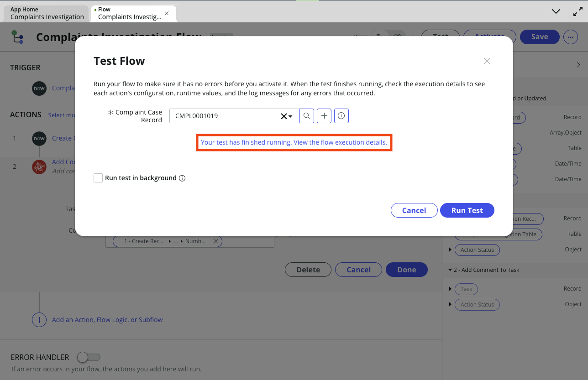


16. Here you will be able to view any errors or resultant records that are created as part of your workflow. If you received errors, go back and take a look at your flow to ensure everything has been completed correctly. If it was successful, you should see **Test Run - Completed** at the top of your screen. If your test was successful, **Save** your work!
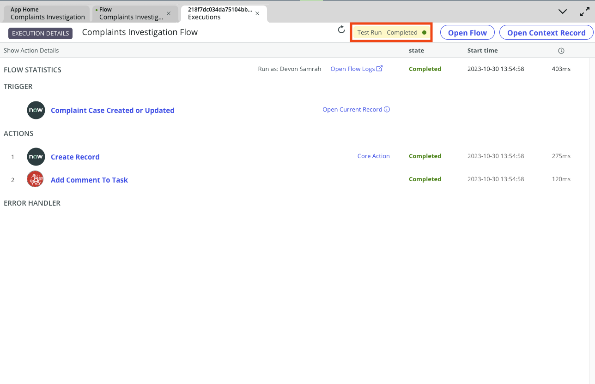


17. Finally, let's see what this looks like for Devon in her new Workspace. Go back to **App Home** and Preview the Workspace again.
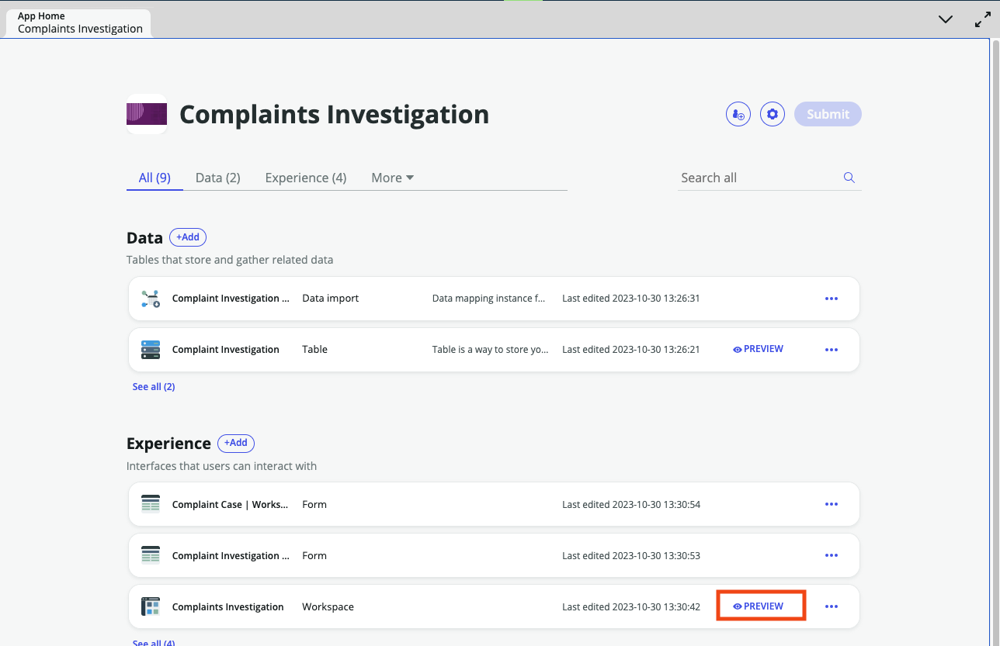


18. Notice there is now an unassigned Investigation for Devon awaiting her on the workspace homepage. Click on the **1** under **Unassigned Investigations** to view the list of investigations that are unnassigned
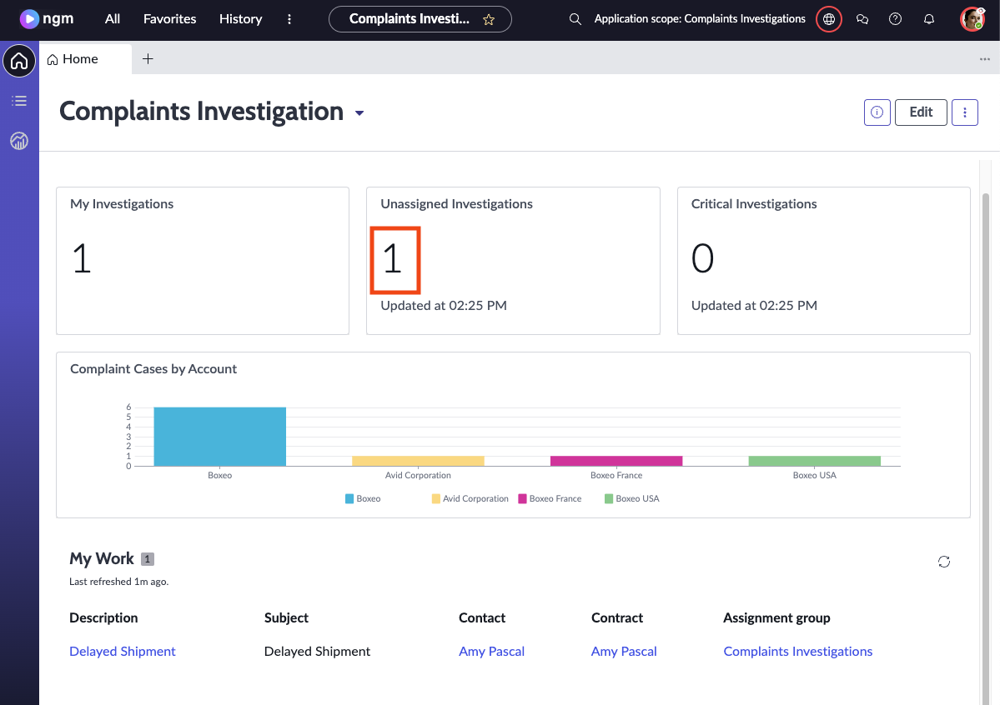


 19. Click on the record that appears in the list to view the newly created investigation record. Your screen should look very much like the screen below!
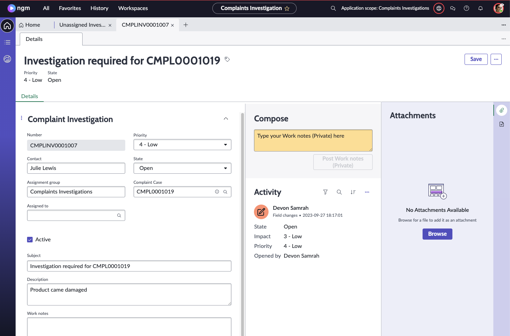

That's it! You've successfully created automation necessary to create a new investigation when a complaint case requires investigation. 

:::note
Next Steps for **Devon**:   
<br/>
In the real world, once Devon is happy with her app, she would submit the app for review and approval by the App Engine Administrators.     
<br/>
<br/>
For the purposes of our lab today, we will not cover those steps, however if you are interested in learning more about how we govern all aspects of application development in ServiceNow, please reach out to your Creator Workflows team.
:::
