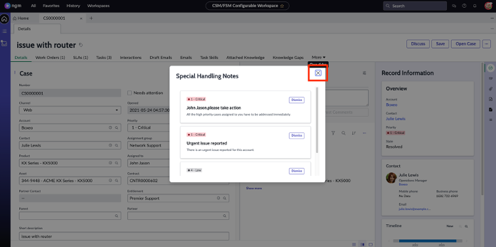

# Preventing important cases from falling through the cracks 

1. First, we need to pick the right user. Click the user profile picture and select **Impersonate user**.

2. Search for ‘John’ and select the service agent **John Jason**.

3. We will now navigate to the purpose-built agent workspace. Click on **Workspaces** and select **CSM/FSM Configurable Workspace**.

4. You are now on the Home page of the agent workspace that comes out of the box. Locate these 3 items by scrolling through the page:
   * Important Items
   * My Active Cases
   * My Team's Cases

5.	Under the **Important Items**, we see that there is a case where the **SLA is breached**, we need to escalate the case immediately. Click on **the number** in the SLA breached tile to be taken to the list of cases.

6.	On the list, we can see the case, which SLA is breached, stage, and by how many minutes/days alongside other information. Click on the case number to be taken to the case record.

7.	First, you’ll see **Special Handling Notes**. These notes automatically pop up based on the values on the case. You can have multiple special handling notes to alert your agents for better customer service. Click **X** to close the special handling notes window.

8.	On the case page, we can see all the details such as customer information, work orders, SLA, tasks etc.

9.	John will leverage out of the box features to search for similar cases that were resolved and look for helpful knowledge articles. Click on the **Agent Assist** icon as shown on the screenshot below

10.	Click on the hamburger icon as shown on the picture to see all the out of the box search options. Currently you are seeing all similar resolved cases. Click on **Knowledge Articles**. 

11.	We can now see relevant Knowledge Articles that gets surfaced automatically. Click on the first article and then click **Attach** to attach it to the case.

:::note
If you include ’Additional Comments (Customer Visible)’ before clicking on Attach Article, the article will be visible to the customer via the customer portal including your comment.
:::

12.	Finally, John will escalate the case before moving on to other cases in his queue. Click on the **three-dot icon** and select **Escalate Case**.

13.	On the Case Escalation page, select these values:
      
 |Field | Value 
 |---|---
 |**Reason** | Lack of Progress
 |**Escalation Trend**| Declining 
 |**Watch List** | Fred Luddy
 |**Escalation Justification** | Need more help - partner is having repeated billing issue.
 Click **Save**.
 

 14. Click on the **Details** tab to go back to the case. Observe the escalation that is automatically attached to the case.
 
 
 
 **Great Job!** John now has escalated the case and added his manager as watch list. He did all this work by using out of the box features!

15.	We will continue working on the agent workspace. Click on the hamburger icon to go to the case and task lists assigned to John.

16.	John has quick access to cases and tasks that matter to him. These lists are automatically updated and always show real-time data.

17.	Users like John can easily create their own lists when needed without creating IT Backlog. We will now create Critical Cases lists that are assigned to John. Click on **My Lists**.

18.	Click on **Add new list**

19.	On the pop-up screen, click on **List** and select **My Open**.

20.	Populate List Name: “My Open Critical Cases”

21.	On the pop-up screen scroll down to the filter criteria and click on **AND** as shown on the screenshot below:

22.	On the first input field select **Priority**, in the second input field select is, in the third input field select **1-Critical**. Click **Create**.

**Congratulations!** You helped John to efficiently work on and prioritize his cases. Next chapter we will see how one of your customers will log a complaint using out of the box customer portal and then John addressing the complaint leveraging automation.
