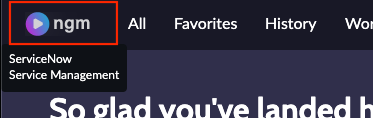

1. Let’s get started! First, we need to copy our portal URL from our lab instance. If you're not already there, go to the home page of your instance by clicking the icon in the top left.
.

2. Find Julie Lewis in the **Workshop Experiences & Personas** section and copy the **Experience URL**

:::info
Your instance name will vary from what is reflected in the screenshot
:::

3.  Next, we'll need to open a new browser session.
   
   If you are using Chrome, open a **New Incognito Window** on your browser.
   

   If you are using FireFox, open a **New Private Window**.
   

4. Now, on the incognito window paste the external portal URL that we just copied. Then hit Enter or Return key on your keyboard so that you can be directed to the portal.

5. On the portal page, click Log in and enter:
 
 |Field Name|Password|
 |---|---|
 |**User name**|    julie.lewis|
 |**Password**|     Portal1!|
 
 Click **Log in**
 

 

6. What you see on the screen is the out of the box portal. Your organization will change the look and feel, but the out of the box portal is already full of functionality with service catalogs, knowledge articles, virtual agents and chat bots etc.

7. Julie received a damaged product. First, she wants to see what her next steps could be to get support from your company. Go to the search bar as shown below and type **Product damage upon shipment** and press **Return** or **Enter** on your keyboard.

8. You can now see knowledge articles. Click on **the first knowledge article** to display.

9. Let’s assume that Julie decides to log a complaint. Click on **Requests** and select **Request Something**.

10. On the screen, search for **Log a complaint** as shown in the screenshot below

11. Fill in the form as followed:

 |Field Name|Value|
 |---|---|
 |**Complaint Type**| Product|
 |**Product**| ACME Corporation ACME DM|
 |**Category**| Defective Product|
 |**Sub Category**| Broken|
 |**Short Description**| Product broken upon delivery 
 |**Date issue occurred**| Click on the calendar icon. Select today and click **OK**. You can also type in the answer instead of using the calendar widget|
 |**Complaint Details**| The product is shattered and can’t be used|
 |**List the additional parties involved in the complaint**| Click on **Add** button. On the **Involved Parties** field, select **Mike Rogers**. On the **Type** field, select **Co-Complainant**|
:::note
Note that once you type in the **Short Description**, the system automatically displays knowledge articles and related services. If you want to, you can disable this feature
::::
Click **Submit**

12. See that Julie is presented with a complaint record that she can always come back to and track progress.

13. Julie can also interact with the Virtual Agent that is out of the box enhanced with AI capabilities and can be used to log requests, check case/complaint statuses, getting routed to a live agent for chat or more! Click on the **Virtual Agent icon**.

14. On the Virtual Agent, Julie can see her past conversations and start a new one. Type **check case status**

:::note
Instead of typing what you need, you can also click on **Show me everything** to see all the list of requests you can accomplish with the VA. In the instance you are using right now, we have a couple out of the box requests enabled.
:::

15. Virtual Agent presents all the cases and complaints that are being logged by Julie. Click on the **magnifier icon** to search for the complaint.

16.	Type **Product broken** on the search bar. You’ll see that Virtual Agent returns the complaint that you just logged. **Select the complaint**.

17. Select **Update CMPL0001001** (the complaint number may be different). Julie can create and update their cases, requests, and complaints without any effort from the support team!

18.	Select **Add a comment** and type **The issue impacts our business, can you prioritize this?**

19.	Now you added a comment to the complaint. Select **Cancel** in the new Virtual Agent question as you don’t want to do any other updates. 

**Congratulations!** Your customer was able to submit a complaint so easily. All this with out of the box features, including the Virtual Agent!  We will now go back to John and start working on this complaint.