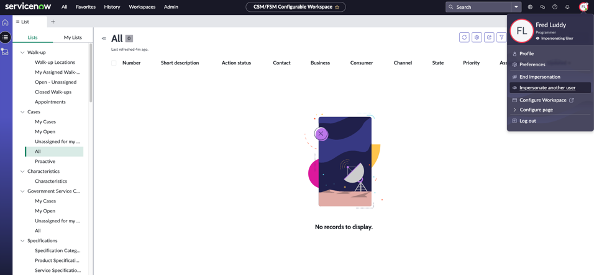

1. First, we need to pick the right user. Click the user profile picture and select **Impersonate user**

2.	Select “Kelly Smith” and click “Impersonate User”

3. Select the **Create from an existing table** option and then **Continue**

4. Set the **Table** field to **Task** and select **Continue**

5. Set the **Table label** field to **Dept Task**\
    Select **Make extensible**\
    Select **Auto number**\
    Set the **Prefix** field to **DEPTTASK**

6. The next step is to setup permission for the Dept Task table. Assign full permissions to the admin role by selecting **All**. Select the **Create**, **Read** and **Write** permissions for the user role

7. Select **Done** once the table is created to return to **App Home**

Excellent! In our next exercise we'll create our Request tables and add some department specific fields.