In this section, we see how a manager can leverage reporting in ServiceNow to keep track of his company's and team’s performance.

## Personas
| Fred Luddy | Manager
|--|--|
| |  Fred is responsible for overseeing and leading a team of customer service representatives and ensuring the delivery of excellent customer support. His primary role is to manage and optimize customer service operations to meet or exceed customer expectations. 

1.	Let’s get started! First, we need to pick the right user. Click the **user profile picture**, if you are still impersonated as John Jason, select **End impersonation**.
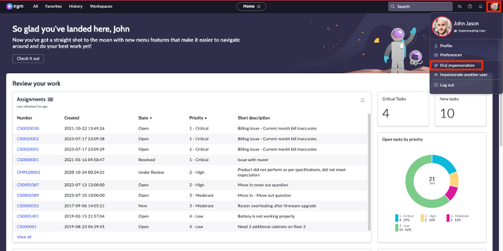

2.	Click the user profile picture, select **Impersonate User**.
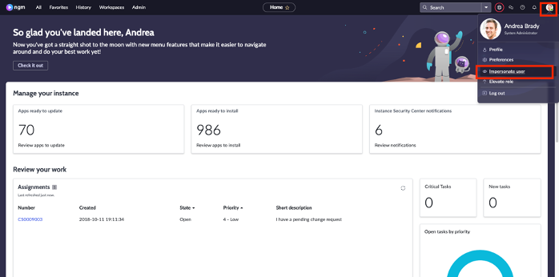

3.	Search for **Fred Luddy** and click **Impersonate User**.
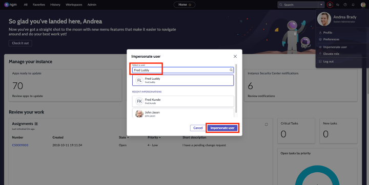

4.	Click on **Favorites** and then click on **Customer Service Manager** dashboard
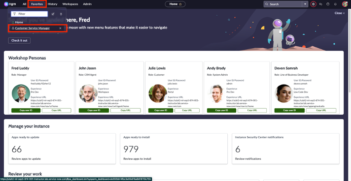

5.	What you see on your screen is a sample **service manager dashboard**. CSM OOB provides you template dashboards that you can edit based on your needs. Observe that on the highlighted graph below, the number of open cases is increasing but the average age of open cases is decreasing. 
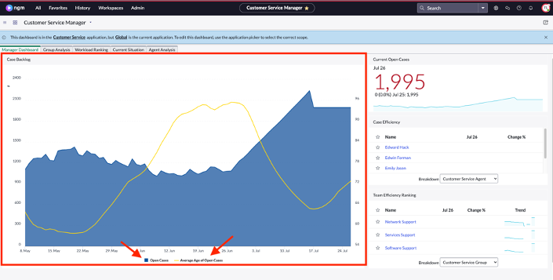

6.	Let’s understand this trend. You can click anywhere on the lines to drill down into the data. For this lab purpose, click on the **yellow line** where it intersects with the blue line. 
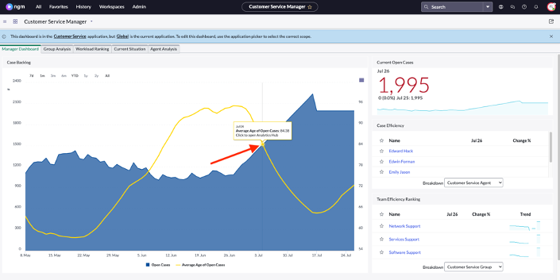
:::note
It’s ok if you click somewhere else, you’ll still be able to follow along
:::

7.	We will now discover the breakdown of this trend to understand what products, customers, channels etc. Is contributing to it. Click on the list icon as shown below
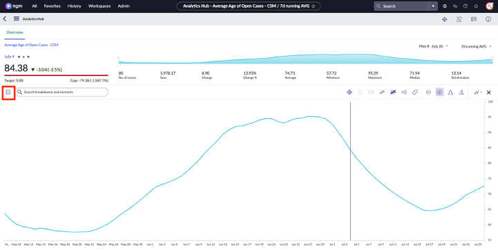

8.	Observe that you have multiple variables that you can drill down to. Let’s first click on **Customer Service Group**
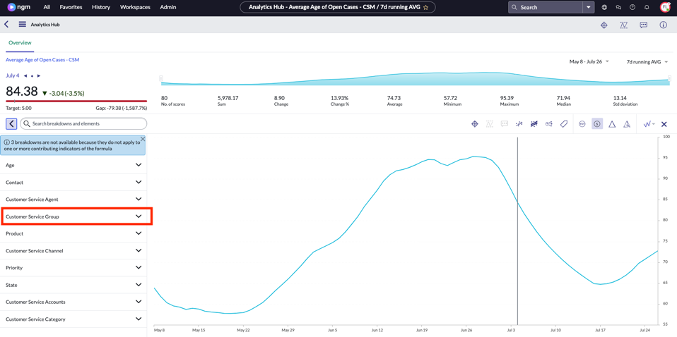

9.	We can now see that within the Customer Service Group, Software Support has been the fastest and Services Support the slowest.
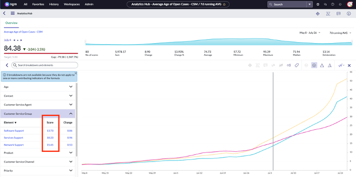

10.	Let’s now see which products have been impacted by this trend. Click on **Product**. Then click on the **line graph icon** to change the view to columns. We can see that cases related to Iris 5875 have been taking the longest.
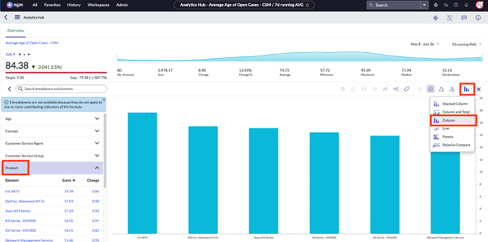

11.	Let’s now see which channels contribute to this trend. Click on **Customer Service Channel**. Observe that cases that come in via chat has been taking the longest to resolve.
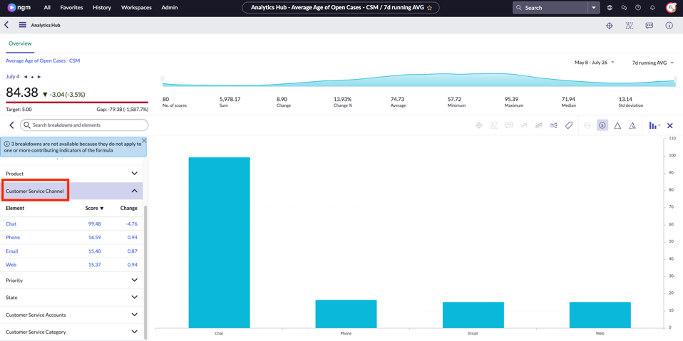

12.	Now Fred has a better idea on what is contributing to the case resolution time. Let’s now click on the **back** icon to go back to the dashboard.
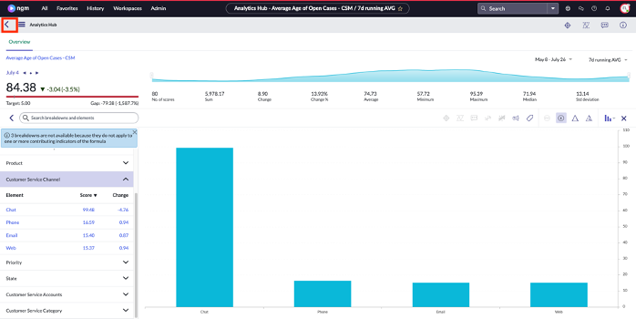

13.	Click on **Workload Ranking**. Observe that you now have case analysis per customer and interactive filters to drill further in data.
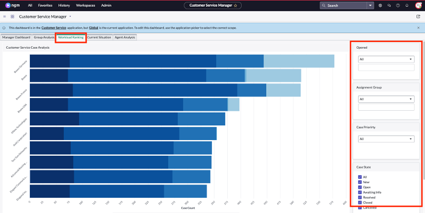

14.	Scroll down and select Stacked by **Product**.
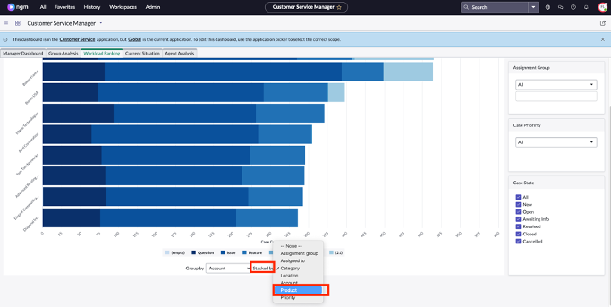

15.	Observe that you can now understand which products are resulting in most cases per customer.
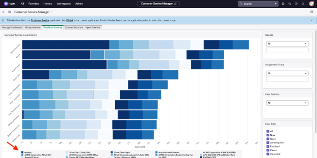

16.	Let’s see another tab. Click on **Agent Analysis**. You can now see the agent stats and agent efficiency. Remember that all this is real time data!
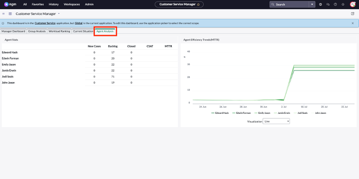

17.	Finally, click on **Current Situation**. We can see that there are open cases older than 30 days. On the Open Cases Older than 30 Days bar chart, click on **1-Critical**.
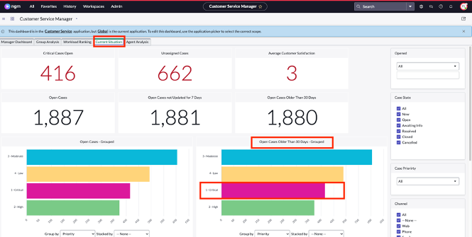

18.	You can now see the detailed list of all the critical cases that are older than 30 days. Let’s add a work note to these cases to get the agents’ attention. Of course, we won’t be doing this one by one! First, click on the check box as shown below:
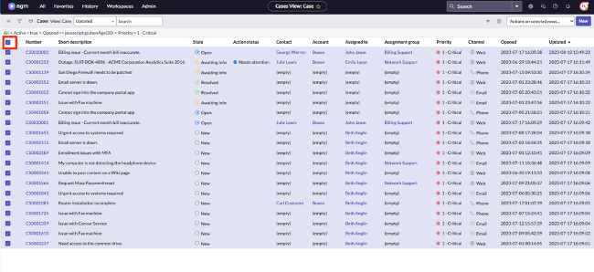
:::tip
You could also select cases individually by clicking on the checkboxes beside the case numbers
:::

19.	Right click beside the Number column and click on **Update Selected**
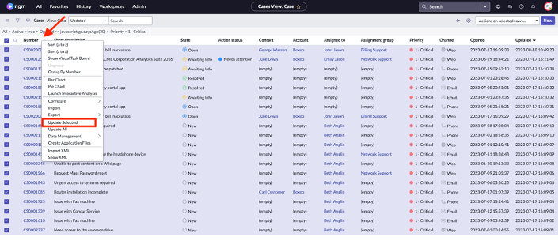

20.	On the form type: **Please update these ASAP!** to the **Work Notes** field and click **Update**.
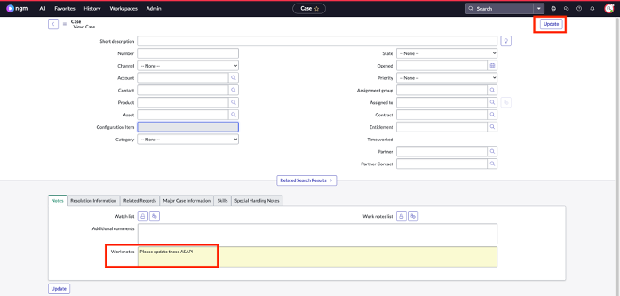

**Congratulations!** Fred was able to understand service trends, get a handle of current state and agent efficiency. Finally, act on critical cases with a single button!