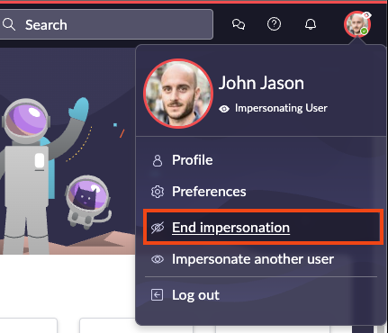
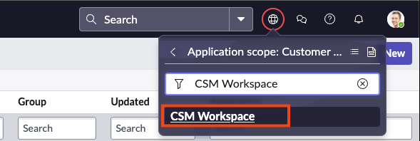
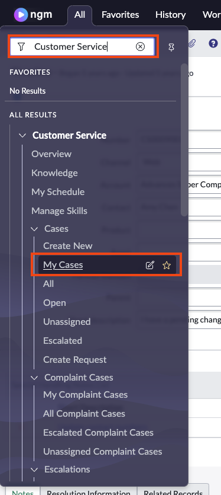
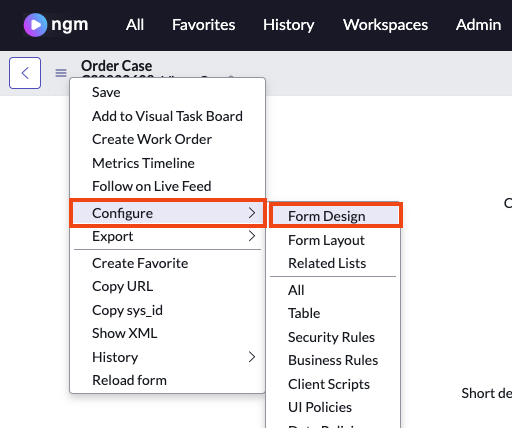
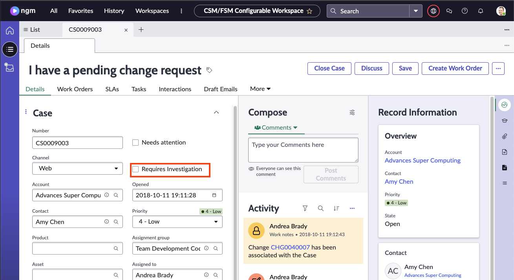

# Configure Customer Service Agent Experience - Case

1. First, end any impersonation you may have set in a previous lab.

2. Change your **Application scope** by clicking on the globe icon in the top right of the screen and choosing **CSM Workspace** from the list
   

   
3. Then in the Filter Navigator, enter **Customer Service** and choose **My Cases** under **Cases**

4. Open case number **CS0009003** by clicking on the case number

5. Click on the hamburger icon and choose **Configure** > **Form Design** from the list

   
6. In **Form Designer**, change the view (second dropdown) to **Workspace**.
   

7.  Find the **Requires Investigation** field using the filter on the **Fields** tab
    

   
8. Drag and drop the field under **Needs attention** in the right column

9.  Click **Save**

10. To test the new configuration, open the CSM/FSM Configurable Workspace, open a case and see the new field

Excellent! Now that we have our form configured, we can move on to configuring our Playbook to include Investigation process!