# Create meaningful experiences for your application users

1. First, we need to pick the right user. Click the user profile picture and select “End impersonation” this will take us to admin view where Andy can make his changes.

2.	Now let’s update the process. Go to **All** and type Process automation. Select **Process Automation Designer**.
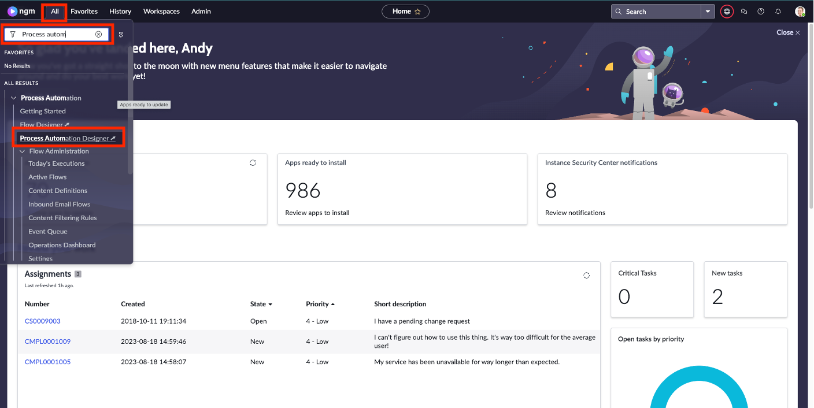

3.	Click on **Complaint Playbook** that has “Published” status.

:::info
In real life you would use the one in **Draft** status to try and test changes before publishing
:::

4.	Observe the lanes and tasks that were previously presented in the complaint case. This is the out of the box process that we will edit to include the investigation. 

5.	Click on the **three-dot icon** beside Research and select **Add lane after**.

6.	Type **Investigation** under Label and click **Save**.
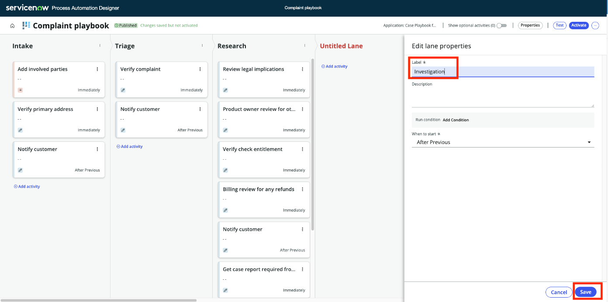

7.	Under Investigation Lane, click on **Add activity**. Select **User Form**.
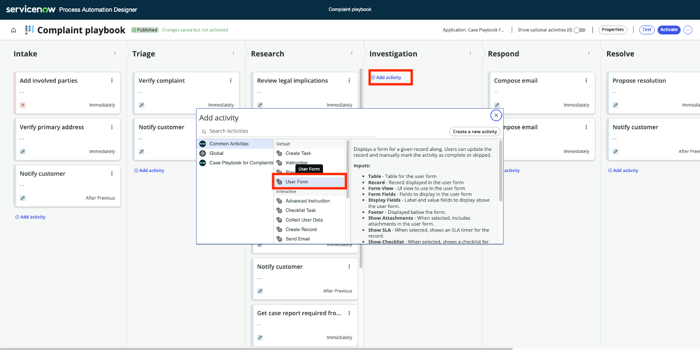

8.	Click on the **Automation** tab

9.	Click on the **data pill icon** beside Record. Then click on the arrow beside **Trigger Complaint Case**. Select **Complaint Case Record**

:::info
This allows the process dynamically pull data from the current complaint record that the user is on
:::

10.	Type **padinvestigation** to the Form View field. Click **Save**

:::info
Making this change allows the user to see the investigation required field at the right step of the overall process.
**padinvestigation** is a form view that we have in this instance. The form view may be named differently.
:::

11.	Now we will allow the users to create a task for the legal team. Click on **Add activity** under the **Investigation** Lane. Then select **Create Record**

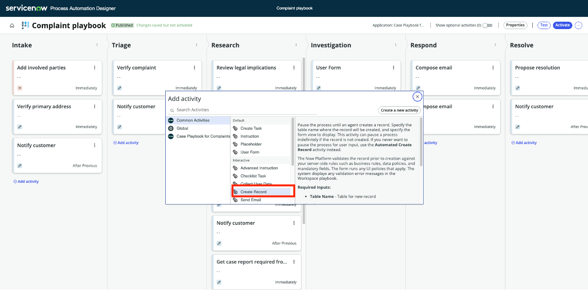

12.	Type **Create Task for Legal Team** to the Label field
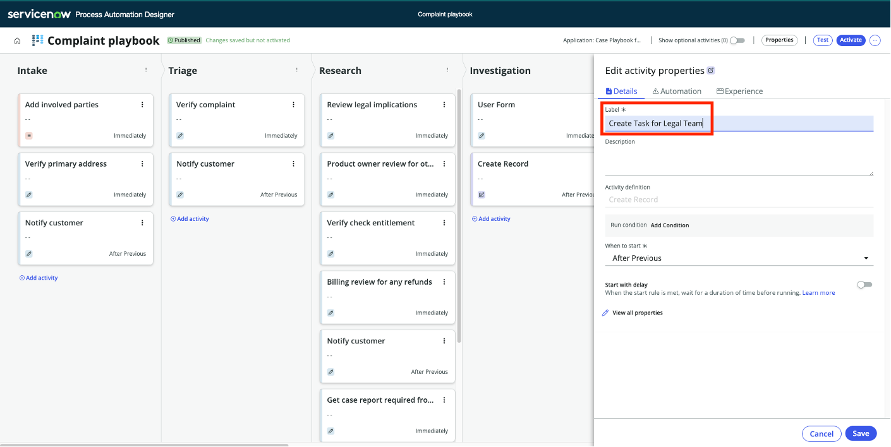

13.	Click on **Automation** and then type **sn_customerservice_task** to the Table field. Select Task that pops up in the dropdown as shown below:
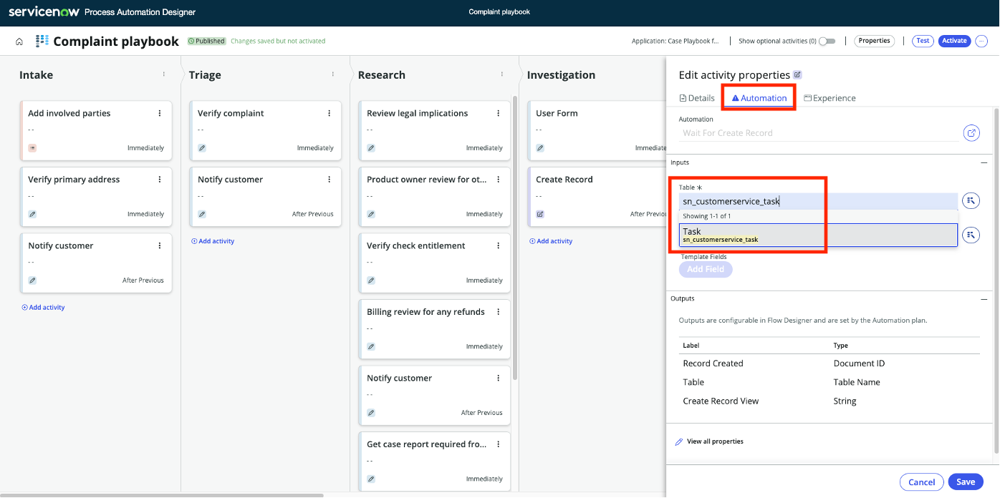
:::info
**sn_customerservice_task** is the system name for the Customer Service Task table. You can assign different types of tasks to cases.
:::

14.	Type **task** under create record view
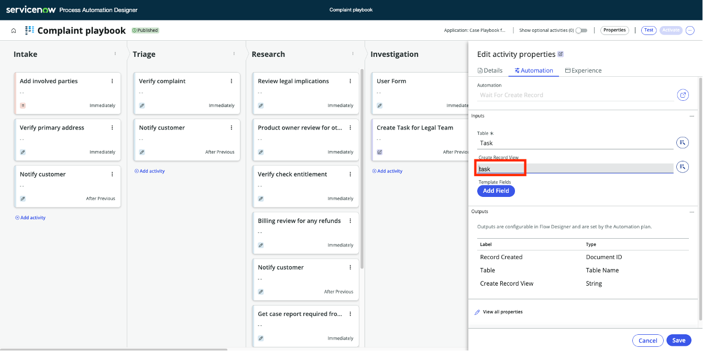

15.	**Stay where you are.** Now we want to add more automation! We will define the parent record and the assignment group. Click on **Add Field**
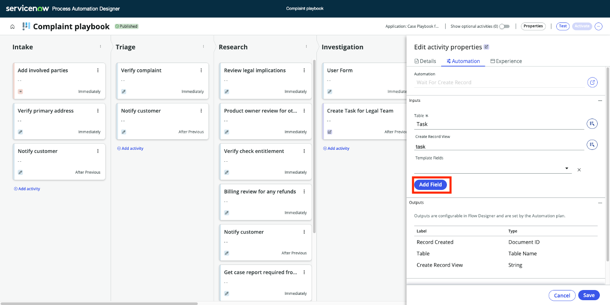

16.	Click on the **Template Fields**, search and select **Parent**
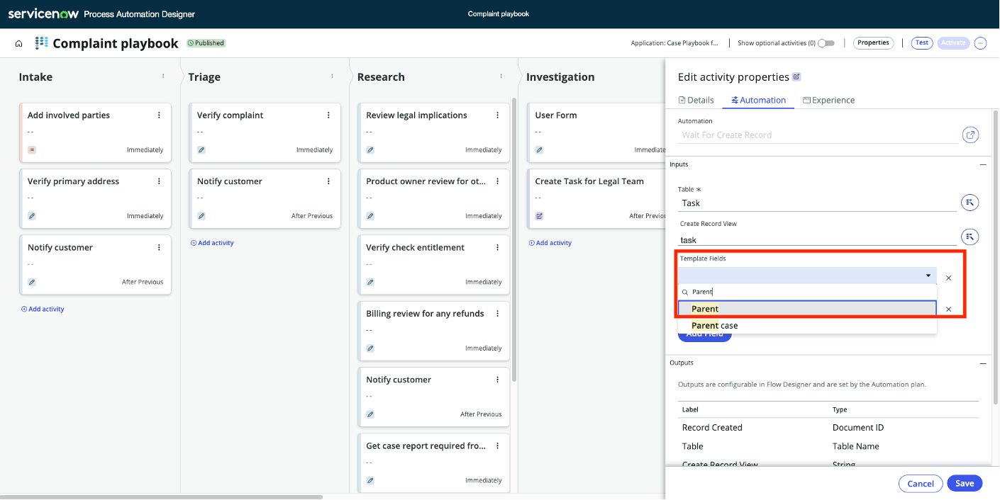

17.	Click on the **data pill** icon, as shown below:
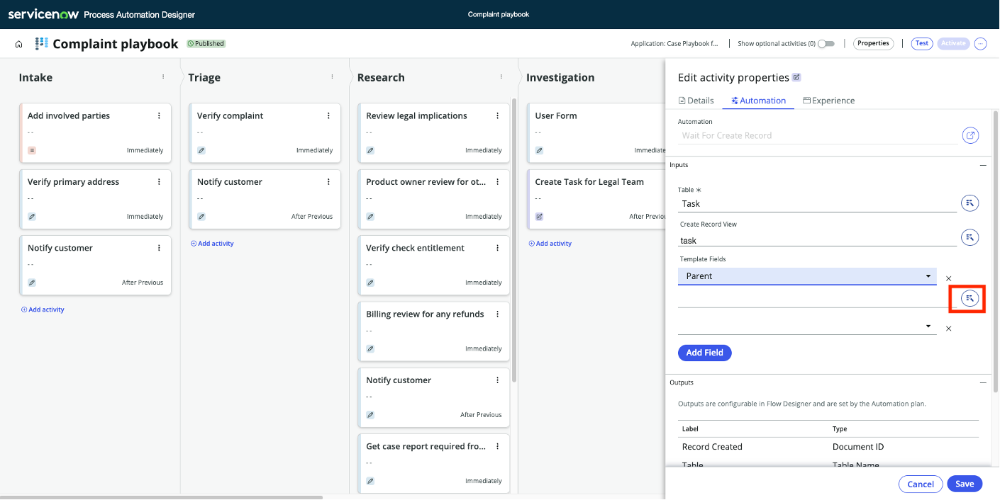

18.	Click on the little arrow beside **Trigger - Complaint Case**

19.	Click on the **Complaint Case Record**. This way we dynamically relate the legal team’s task to the complaint record. No manual effort will be required!
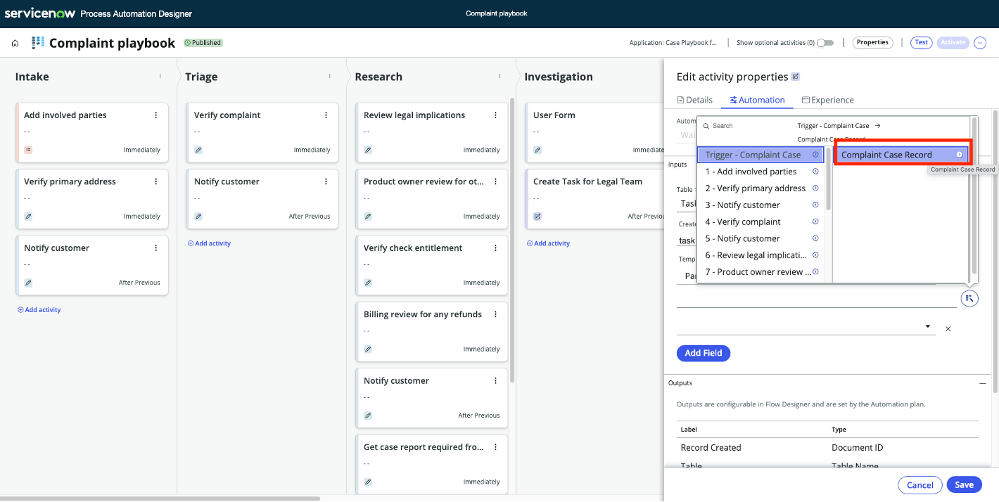

20.	Stay where you are. Now, we will add one more automation. We want to set the assignment group to be Legal Team. Click on **Add Field**
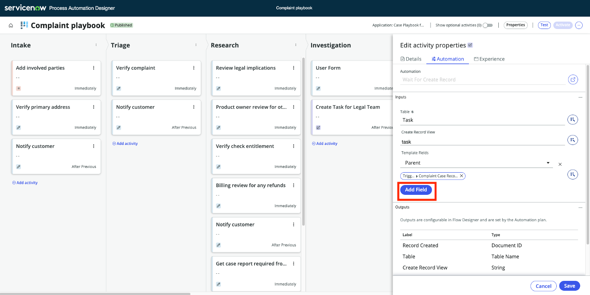

21.	Click on the field that popped up, search and select **Assignment Group**
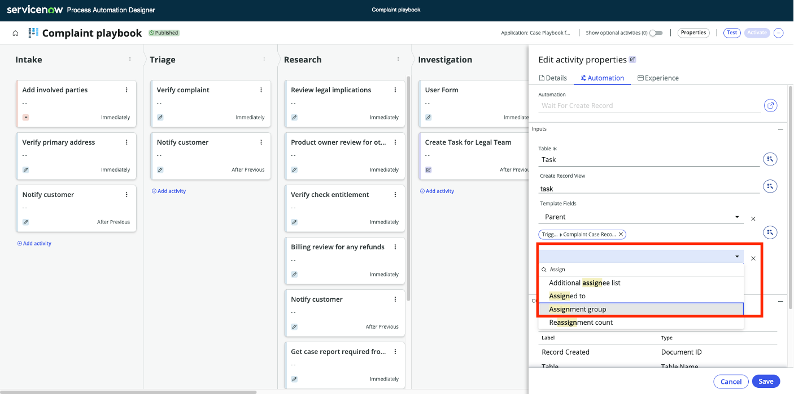

22.	Click on the field that is right below **Assignment Group**, search and select **Legal Support**
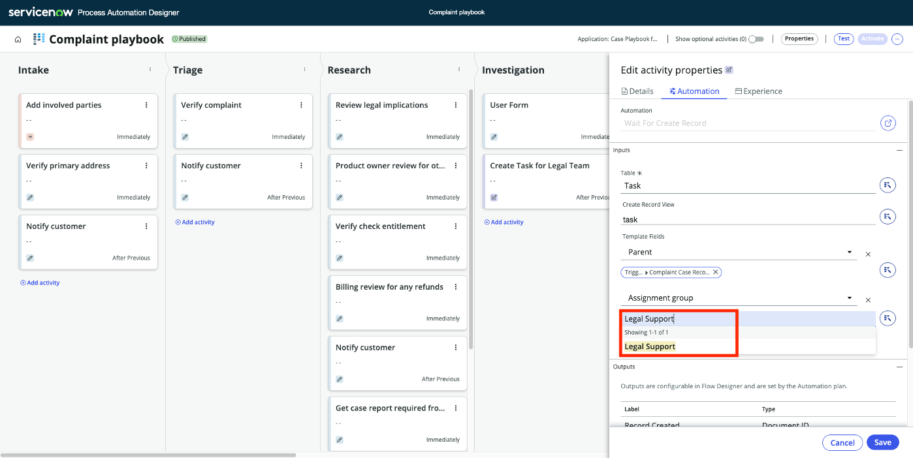

23.	Click Save.
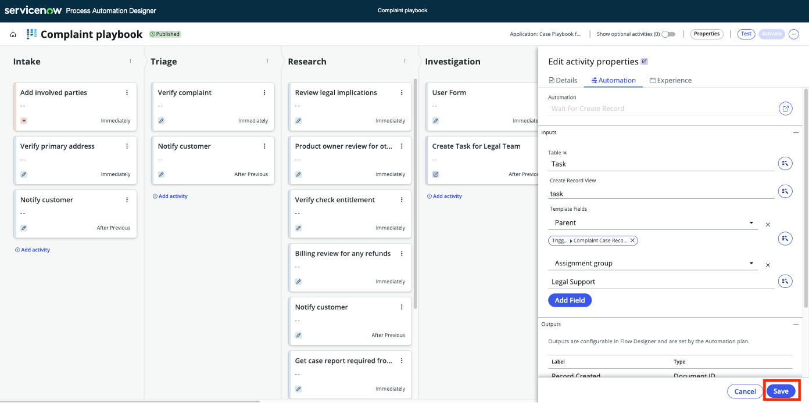

24.	Finally, click on “Activate”. This will activate the new process. It’ll be applied to new complaints created going forward
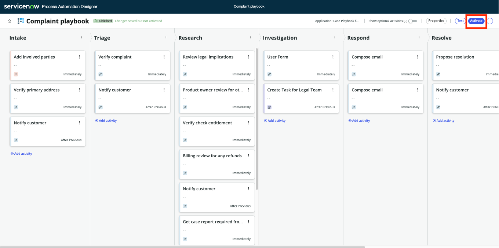

**Great job!** You updated the process so that the agents can now flag records for investigation and loop in the Legal Support team. Now let’s see this on action! To see the new complaint process, we will create a new complaint record.

