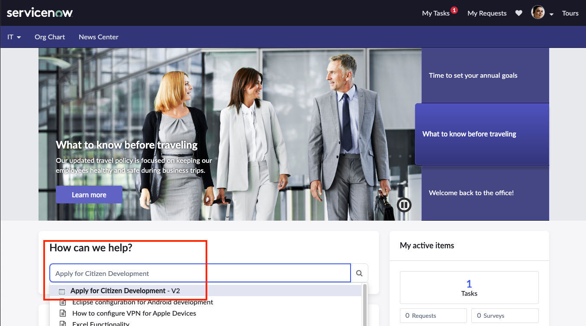
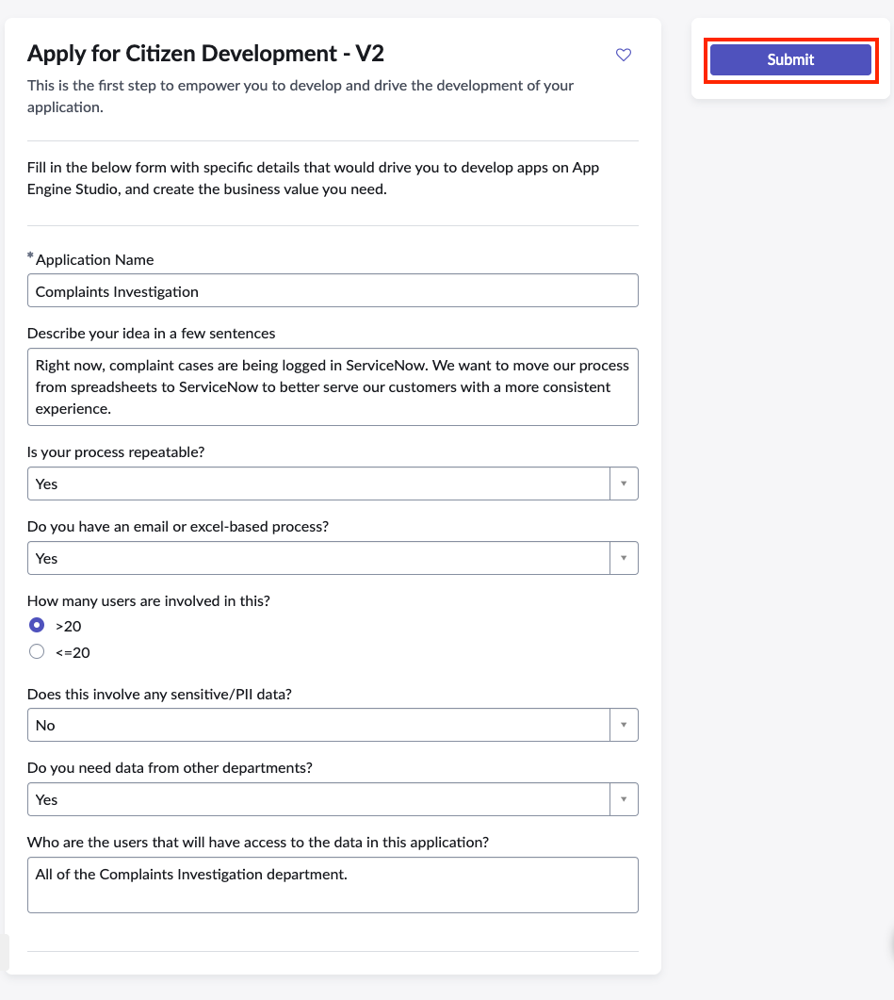
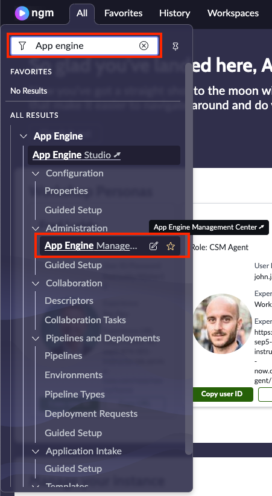
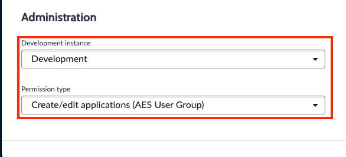
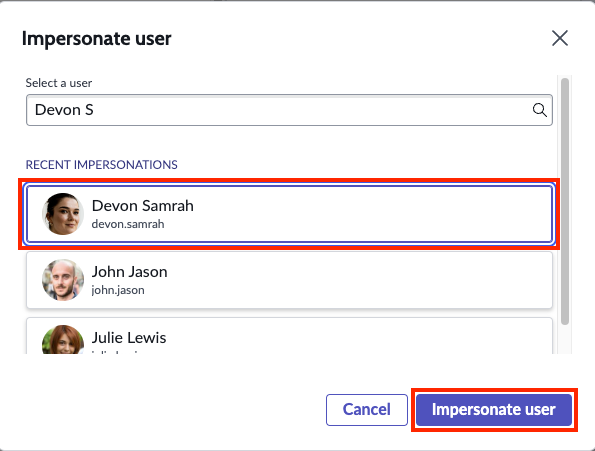

Governance plays a key role in the success of any citizen development program. Our use case is no exception. Before Devon can build her application, she needs to request the access from the IT team. She will create a new request on the Employee Center portal and Andy, our platform administrator will review and provide his approval. 

NOTE: In a real world environment, notifications in the form or email, text, playform notifications would take place. In our lab environment we will simply rely on the switching of users to see and approve the requests.

1. To get started, navigate to the Employee Center portal and impersonate **Devon Samrah**. You can find the link to Employee Center on the landing page of your instance, but for quick reference - 

  [https://INSTANCENAME.lab.service-now.com/esc](https://INSTANCENAME.lab.service-now.com/esc) 

  (replacing INSTANCENAME with your personal lab instance)


2. Type **Apply for Citizen Development** in the **How can we help?** search box and then click on the **Apply for Citizen Development - V2** option that appears.



3. Complete the form with the following fields:

 ### Application Name: 
 ```
 Complaints Investigation
 ```

 ### Describe your idea in a few sentences:
 ```
 Right now, complaint cases are being logged in ServiceNow. We want to move our process from spreadsheets to ServiceNow to better serve our customers with a more consistent experience.
 ```

 ### Does this involve any sensitive/PII data?
 ```
 No
 ```

 ### Who are the users that will have access to the data in the application?
 ```
 All of the Complaints Investigation department including management.
 ``` 
 
  Once your form is complete, click **Submit**


4. *With our request submitted, we can now switch back to our platform admin persona, Andy, to approve Devon's request.*
Click on Devon's profile picture in the top right then click **End Impersonation**.


5. Now back on our platform landing page, click on **All** and search for **App Engine** in the filter nav. Choose **App Engine Mangement Center** from the options. AEMC loads in a new browser tab.



6. Here, Andy can see any new requests for applications, collaborations or application delployments. We see there is one new pending request to complete. Click on the **1** just above the work **Intake**.


7. We see there our request from Devon. Click on the number beginnging with **RITM** to view it

:::note
Your RITM number may vary from what is in the screenshot
:::


8. Next, we will specify the development environment and what access Devon will have as she is building her application. 

   Scroll to the bottom of the request and choose **Development** from **Development Instance** and **Create/edit applications (AES User Group)** from the **Permission type** field.



9. Once complete, save the reqest record. Since we are operating in a lab environment and this is NOT a governance workshop, we've reconfigured Devon to have the access she needs without requiring a complete pipeline configuration. We can now move on to impersonating  Devon again and build our Complaints Investigation app.
Click on Andy's profile picture and the top right and click **Impersonate User**. Choose Devon Samrah from the list.


Click **Impersonate User** to complete the switch to Devon's persona.
   

Nice work.. you've just created the foundation of our Complaint Investigation app. Now let's move on to the next exercise, creating our data model.