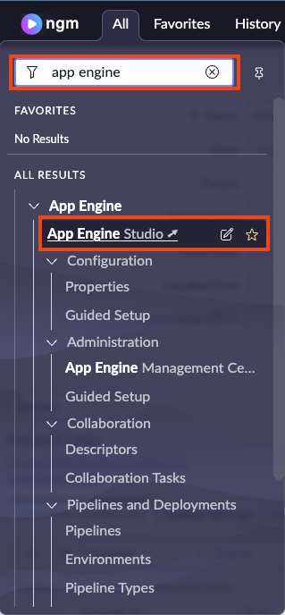
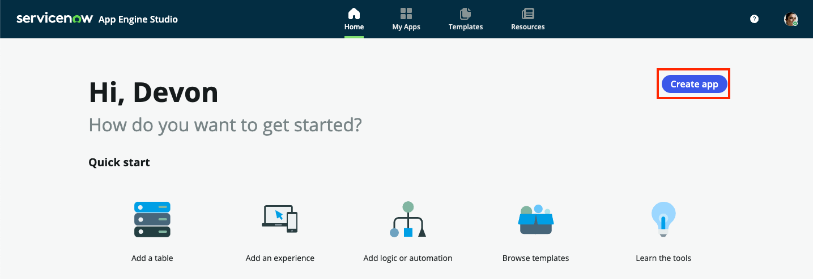
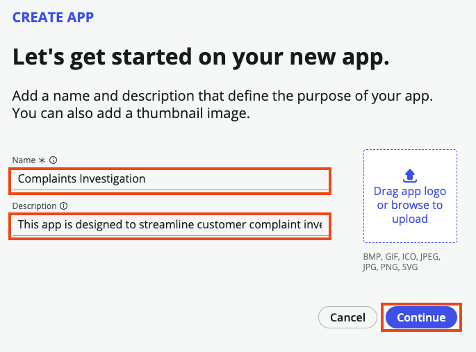
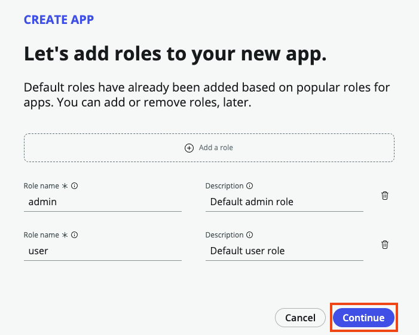
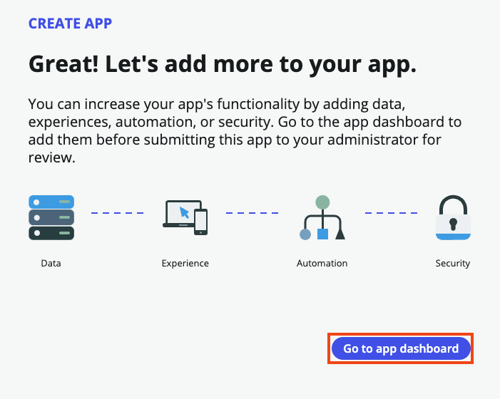

1. Type **app engine studio** in the **Filter Navigator** and then click on the **App Engine Studio** link. **App Engine Studio** will open in a new browser tab
    

2. Once App Engine Studio opens click the **Create app** button in the upper right of the screen.   
   NOTE: if you get a **Getting Started** message, you can close it.
    

3. Enter **Complaint Investigation** in the **Name** field. For **Description** use:
    This app is designed to streamline customer complaint investigations.
    

4. App Engine Studio will create default roles for **admin** and **user** of our application. Users assigned these roles will be members of the team responsible for investigating the complaints. Accept the default **admin** and **user** roles and select **Continue**.
    

5. Select the **Go to app dashboard** option once the app is created.
    

Nice work.. you've just created the foundation of our Complaint Investigation app. Now let's move on to the next exercise, creating our data model.