In this exercise will start building out the tables needed to support out application. We'll import a spreadsheet to quickly populate the table with existing data. This is a very common way customers are building tables in App Engine Studio for processes that are currently being administered in Excel and email.

Data can also be imported from other third-party sources like a database or web service/API.

1. On the app homepage, click on **+Add** next to **Data**.
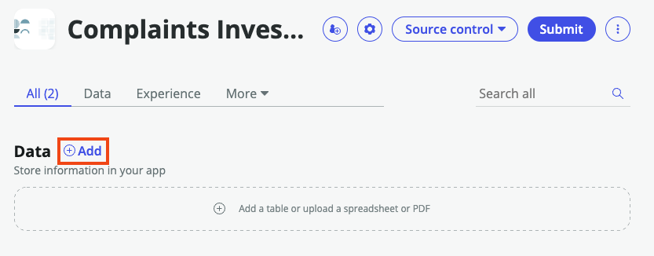

2. Select **Import a spreadsheet** and then the **Continue** on the next screen
    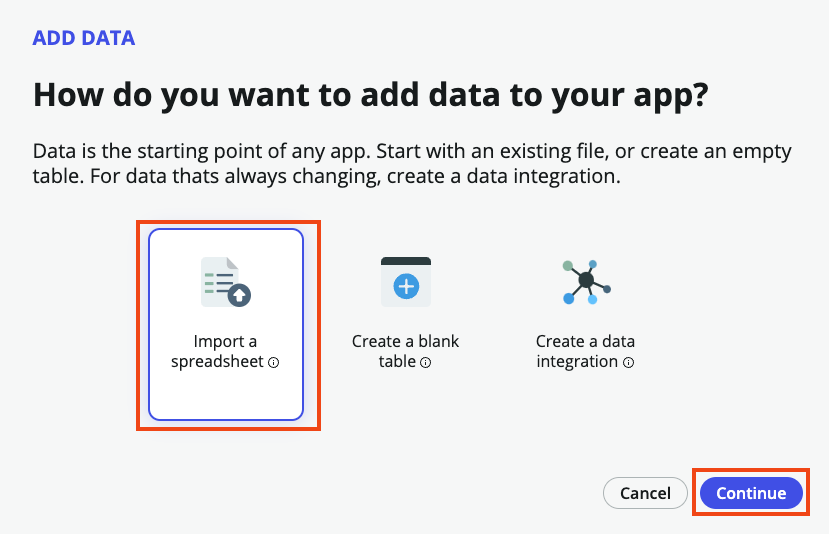

3. Click **Drag and drop or browse to upload spreadsheet**. 
Download this file: [ComplaintsInvestigationImport.xlsx](https://github.com/CreatorWorkflowsNow/creatorworkflowsnow.github.io/raw/source/labs/complaint/downloads/ComplaintsInvestigationImport.xlsx) 
and upload the file to the instance.
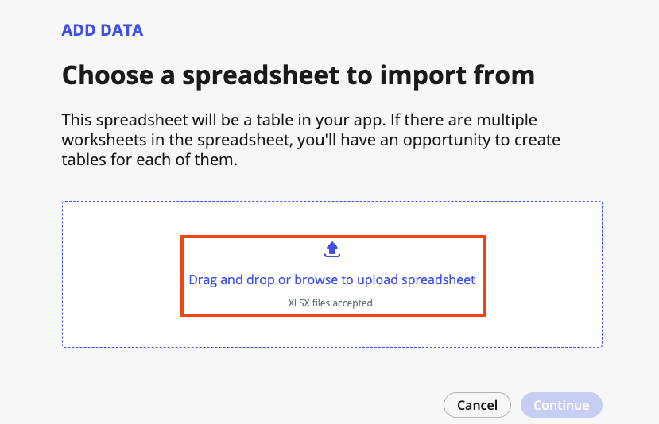

4. Check the **Import spreadsheet data** checkbox and click **Continue**
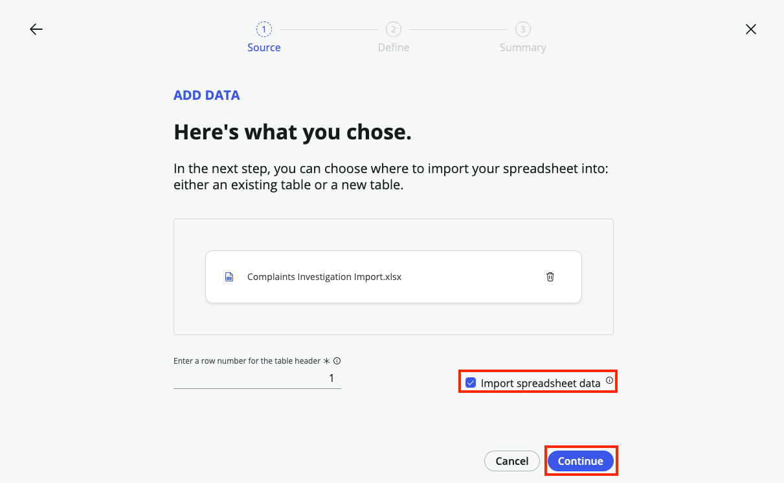

5. On the next screen, keep the default option of **A new table** and choose **Create from an extensible table** then click **Continue**
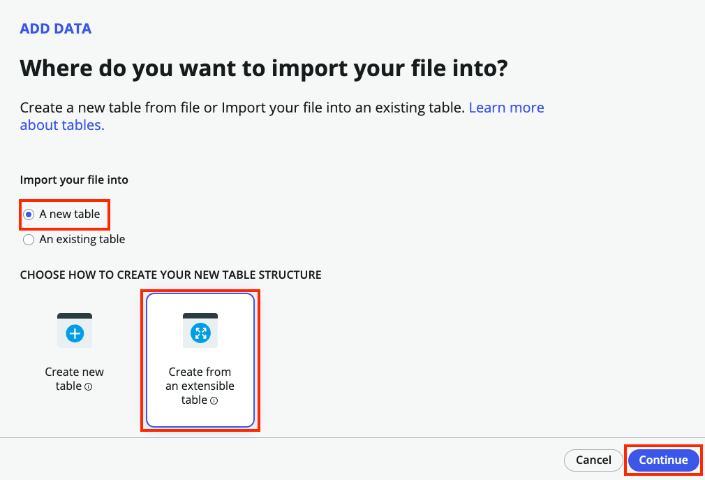

6. Search in the **Table** field for **Customer** and choose **Task** from the list. Click **Continue**
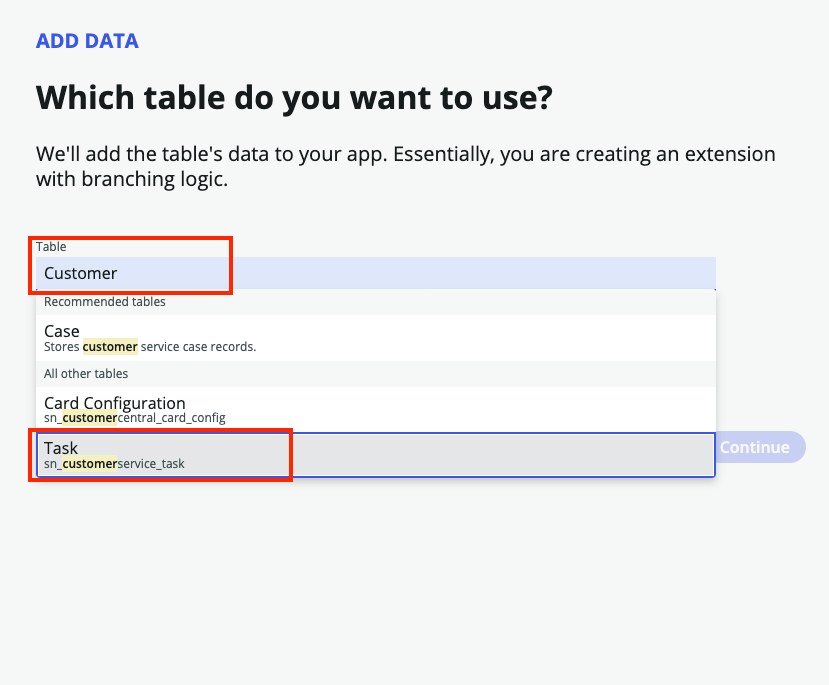

7. Set the **Table label** field to **Complaint Investigation**
 
 Select **Auto number**
 
 Set the **Prefix** field to **CMPLINV**
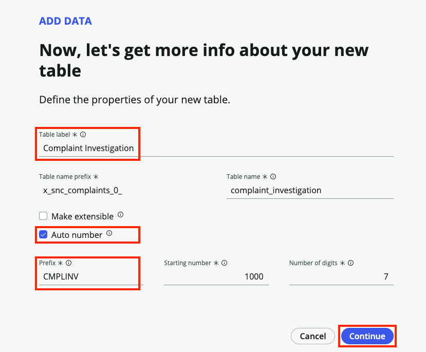
:::info
Setting the Prefix allows us to distinguish our tasks from records created that are also extended from the Customer Service Task table.
:::

8. The next step is to setup permission for the Dept Task table. Assign full permissions to the admin role by selecting **All**. Select the **Create**, **Read** and **Write** permissions for the user role. When finished, click **Continue**.
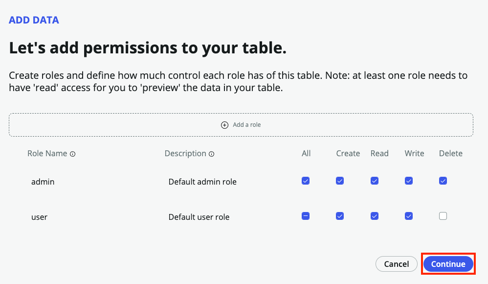

9. Now, we wait for the platform to create our table. Select **Continue** once the table is created to move on to mapping our imported data to the appropriate fields.
    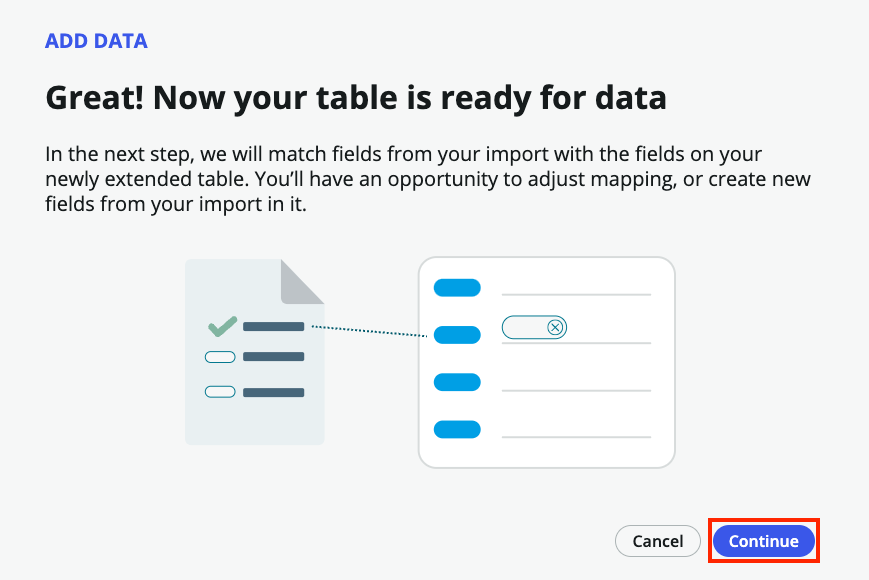

10. Once the screen loads, you can exit out of any guided tour popup that may appear initially. Looking at the right hand column, you'll notice the platform automatically mapped our fields for us! This is indicated by the wand icon next to the column name
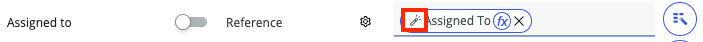

11. Scroll through the list to ensure all your fields are accounted for. You'll notice that **Group** is not associated with the **Assignment Group** field on our table. Drag and drop it from the left side to the right next to the **Assignment Group** field. 
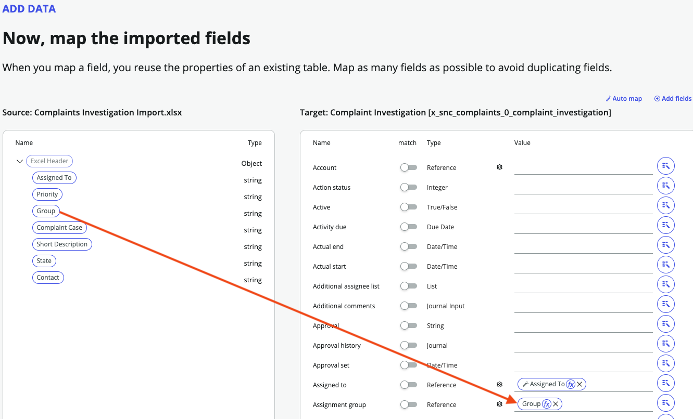

12. We also need to associate these existing complaint investigations with the cases they are related to. Scroll down until you see the **Parent** field on the right. Click the magic wand icon on the right of the field then the small arrow next to **Source** and choose the **Complaint Case** option from the menu.

:::info
This is referred to as 'dot-walking'.    
:::

13. Click **Continue**
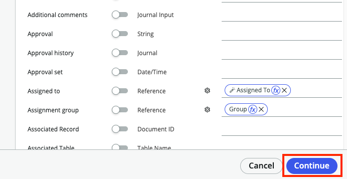

14. Click **Done** once the table has been created to return to the App Home.
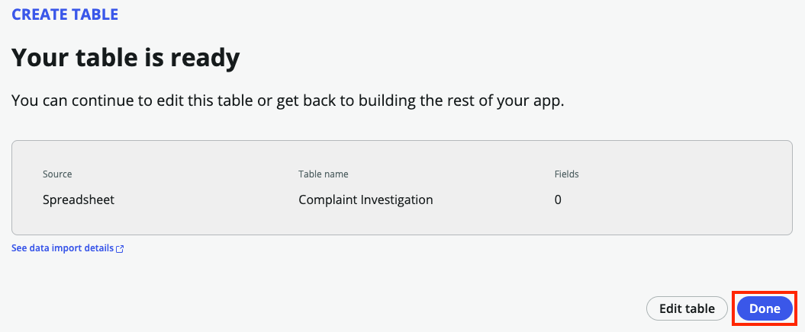

15. Let's check our table to make sure the data is mapped correctly. You should see our newly created **Complaints Investigation** table listed under **Data**. Click on the **Preview** link
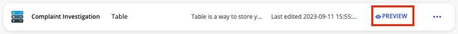

16. Your screen should look similar to the one below
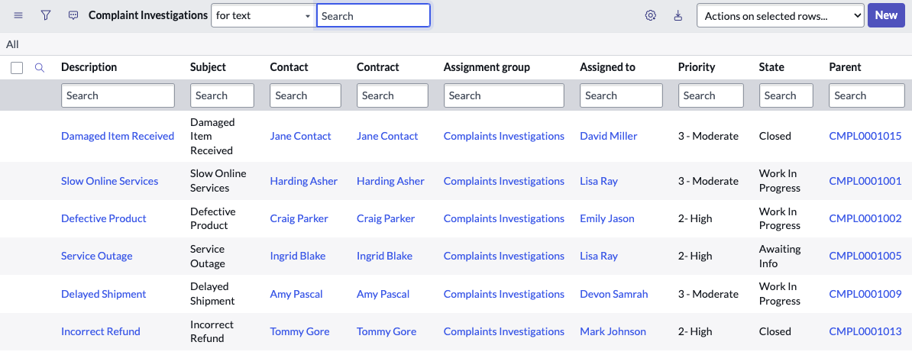
Once you've finished reviewing the data, close the window to return to App Engine Studio

17. Next, let's focus on the data we want to be shown on the screens when viewing these investigation records. In **App Engine Studio**, click on the table and click on **Forms** at the top of the screen to open **Form Builder**
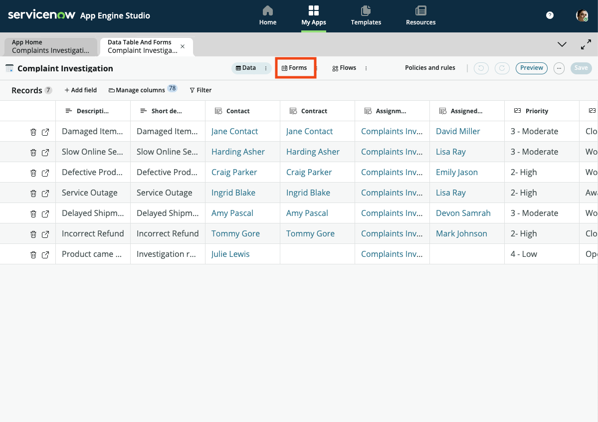

18. Forms can have many views, but for our lab today, we will focus on the **Workspace** view only. Click on the button that says **Default view** and choose the **Workspace** view from the list
:::note
Your view name(s) may vary from what is reflect in the screenshot but you should only have single view starting with **Workspce**
:::
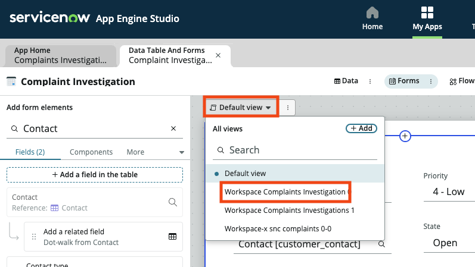

19. To make this form more useful for us, remove the **Configuration Item** field by hovering over the field and clicking on the **X** that appears
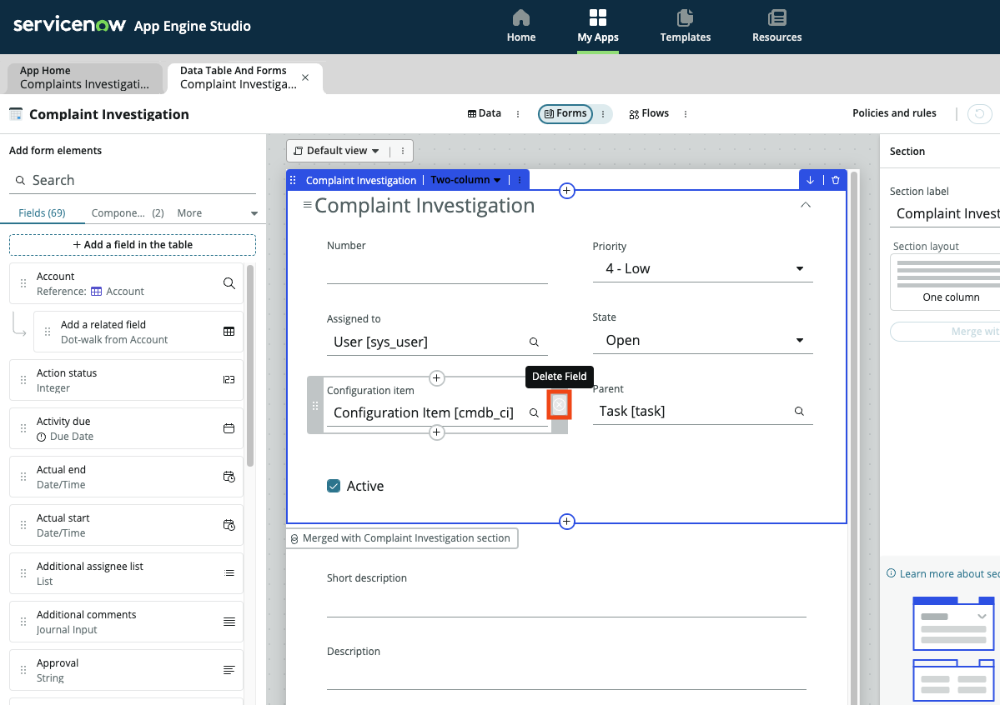

20. Now we'll add some fields that help us with our investigation process. On the **Add form elements** side bar, search for the **Assignment Group** field and drag/drop it on the form. Repeat the process for **Contact** and save your form once complete. Your form should look similar to below
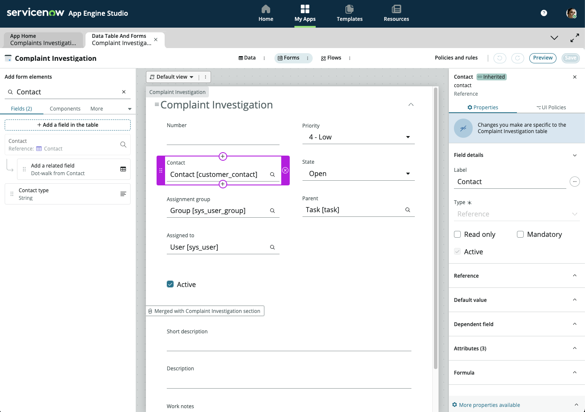

21. Let's also rename the **Parent** field so it is more meaningful for our process. Click on the **Parent** field and change the **Label** field in the right configuration section to say **Complaint Case** and click **Save**
:::info
This label change will only be reflected in our Complaint Investigation table and will not impact the rest of the platform.
:::
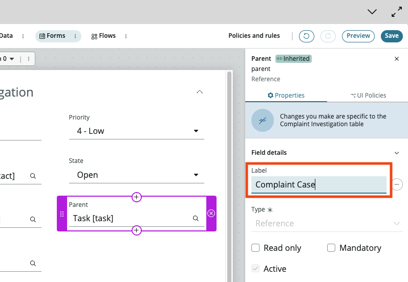

Excellent! Now that we have our legacy data in the plaform, let's look to see how we create our own Workspace to start managing these investigations using ServiceNow!