We've got our data, now we need to work on the experience for our investigations team. Similar to John Jason in the earlier lab, we'll configure our workspace to ensure we don't miss important investigations and provide our customers with the best customer experience.

1. On the app homepage, click on **+Add** next to **Experience**.
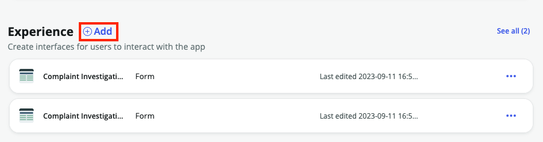

2. Select **Workspace** from the next screen and then **Begin**
    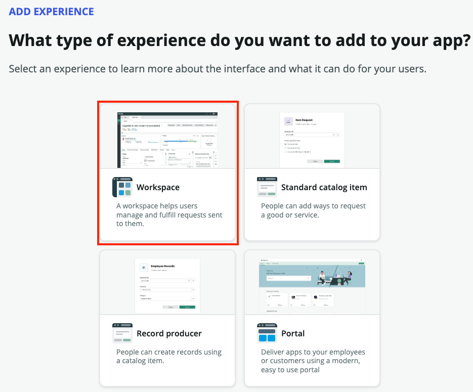
    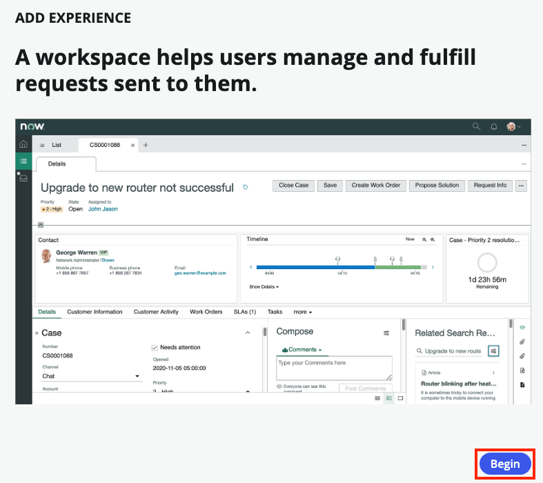

3. Leave everything as default on the next screen
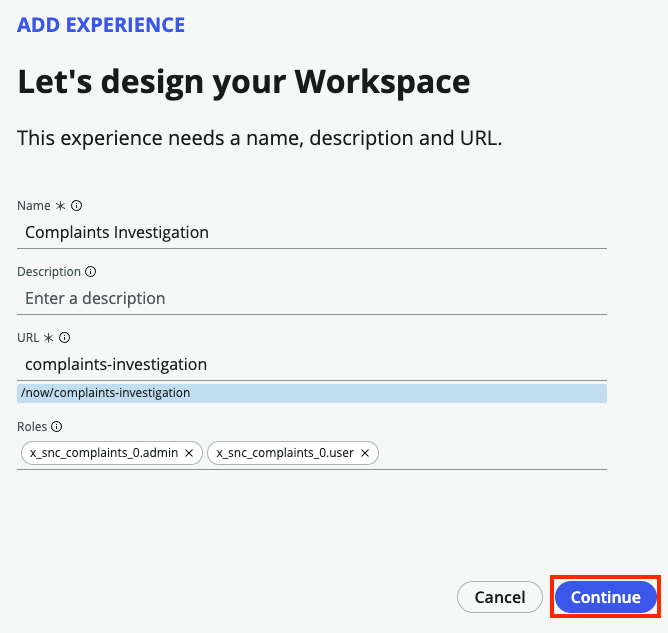

4. Ensure **Complaint Investigation** is listed as the **Primary table**. For **Secondary tables**, choose **Complaint Case** so we can see those on our workspace as well
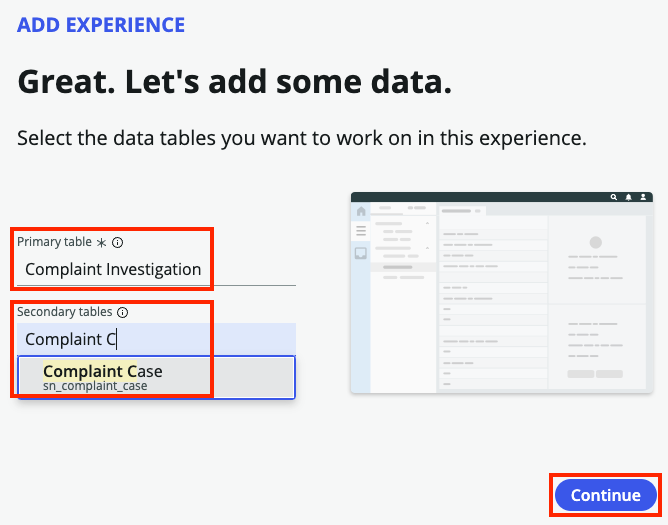

5. Once the Workspace has been completed, click **Done**
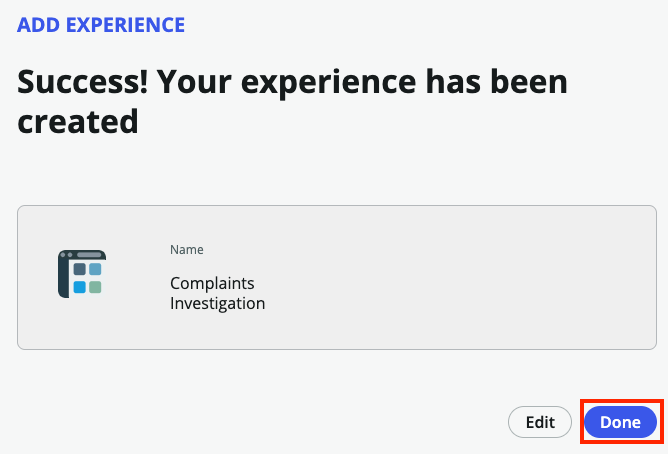

6. Back on our App Home page, click on **Preview** next to our new Complaints Investigation Workspace.
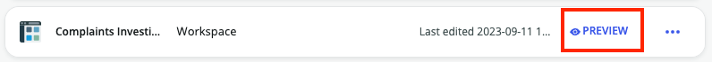

7. Since we uploaded our existing spreadsheet, you should see some existing records in our workspace. Your workspace should look similar to this one:
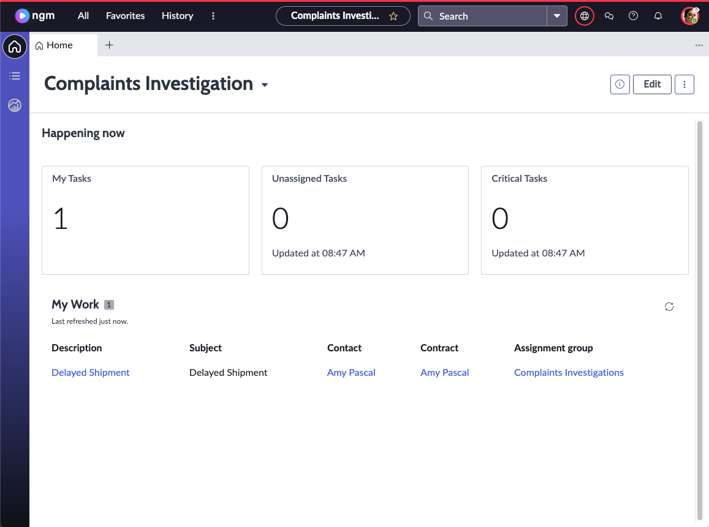

8. Let's use Workspace Builder to configure this workspace to our needs. Click **Edit** at the top of the screen
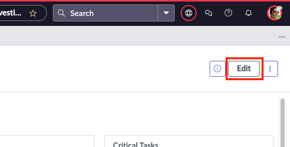

9. Click the **My Tasks** component then click the **Configure** button
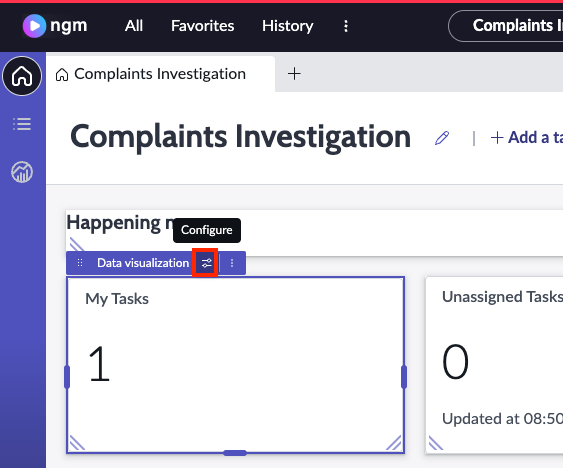

10. On the **Configuration** pane that appears, find the **Header and border** section and click the down arrow to expand it. Change the **Chart title** to **My Investigations** then click **Save**
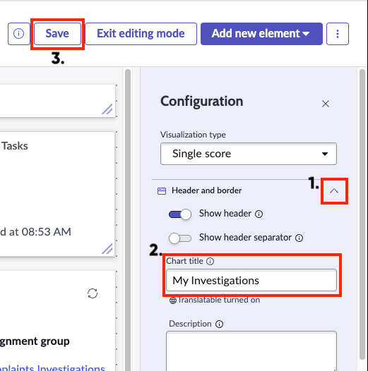

11. Repeat step 10 for the remaining widgets replacing the word Tasks with Investigations. Your workspace should look like similar to the below workspace when complete.
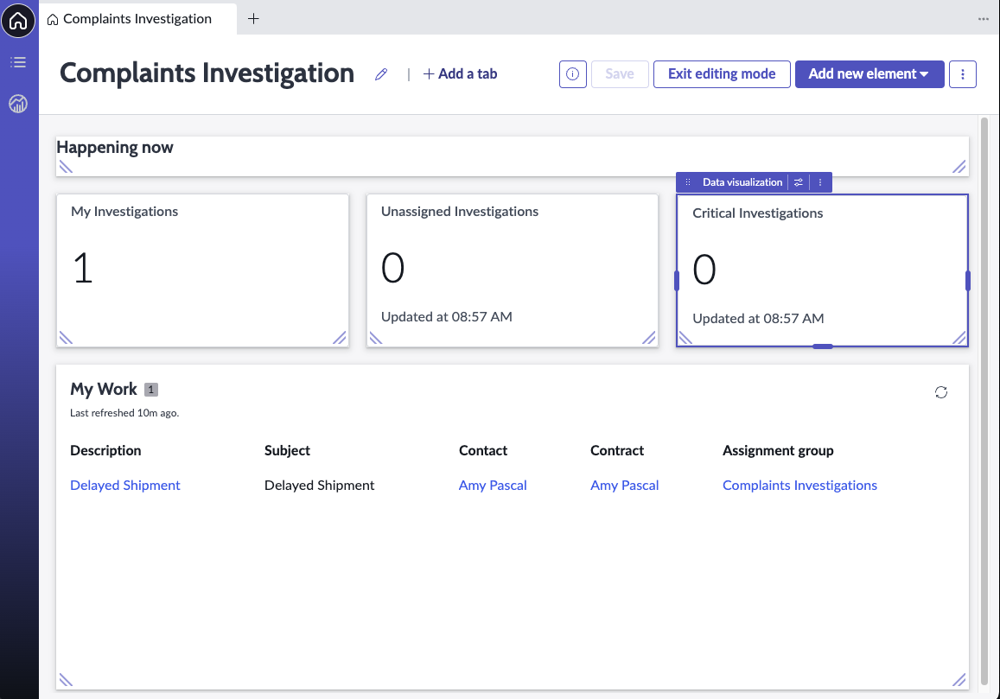
:::warning
Before we move on **SAVE YOUR WORK**!
:::

12. Next, let's add a new Data Visualization widget to our workspace so we have some visiability into the overall landscape of Complaints Investigations. Click on **Add new element** at the top and choose **Data visualization**
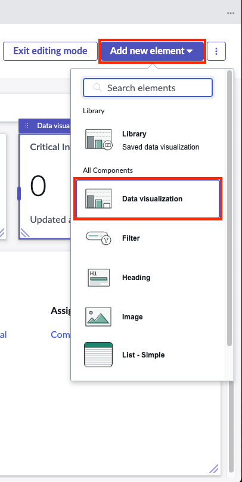

