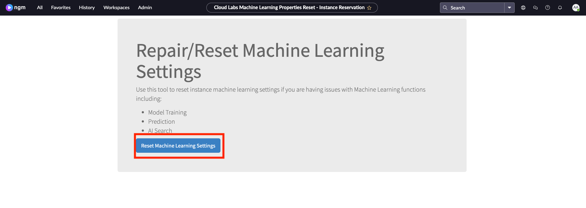

# Setting up AI Search

:::info
**The steps we will follow to "request" AI Search is only valid for the lab instances. In a sub-prod instance or prod instance you would follow a different step to "request" AI Search. All the subsequent steps for setting up the AI Search are the same.**
:::

1. Log in to the student lab instance. This is the screen you'll see:

2. Now, we need to sign in as **aislab.admin**. First, copy the URL on your current browser. 

3.  If you are using Chrome, open a New Incognito Window on your browser and paste the URL there.
    
    If you are using FireFox, open a New Private Window and paste the URL there.
    

3. Login:

    |Field | Value 
    |---|---
    |**User name** | aislab.admin
    |**Password**| aislab.admin
    
    Click **Log in**
    

4. Click on **All** and then click on **Repair Machine Learning Settings**.
 

5. Click on **Reset Machine Learning Settings**.

:::note
This may take up to 90 seconds. Please wait until this is completed.
:::

6. Now go back to your previous browser. Click on **All** and then type in **AI Search Status**, select **AI Search Status**

7. You should see this success screen:

:::note
On the same page you can see that there is a link to "Guided Setup". We won't go through this today but it's a tool to help you set this up for the first time in your organization.
:::

**Congratulations!** You completed the first step of the lab. Let's continue with configuring and fine tuning AI Search