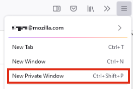
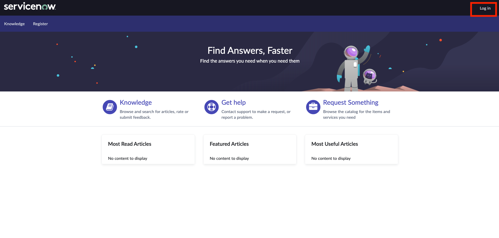
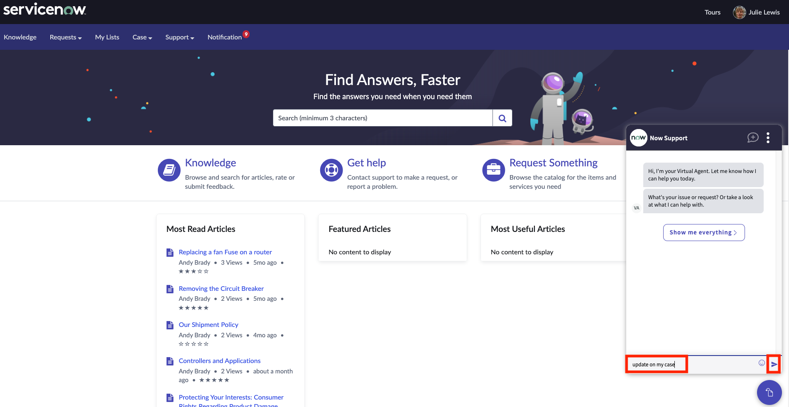
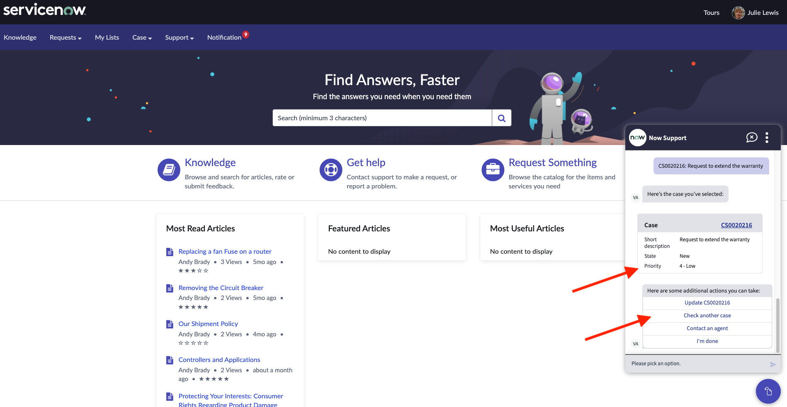
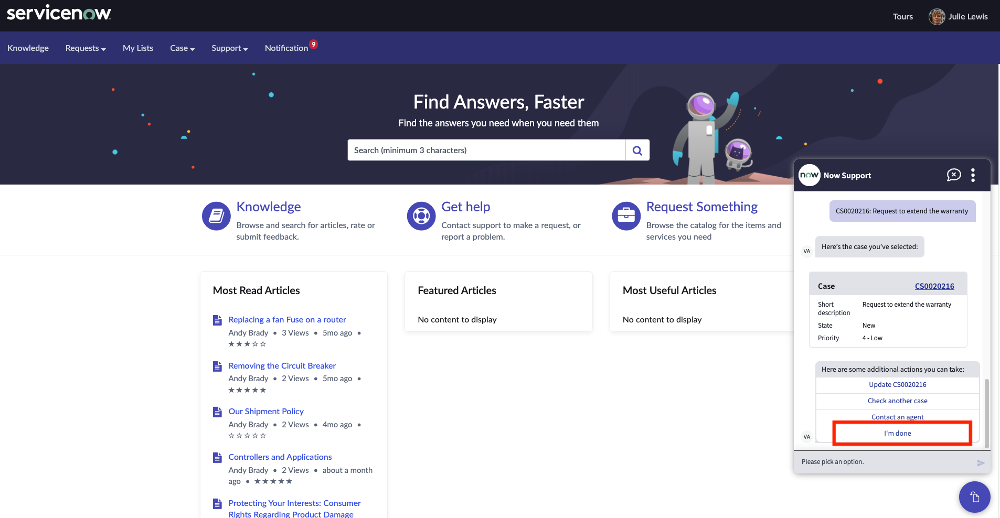

id: oob
title: "Out of the Box"
hide_table_of_contents: true
pagination_label: "Out of the Box"
sidebar_label: "Out of the Box"
draft: false
---

id: oob
title: "Out of the Box"
hide_table_of_contents: true
pagination_label: "Out of the Box"
sidebar_label: "Out of the Box"
draft: false
---

# Experience the out of the box virtual agent before configuring it

1. Log in to the student lab instance.

2. We need to login as Julie Lewis. First, copy the portion of the instace url that ends with INSTANCENAME.com

3. Then, we'll need to open a new browser session to login to the customer portal as Julie.
If you are using Chrome, open a New Incognito Window on your browser.

If you are using FireFox, open a New Private Window.

4. On the incognito browser, paste the URL and add **/csm** to the URL. This is the customer portal URL that we need to go to.

5. On the customer portal, click **Log in**. 

6. Enter:
 |Field | Value 
 |---|---
 |**User name** | julie.lewis
 |**Password**| Portal1!
 Click **Log in**
 

 7. This is the out of the box customer portal, including the out of the box virtual agent. Click on the **Virtual Agent logo**.

8. For this exercise, we will leverage one of the out of the box flows, checking case status. Type **update on my case** to the virtual agent.

<em>Note that, you could use a different expression such as "check case status" or "who is working on my case". Virtual  Agent is AI enabled from the get go and can understand various utterances to best help your customers.</em>

9. Pick the **third case** on the list that has the title "Request to extend the warranty". Observe that you can see the status, update the case if you need to or get connected to a live agent.

10. Click on **I'm done**.

11. Virtual Agent is only one facets of omnichannel support. Click on the **three dot icon** on the Virtual Agent to see other channel options provided, such as live agent, phone call or email.

**Congratulations** You walked in the shoes of a customer and discovered one of the out of the box virtual agent capabilities.

