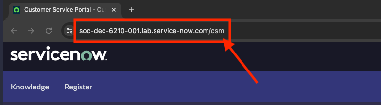

1. Navigate to **Workspaces > CSM/FSM Configurable Workspace**.

2. Click on the list module and then navigate to **Service Requests > All**.

3.	Click **New** to begin a new Service Request case. Click in the **Service** field and type *light

4.	Close the tab and do not save the record used for the lab verification.

Good job! You are done with the first lab verification!

