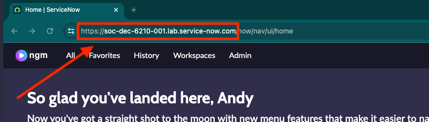

id: iterate
title: "Iterate"
hide_table_of_contents: true
pagination_label: "Iterate"
sidebar_label: "Iterate"
draft: false
---

# Creating a new Street Light Service Offering

1. Log in to the student lab instance.

2. First, we need to be in the right scope. Change the application scope from **Global** to **Public Sector Digital Services Core**.

3.	Navigate to All > Services Offered >All

4.	In the Services Offered list, click **New**. 

5.	On the form, fill in the fields.
      
 |Field | Value 
 |---|---
 |**Name** | Street lights
 |**Category**| Streets and Sidewalks 
 |**Sub-category** | Streets
 Click **Submit**.
 