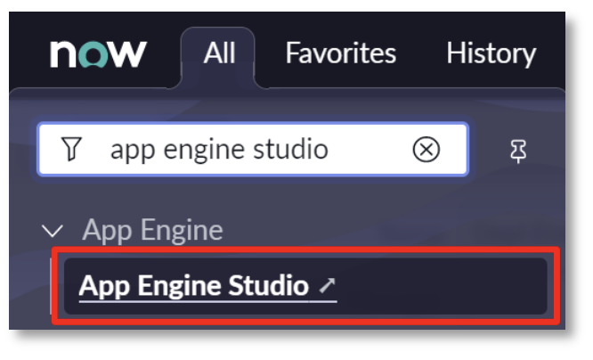
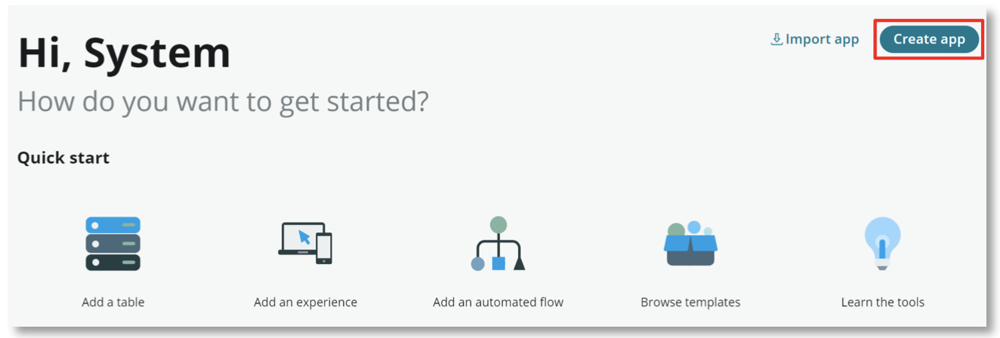
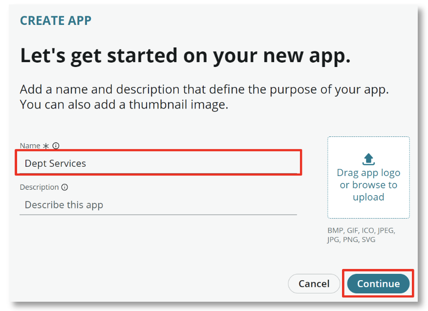
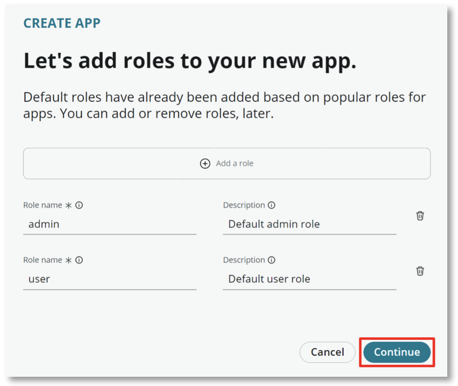
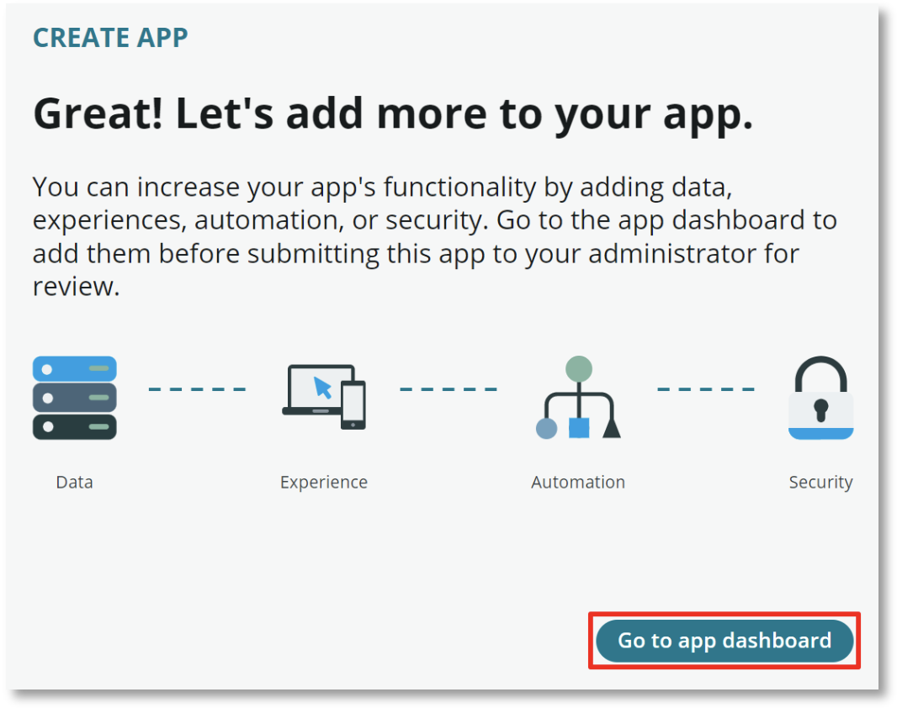

# Create Application in App Engine Studio

## Let's start

1. Type **app engine studio** in the **Filter Navigator** and then click on the **App Engine Studio** link. **App Engine Studio** will open in a new browser tab

2. Once App Engine Studio opens click the **Create app** button in the upper right of the screen

3. Enter **Dept Services** in the **Name** field and select **Continue**. One final reminder to replace **Dept**!

4. App Engine Studio will create default roles for **admins** and **users** of the Dept Services application. Users assigned these roles will be members of the department and will play a role in service fulfillment as fulfillers. Accept the default **admin** and **user** roles and select **Continue**.

5. Select the **Go to app dashboard** option once the app is created.

Nice work.. you've just created the foundation of your Departmental Services app. Now let's move on to the next exercise, creating the base department task table.

