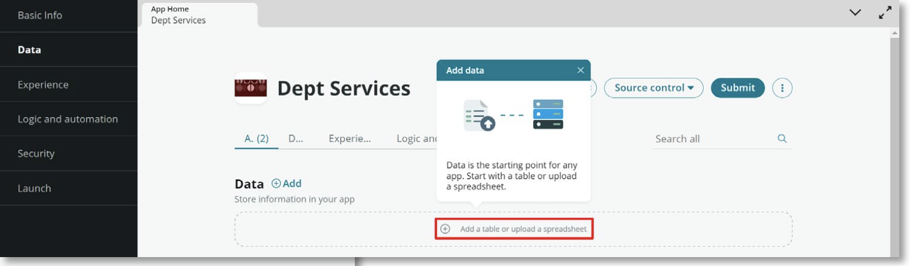
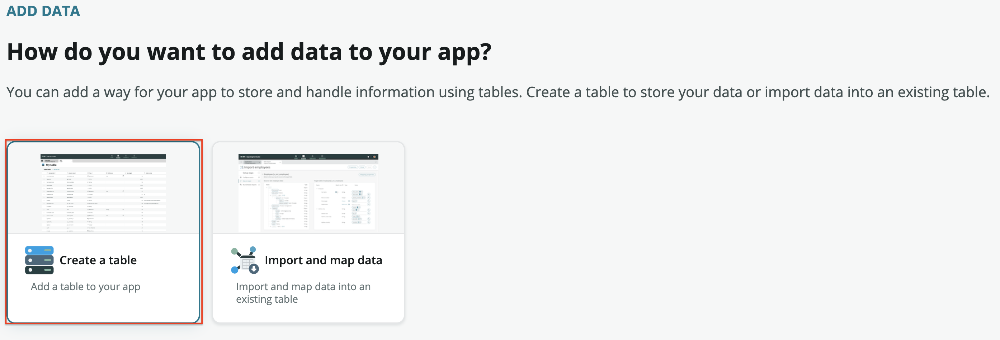
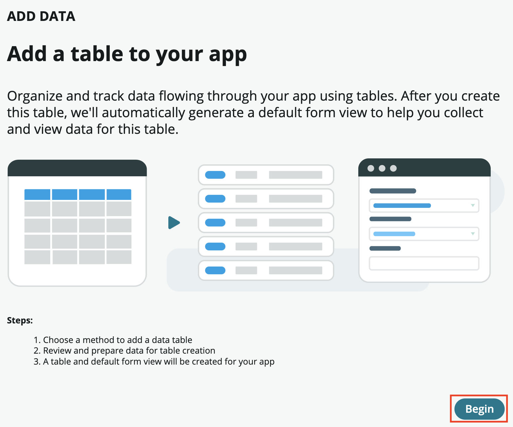
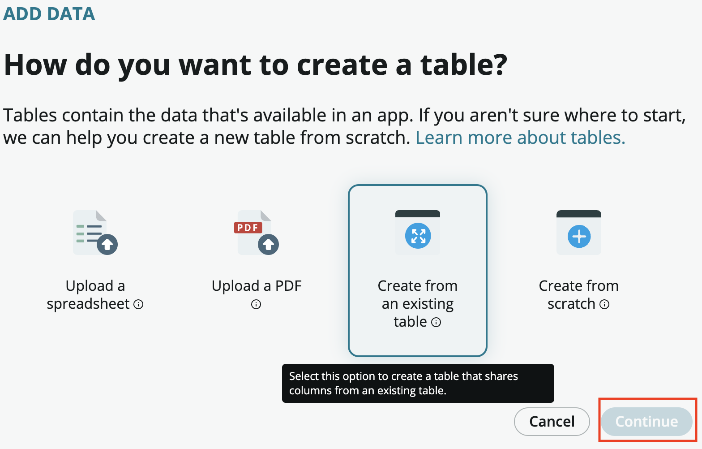
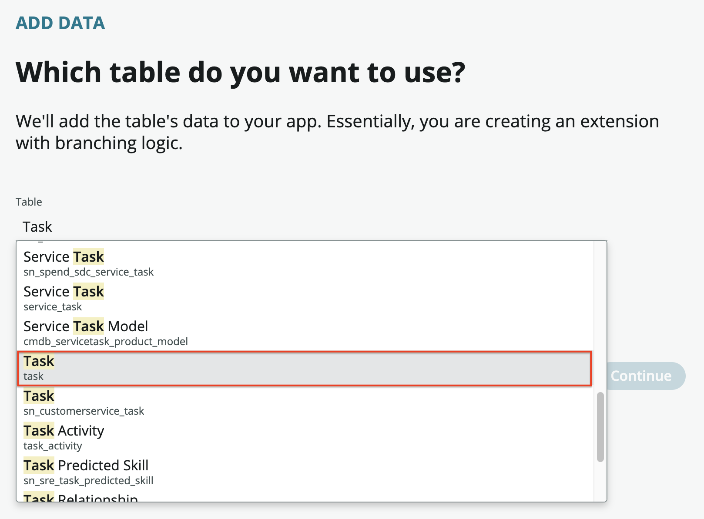
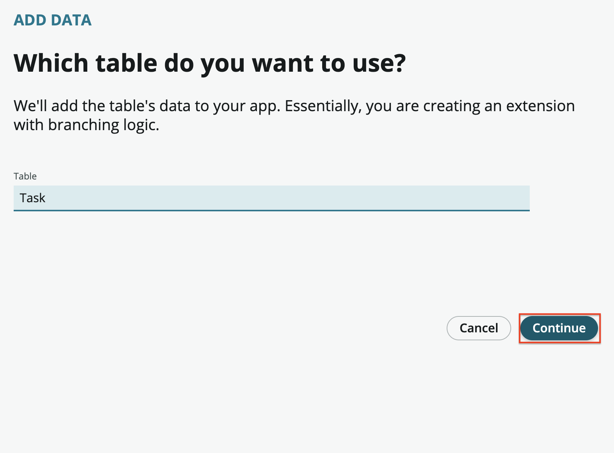
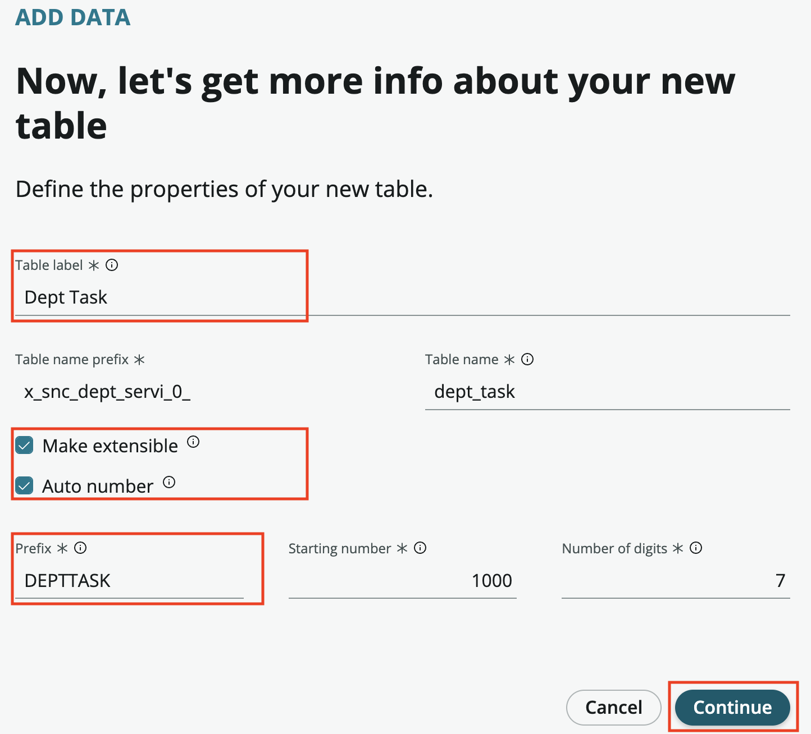
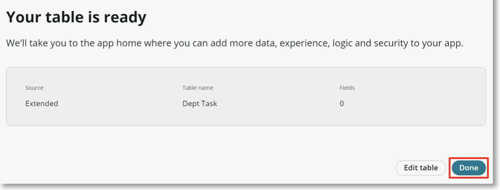

# Base Dept Task Table

## Let's start

1. Once the **App Home** tab opens, select **Add a table or upload a spreadsheet**

2. Select **Create a table** and then the **Begin** on the next screen
    

3. Select the **Create from an existing table** option and then **Continue**

4. Set the **Table** field to **Task** and select **Continue**

5. Set the **Table label** field to **Dept Task**\
    Select **Make extensible**\
    Select **Auto number**\
    Set the **Prefix** field to **DEPTTASK**

6. The next step is to setup permission for the Dept Task table. Assign full permissions to the admin role by selecting **All**. Select the **Create**, **Read** and **Write** permissions for the user role

 7. Select **Done** once the table is created to return to **App Home**
    

Excellent! In our next exercise we'll create our Request tables and add some department specific fields.

