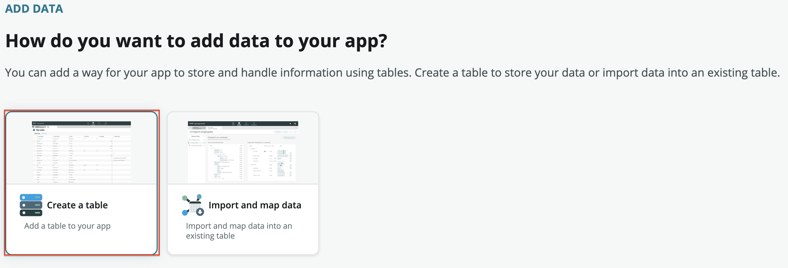
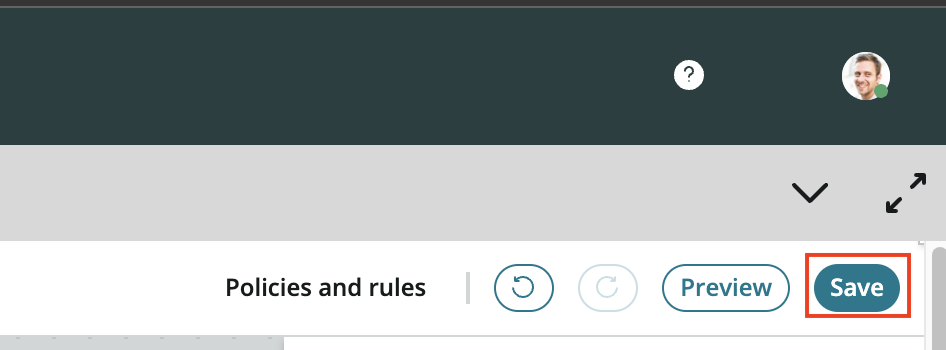

# Department Request Table

The Dept Request table will be used to store the service requests that the Dept provides. We'll follow the same steps we did from our last exercise exception this time we'll extend from our Dept Task table.

1. Choose the **(+) Add** option to add the Dept Request table

2. Select **Create a table** and then the **Begin** on the next screen
    

3. Select the **Create from an existing table** option and then **Continue**

3. This time choose the Dept Task table to extend rather than the Task table. By extending the Dept Task table we can create reports
    Select **Continue**

4. Set the **Table label** field to **Dept Request** 
    Select **Auto number**
    Set the **Prefix** field to **DEPTREQ**

5. Set the same permissions for the admin and user roles as last time
    

6. Select the **Edit Table** option once the Dept Request table is created

7. Select the **+ Add new field** option to add a field to the Dept Request table

8. Enter **Request Type** in the **Column label** cell

9. Enter **Choice** in the **Type** cell and select **Choice** option

10. Choose **Dropdown with –None--** for the **Choice Type**. For the **Choices**, you should enter different types of services that the department you chose might provide

    For example, a badging department might use the choices:

    - New Badge Request
    - Replacement Badge Request
    - Add Building Access
    - Remove Building Access
    
    Select **Done** when finished adding your choices and save your work.

11. Select the **Forms** link to edit the Dept Request form

12. The default form view contains fields from the Task table that will not be used in in this application. Hover over the **Configuration item** field in the form view. Select the **(X)** on the right of the field to remove it\

    Repeat for the **Active** checkbox\
    Repeat for the **Parent** field

13. Enter **request type** in the **Search** field located towards the upper left of the screen to find the **Request Type** Choice field you added earlier

14. Drag the **Request Type** field on the left to the form view underneath the **State** field

15. Enter **opened** in the **Search** field located towards the upper left of the. The **Opened** and **Opened by** fields will automatically be populated when a user submits a request. These are helpful to track who is submitting a request and when it was submitted

16. Enter **opened** in the **Search** field located towards the upper left of the. The **Opened** and **Opened by** fields will automatically be populated when a user submits a request. These are helpful to track who is submitting a request and when it was submitted

17. To finish editing our form, click **Save** in the top right of the screen
    

We're all done with the request table.. now we move on to the issue table!

