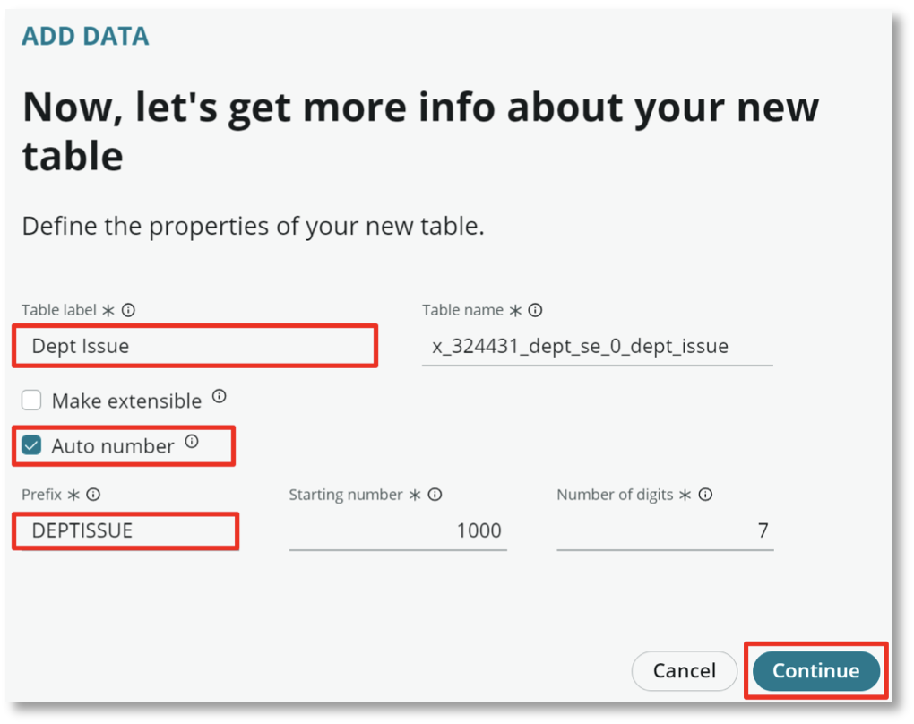
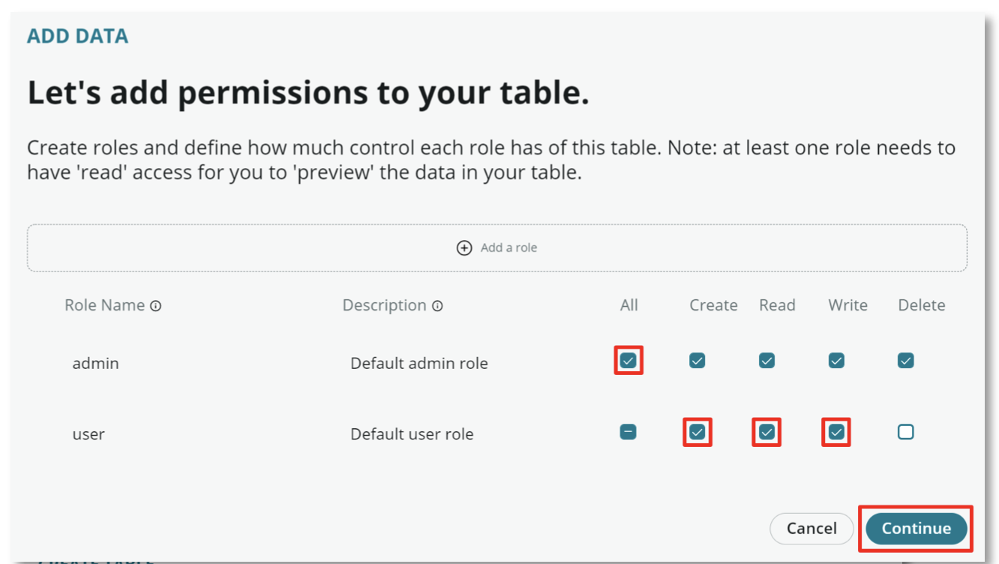
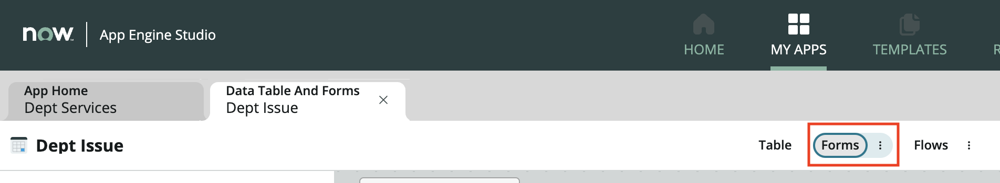
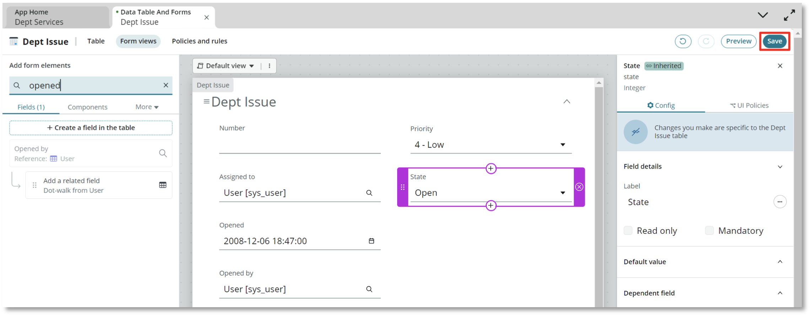
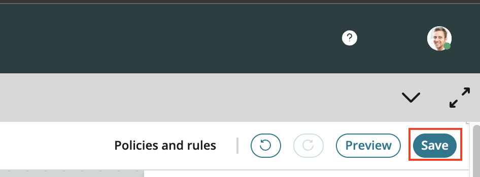

# Department Issue Table

The Dept Issue table will be used to allow users to submit issues encountered in service delivery. Using a custom table for departmental issues rather than overutilizing a platform table allows for:

- Simplified routing, assignment and ACLs
- Better custom reporting capabilities
- Scoped application security
- App-specific views and workspaces

1. Setup the Dept Issue table using the same initial steps as the Dept Request table. Make sure to extend Dept Task

    Set the **Table label** field to Dept Issue Select **Auto number**\
    Set the **Prefix** field to **DEPTISSUE**

2. Set the permissions the same way as the previous table

3. Select **Edit table** once the table has been created

4. Then select the **Forms** link to navigate to the form view for the Dept Issue Table

5. Remove the **Configuration item**, **Active** and **Parent** fields\
    Add the **Opened** and **Opened by** fields\

6. To finish up, click **Save** in the top right

