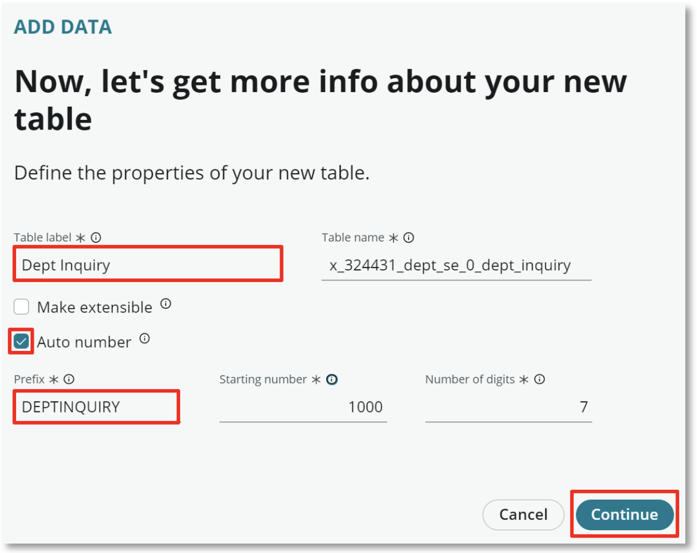

# Department Inquiry Table

You've probably gotten the hang of creating new tables at this point, so we'll skip all the screenshots and get right to the point.

1. Repeat the process for Dept Issue. The setup will only differ in the **Table label** and **Prefix** values

    Set the **Table label** field to **Dept Inquiry**\
    Select **Auto number**\
    Set the **Prefix** field to **DEPTINQUIRY**

2. Configure the permissions to match the Dept Issue table where the admin role has full permissions and the user role does not have **Delete** rights

3. Modify the Dept Inquiry form view to match the Dept Issue form view 
Remove the **Configuration item**, **Active** and **Parent** fields 
Add the **Opened** and **Opened by** fields

4. Don't forget to hit **Save**!

That's it! We're all done with tables so now we'll move on to creating our workspace in the next exercise.