# Configure Workspace Home Page

Workspaces are a great option for departments. Workspaces can be tailored specifically for department needs and can simplify interacting with the platform.

In this section, we will change the default homepage Data Visualizations to count the opened Requests, Issues, and Inquiries.

## Let's start

1. Select the **(+) Add** link by the **Experience** header
    Select **Workspace** for the type of experience on the next screen

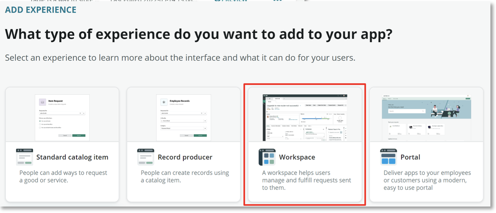

2. Select **Begin**

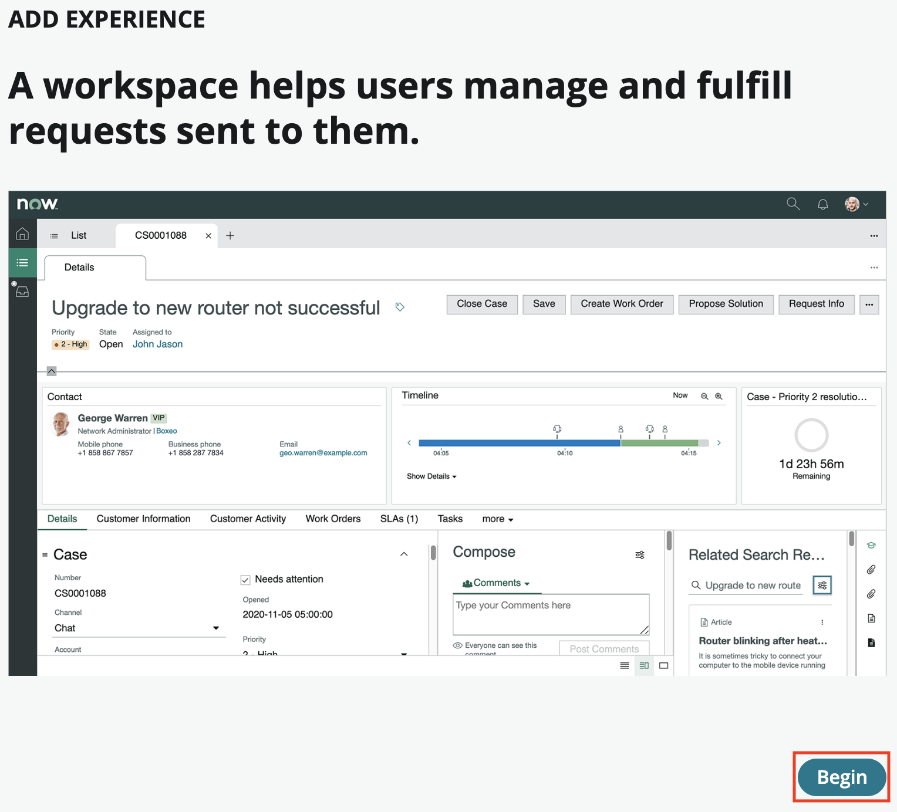

3. Accept the provided defaults for the workspace design and select **Continue**

4. Accept the data defaults for the workspace and select **Continue**

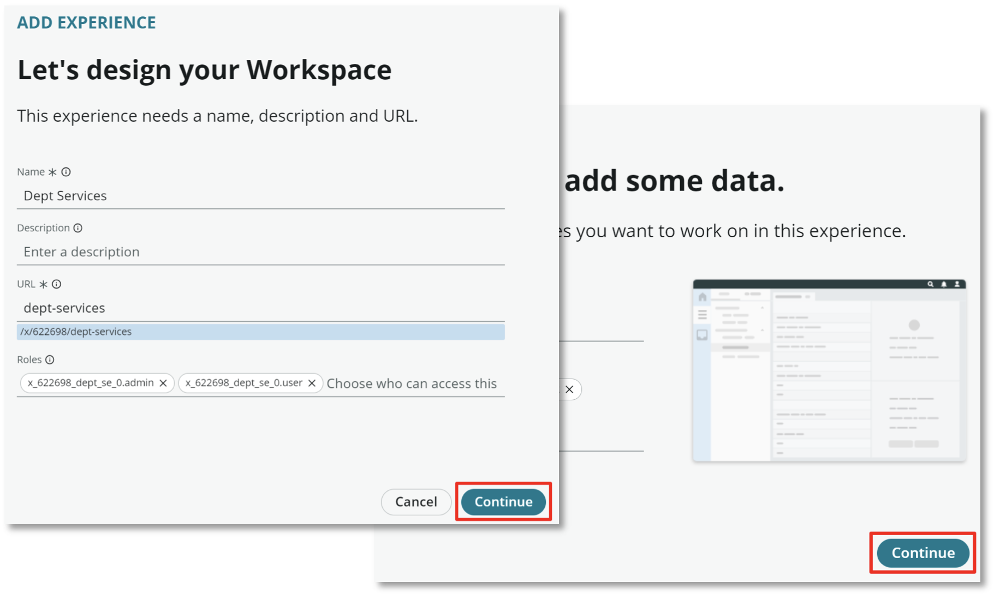

5. Select **Done** to configure the workspace

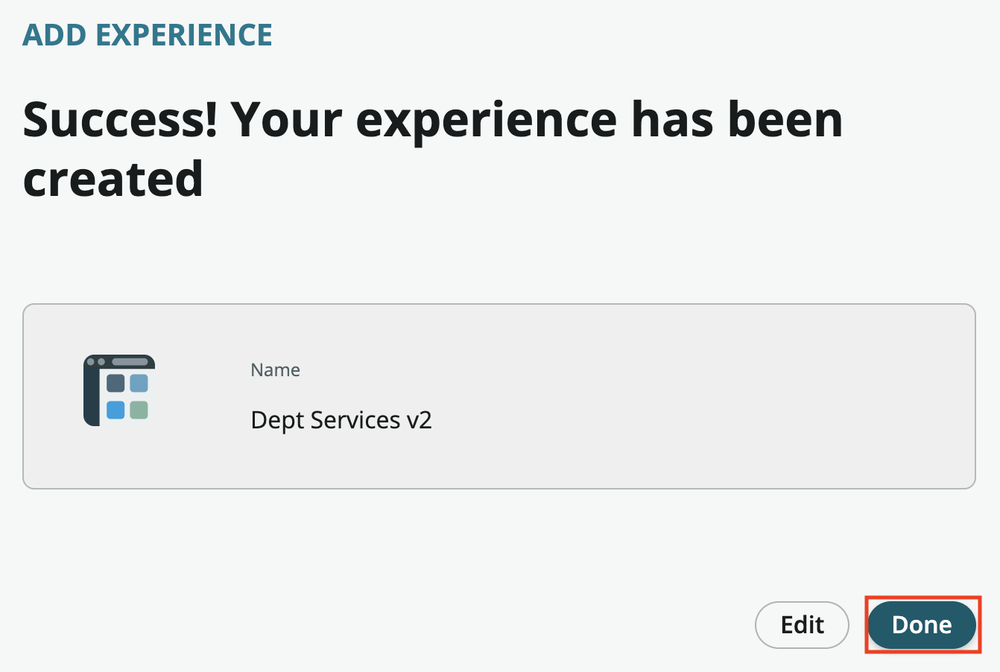

6. Find your newly created Workspace in the list of Experiences and click **Preview**

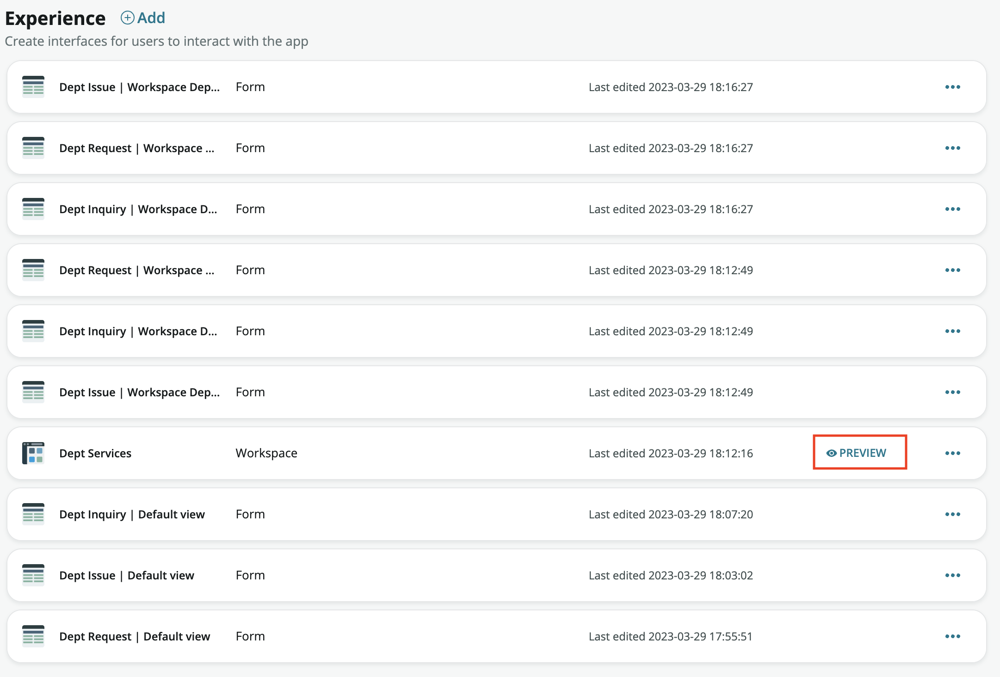

7. Once the workspace loads, click the **Edit** button in the top right

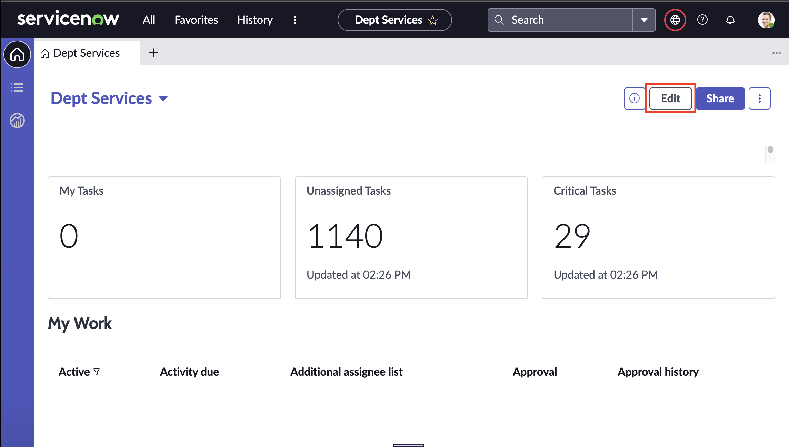

8. Click on the **My Tasks** data visulization and click the **Configure** icon

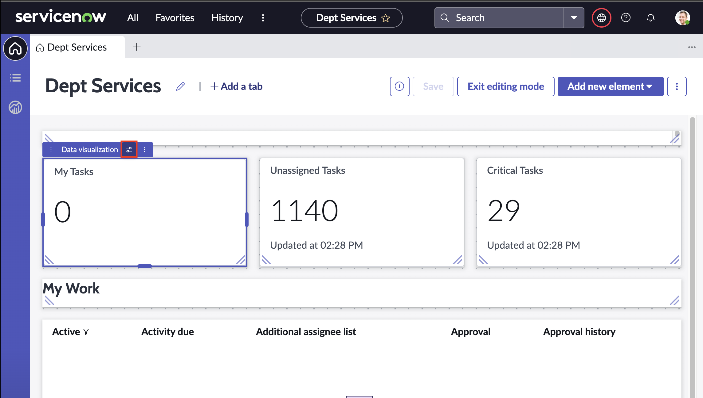

9.  On the **Configuration** pane, find **Data** and **Data Sources** and click on the **...** next to **Dept Inquiry** then click **Edit**
    
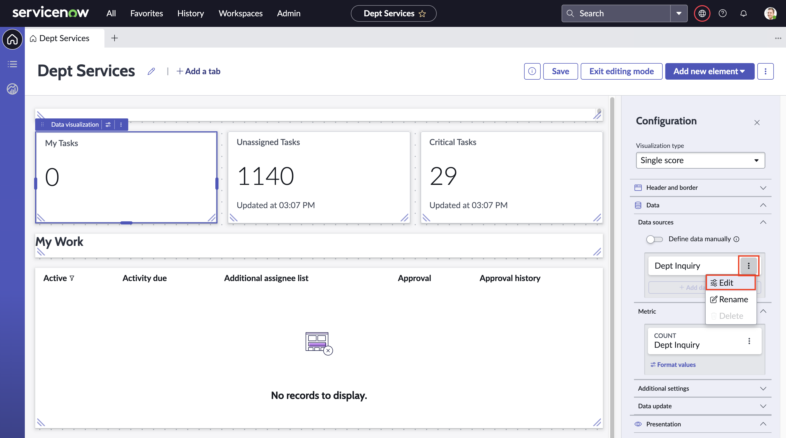

10. Select **Edit** in the upper right. Remove the Assigned to condition by selecting the **[X]** and select **Apply** to save changes

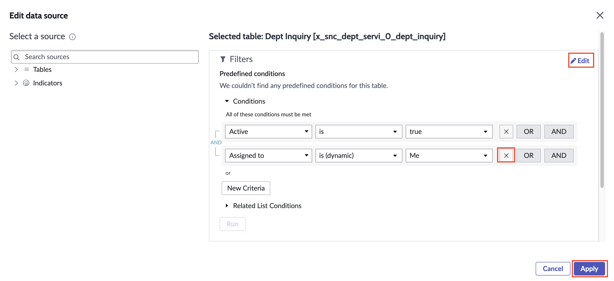

11. Now we will change the title from My Tasks to Inquiries. You may need expand the **Header and border** section on the right pane\
    Change the **Chart title** field from My Tasks to **Inquiries**

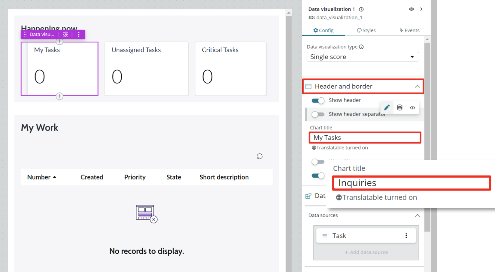

12. Select the **Unassigned Tasks** Data visualization and edit by selecting the **ellipsis** and **Edit**

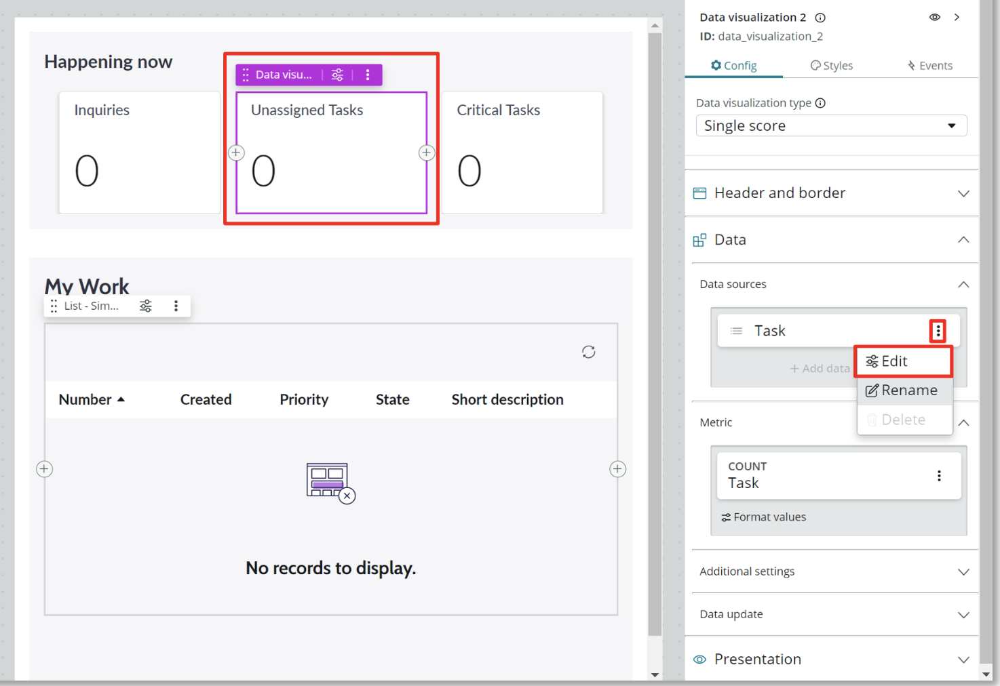

13. Enter **dept request** in the upper left **Select a source** search box 
    Select the **Dept Request** table\
    Select **+ Add custom conditions** and add the condition **Active is true** as shown below\
    Select **Apply**

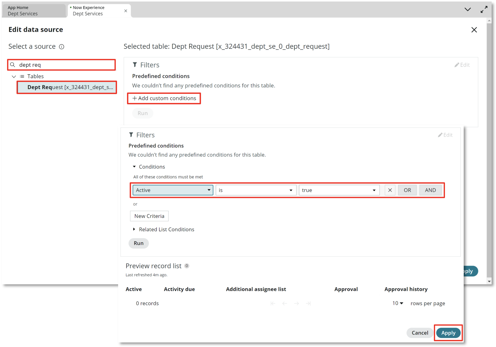

14. Change the Data visualization from **Unassigned Tasks** to **Requests** in the **Chart title** field using the same steps as last time

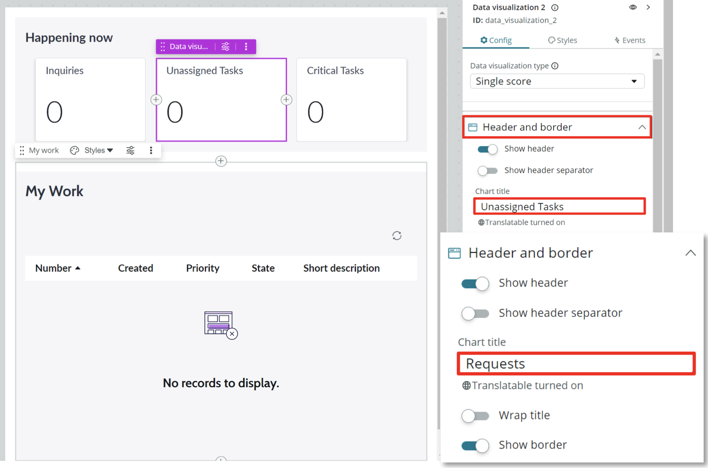

15. Finally, we will change the **Critical Tasks** Data visualization using the same steps

    - Edit the **Task Data source**
    - Change the table to **Dept Issues**
    - Add the condition **Active is true**
    - Change the **Chart title** from **Critical Tasks** to **Issues**

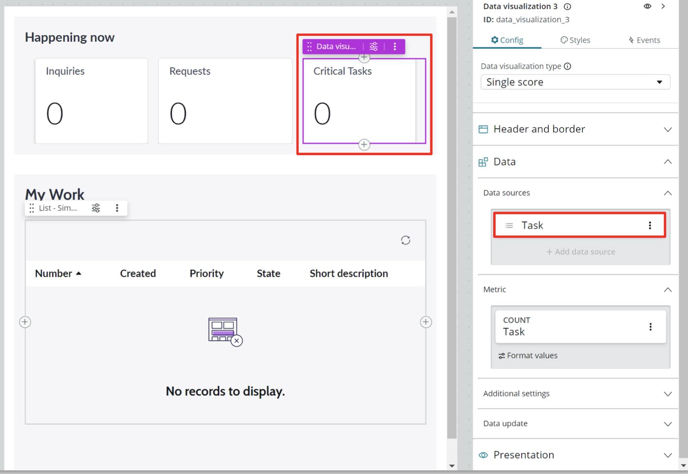

16. Click **Save** then **Exit editing mode** to finish

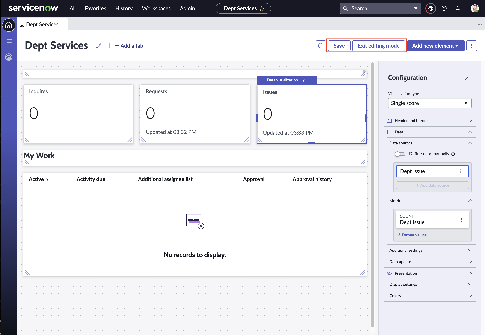

