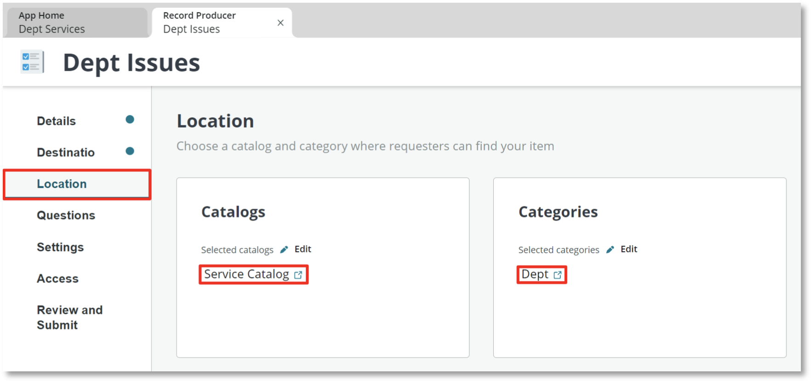

# Department Issue Record Producer

We'll repeat most of the same steps as before, but this time for our Issue task type.

## Let's start

1. Select **(+) Add** and the choose the **Record producer** experience\
    Select **Edit record producer**

2. Enter **Dept Issues** in the **Name** field\
    Provide a **Short description**\
    Select **Continue**

3. Select the **Destination** link on the left\
    Set **Record submission table** to **Dept Issue**

4. Set **Service catalogs** to **Service Catalog** and **Selected categories** to **Dept** as before

5. Select the **Questions** link on the left\
    Select **Insert new question**

6. Set the **Question type** to **Text**\
    Set the **Question subtype** to **Single-line**

7. Check **Map to a specific field on the table**\
    Set the **Table field** to **Short Description**\
    Set the **Question label** to **Issue Summary**\
    Select **Insert Question**

8. Select **+ Insert**\
    Select **New question**

9. Set **Question type** to **Text**\
    Set **Question subtype** to **Multi-line**\
    Set the **Question label** to **Issue Details**\
    Select **Insert Question**

10. Select the **Review and Submit** link on then left and then the **Submit** button on the right\
    Select **Return to my application**

