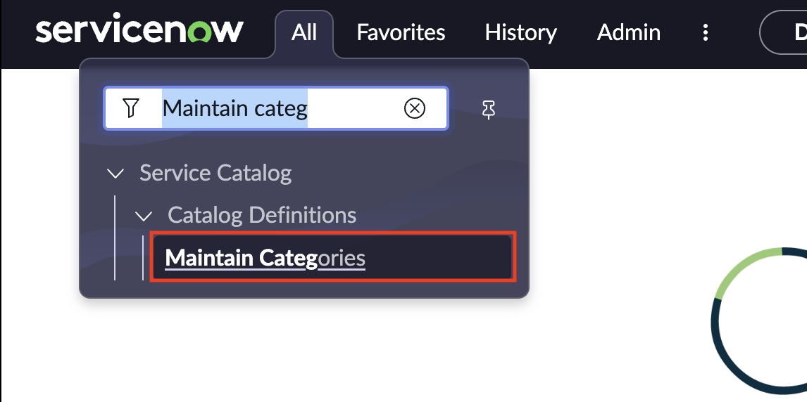
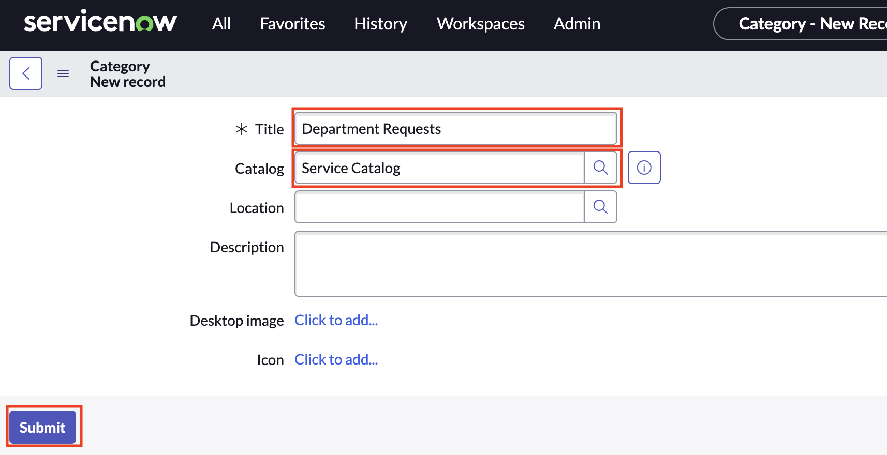

# Create a Service Catalog category

## Introduction

Before we can publish our services to the Employee Center, we need to create a category in our Service Catalog so our employees can easily find our newly created services.

For this exercise, we'll briefly hop back over to our instance and create the needed category.

1. Navigate to **All > Maintain Categories**

    
2. Click **New**

3. Enter **Department Requests** for **Title**

4. Enter **Service Catalog** for **Catalog**

5. Click **Submit**

