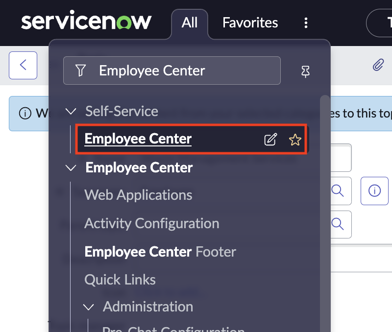
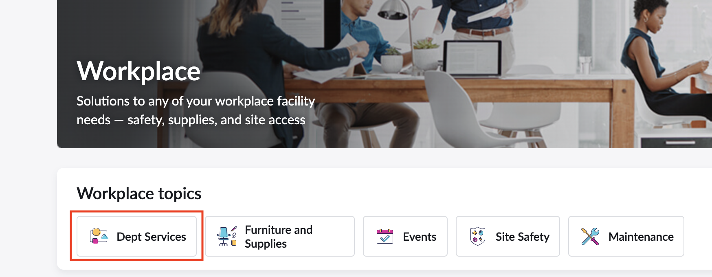
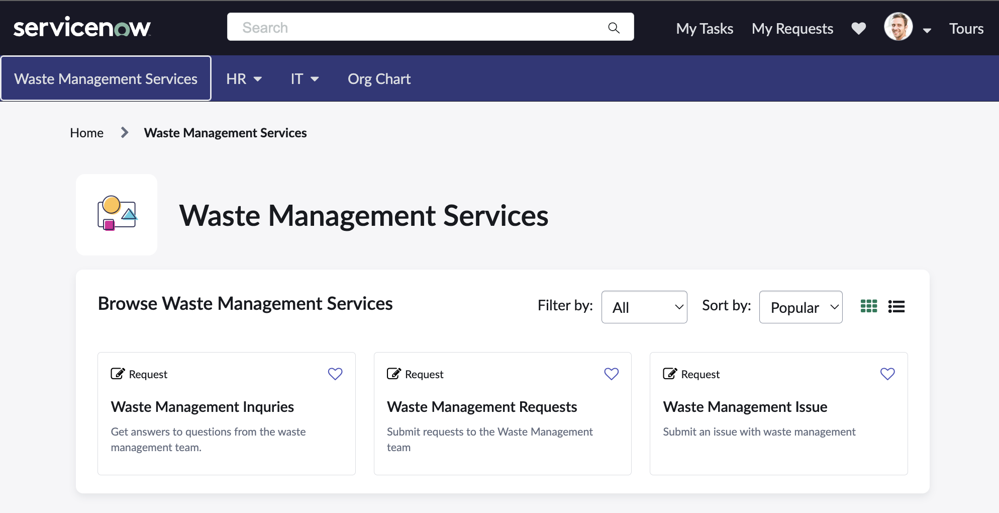
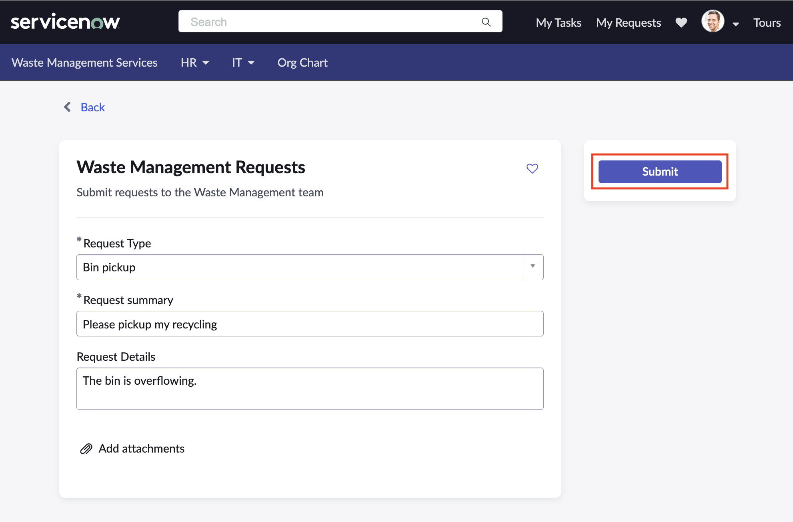
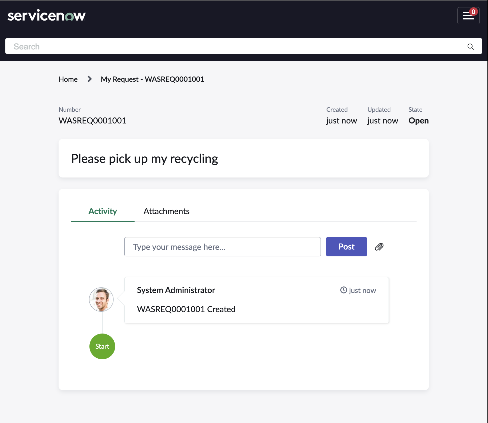
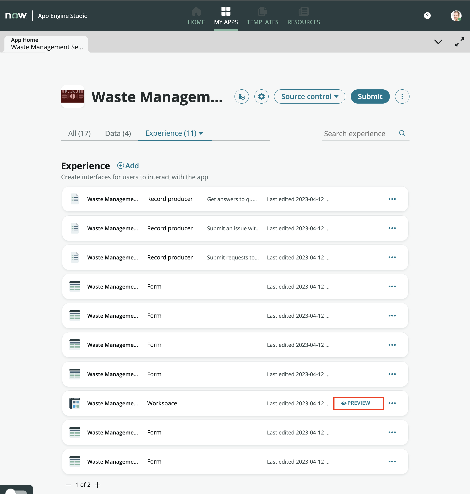
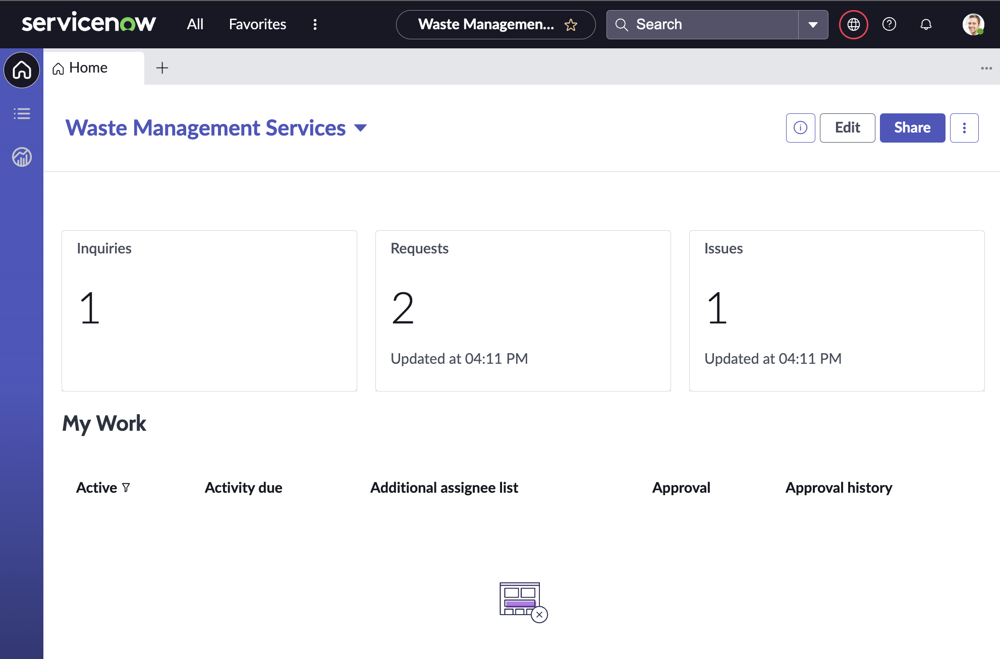
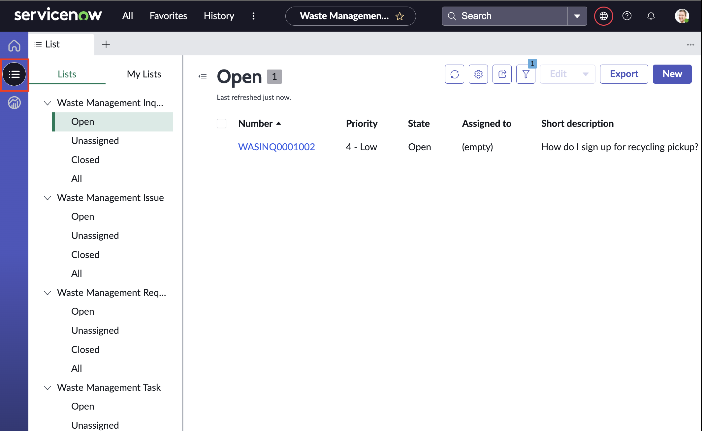
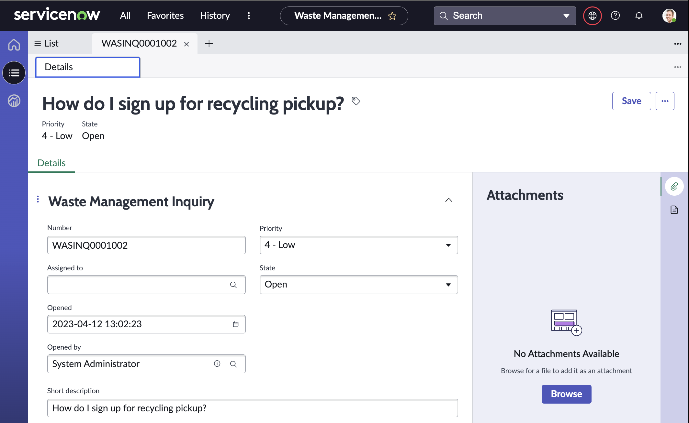

# Submit a Dept Request from the Employee Center Portal

1. Return to the platform view - probably open in another tab. 

2. Enter **Employee Center** in the Filter Navigator and select **Employee Center** under **Self-service**
   

### Employee Center will open in a new browser tab.

3. On the main EC portal page, click on **Workplace** then **Browse all Workplace** you will see your new Topic published similar to the screenshot below. YMMV based on your chosen Topic name and portal branding.
   

4. Click on your topic to view the record producers we creating in the last exercise.

5. Test the Dept Request item by clicking on the tile, completing the required fields and clicking **Submit**
   

### Portal view for the requester

6. Repeat this process for the other items as many times as you'd like

7. Once you've finished with your form testing, navigate back to App Engine Studio (in another tab) and preview your Workspace again.
   

You may have to click **See all** to show the workspace in the list

8. Notice the workspace now has data available in the data visualizations we edited in the beginning of the lab

9. Click on the **List** icon on the left of the workspace to view the list options available by default

10. Click on any record in a list to view the details

And that's a wrap! Feel free to continue to create new services, tables, and/or experiences for your app! The power is in your hands. And if you're feeling brave, try out our bonus exercises!