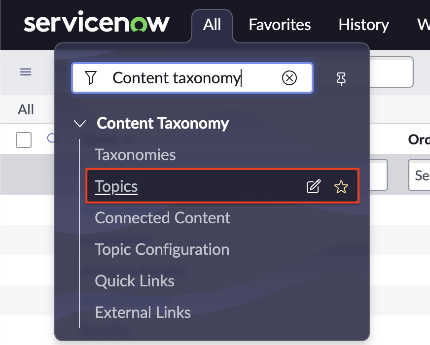
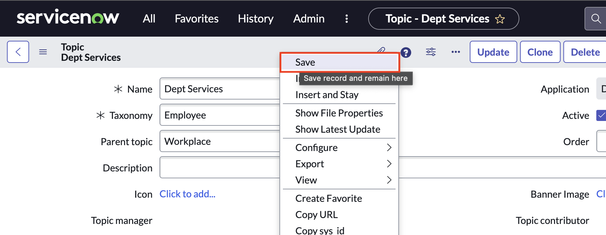
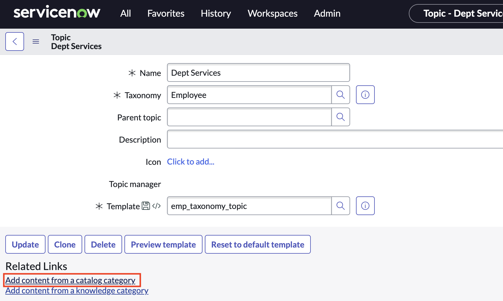
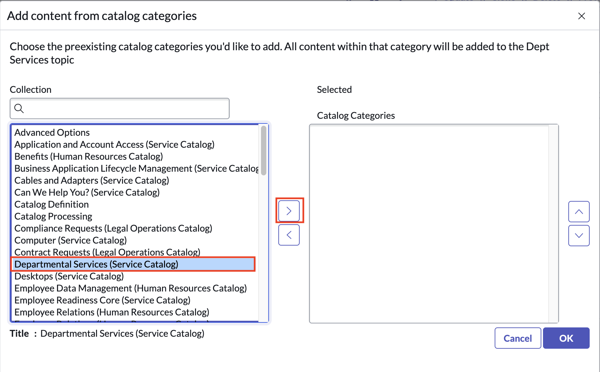
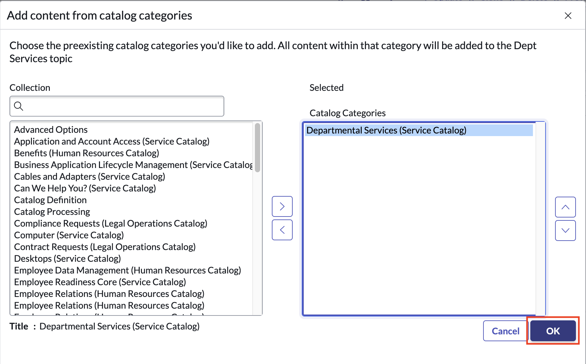
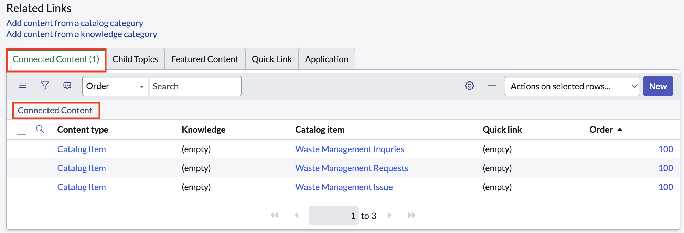

# Create an Employee Center topic

## Introduction

Now that we have our category and out entry forms, we can create our Employee Center Topic and relate that content to our topic.

1. Navigate to **All > Content Taxonomy > Topics**

2. Click **New**

3. Enter **Dept Services** for **Name**

4. Enter **Employee** for **Taxonomy**

5. Enter **Workplace** for **Parent topic**

6. Right-click on the header and click **Save** to create the record and stay on the page.
 

    
7. Under **Related Links** click **Add content from catalog category**

8. Find and select the category you created in the last exercise and move it to the **Catalog Categories** list on the right.
   

9.  Click **OK**
    

10. Click on the Connected Content tab below Related Links and refresh the list by clicking the filter link. Once the list refreshes, you should see your record producers we created listed.
    

That's it! Now we test our newly created services in Employee Center!