# Add dynamic behavior to the Dept Requests Record Producer

Dynamic behaviors allow you to control whether fields on a form are

* mandatory
* visible
* read-only

based on how the user has responded to other fields on the form. This is an important feature that can help your users understand how to complete a form and provide the information the Dept needs to fulfill services, respond to inquires and remediate issues.

1. Select the **ellipses(...)** on the Dept Request table and then **Edit** when the dropdown appears.\

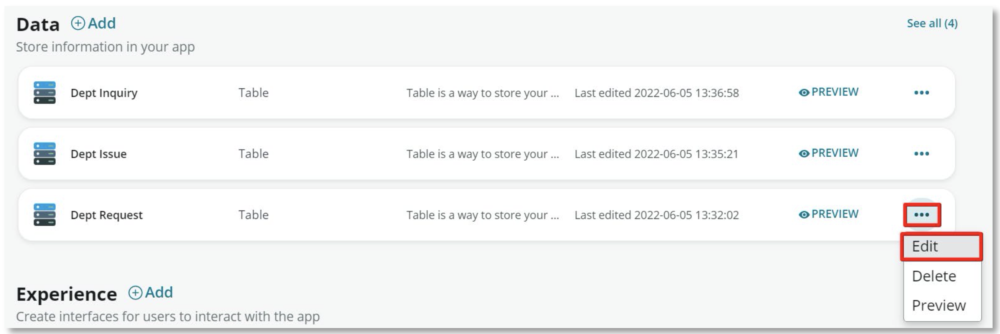
    
2. Select the **Show non-extended table fields** checkbox in the upper right.\
    Select the **Choice** Type option on the Record Type field.\
    Enter **Other** as a new Choice and then select **Add**.\
    Select **Done**.

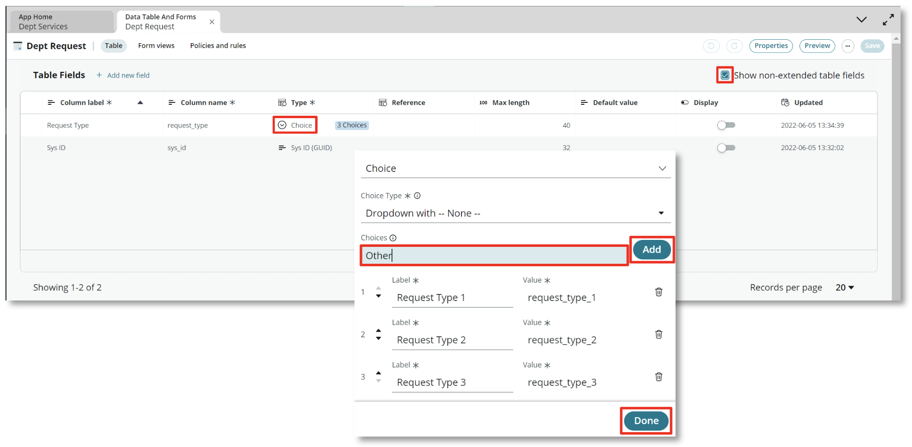

3. Return to the **App Home** tab and select the **Experiences** tab.

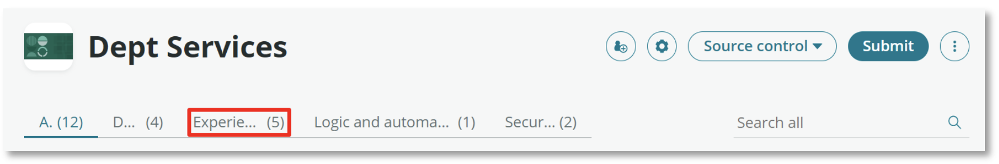

4. Select the **ellipsis(...)** for the Dept Requests Record Producer and the **Edit** option on the drop down.

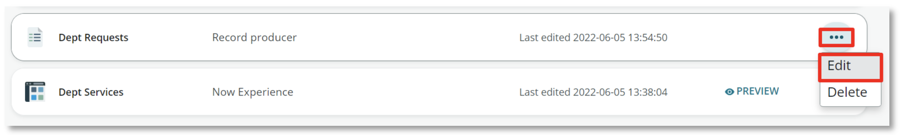

5. Select the **Questions** option on the left side. Hover over the right side of the **Request type** question and select the middle **Edit “Request ype”** option.

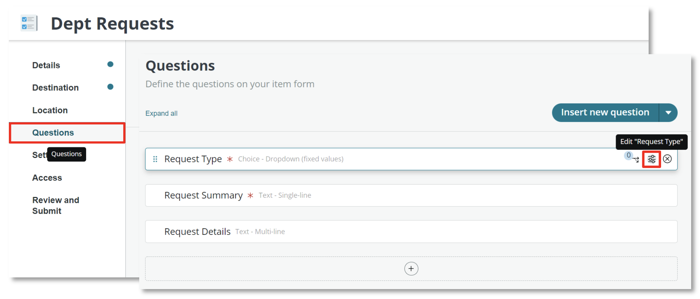

6. Select the **Choices** tab. Scroll down to the bottom of the **Choices** list and add a new option **Other**. Select **Done** in the lower right.

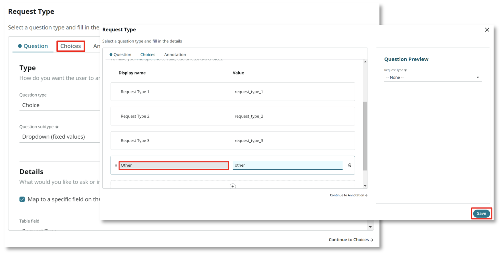

7. Hover over the right side of the **Request Details** question. Select the leftmost **Dynamic Behavior** button. Select **Define new Behavior**.

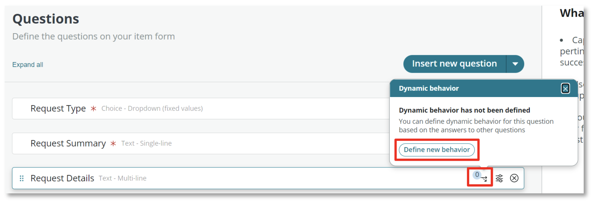

8. Select the **Make the question mandatory** dropdown. Select the **Yes** choice. Select the **Conditions** tab.

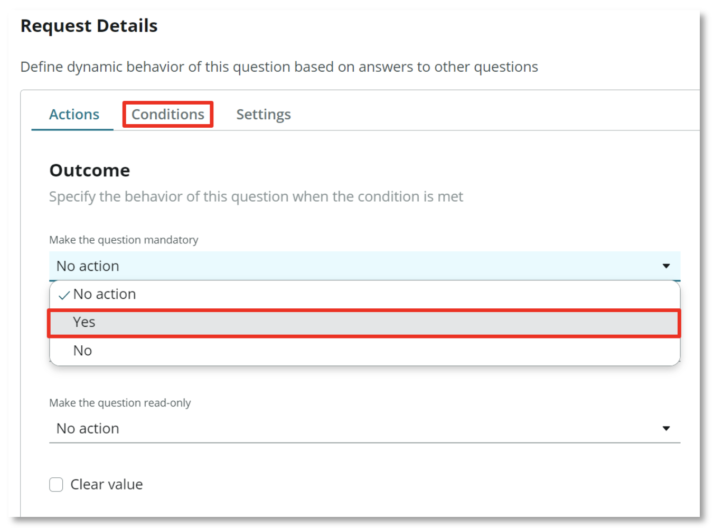

9. Set field to **request_type**. 
Set **operator** to **is**. 
Set **value** to **Other**. 
Select **Add behavior** in the lower left. 

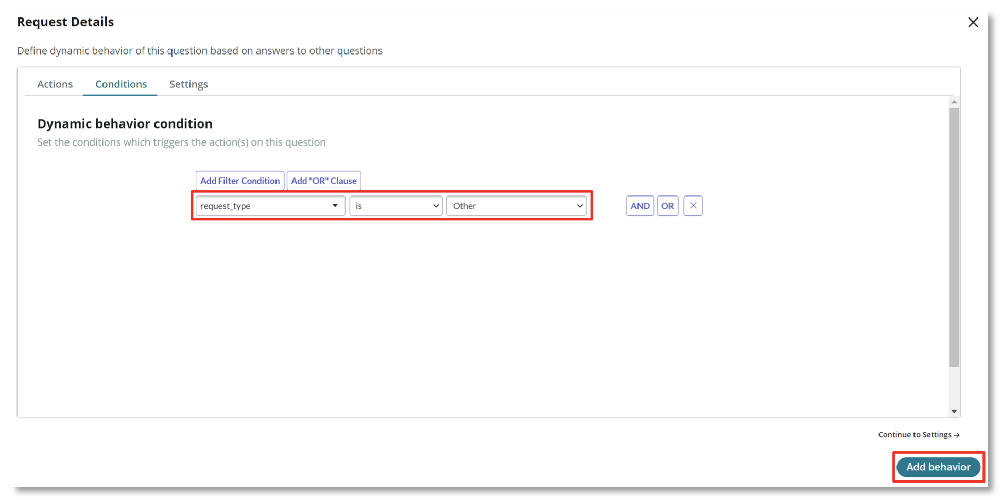

10. Select **Preview** in the upper right to view how the Dept Request will behave in the Employee Center Portal.

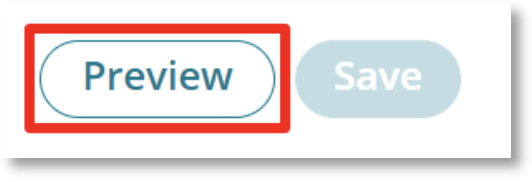

11. Change the **Request Type** to **Other** 
Notice how the **Request Details** question is marked as mandatory 
Change the **Request Type** to another value 
Notice how the **Request Details** question is no longer mandatory 

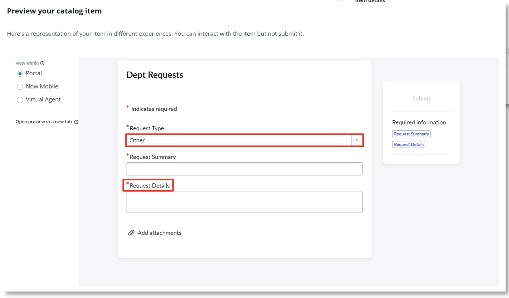

12. Exit the preview and select **Review and Submit** on the left

13. Select the **Submit** button on the upper right 
The changes from this exercise are now available on the Employee Center
Portal