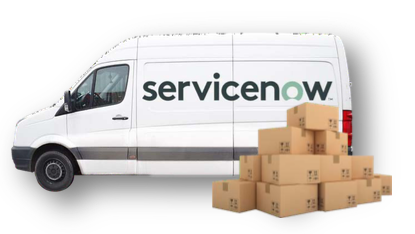
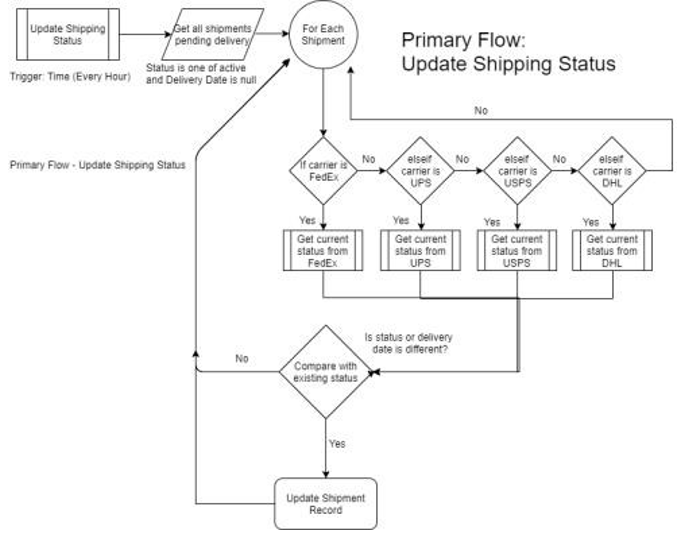

## This use case walks through the creation of a Logistics Management solution.

In this story, you play the role of Joe Shipman. Joe is responsible for managing shipments across the enterprise. Currently, he has no centralized logistics management solution. Joe understands that delays in shipping can lead to serious business issues for the company. Beyond simple user satisfaction or SLA violations, failure to fulfill requests on time can lead to increased cost, risk, and potentially damage the organization’s brand.

As a Citizen Developer, Joe can build applications on the company’s ServiceNow instance. Joe hopes to simplify and automate the shipping and receiving processes to enable near real-time status updates to the business users. This will empower users to make better business decisions to support their organizational goals. Furthermore, because the solution will be built on the Now platform, Joe will be able to seamlessly integrate logistics data with other processes, such as Request Management, already functioning on the Now Platform.

## Important Note

For purposes of this lab, we are assuming the work associated with solution design and validation has been completed.

Typically, all applications should start first with a thorough evaluation of the objectives and outcomes, as well as modeling of the data and process elements. It should never be considered “good practice” to begin the process of application building with a technical implementation. 

Thorough design work can dramatically reduce the risk of extensive rework. Consider building sample data models or flow diagrams of your business process before jumping straight to building or implementation.

## During this lab, you will work through the following exercises:

- Build an Application (30 Minutes)

- Create a Workspace Experience (25 minutes)

- Create an Integrated Business Process using Flow Designer and IntegrationHub (45 mins)

- Create a Mobile Experience (10 mins) (optional)