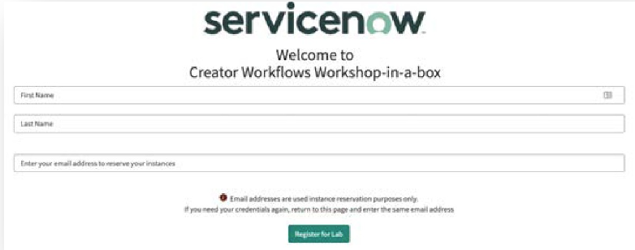

To participate in this lab, you will need to reserve and access a Creator Workflows instance. The URL to request your instance will be provided during the workshop.

Once you have access to the reservation URL, please navigate to this page and provide your **First Name**, **Last Name**, and **Email Address**. Do not close this tab. It is critical that you provide a valid Email Address, as your instance credentials will be delivered to this address.

Once you receive your credentials, please check the URL and password by logging in with the username **admin**, and the password provided.

If there are any issues with connectivity, please raise an issue in the Lab chat window, and one of our Gurus will assist you.

