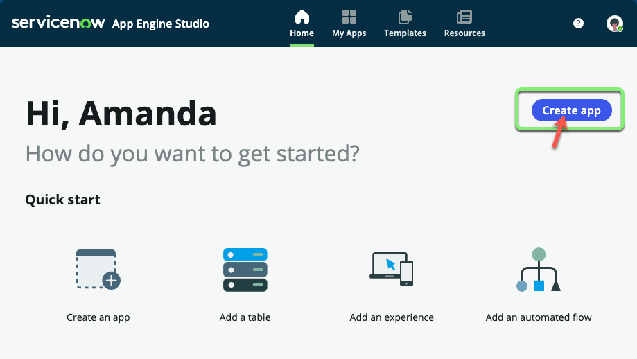
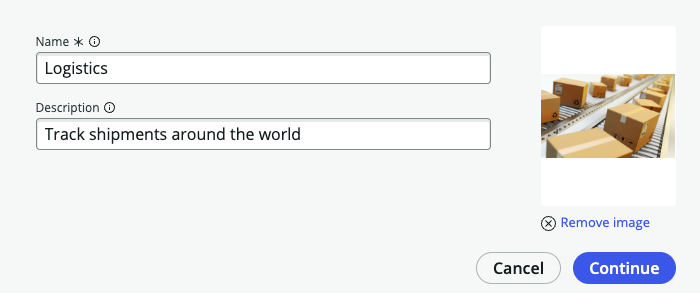
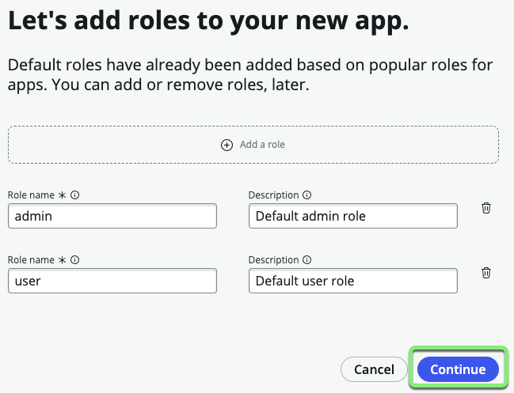
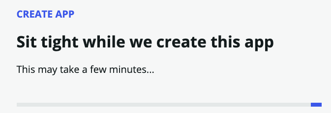
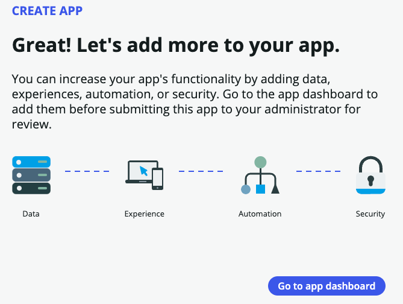

## Overview

In this exercise, you'll create a scoped application named "Logistics" in ServiceNow.

A scoped application, or "app" for short, acts as a container for all the assets that constitute an application, including tables, forms, flows, and security features.

Only the Owner of the application and invited Collaborators can make changes in the app. 

## Instructions

1. **Getting Started Dialog:** If the "Getting Started" dialog appears, close it by clicking the Get Started button.

2. **App Engine Studio Homepage:** Once you close the dialog, you'll be on the homepage of App Engine Studio. Here, you can:
   - Create new applications or extend previously developed ones.
   - Explore various pre-built templates to address common business challenges.

   Feel free to return here later to review the capabilities offered by these templates.

3. **Create the App:**
   - Click the Create App button.
   

4. **Complete the Form:**
   - Fill out the form with the following details:

     |Field|Value 
     |--|--
     |**Name** | `Logistics` 
     |**Value**| `Track shipments around the world`

   - Upload the **Logistics-App-Logo.png** file you downloaded.
   - Click Continue.
   

6. **Roles:**
   - In the "Let's add roles" screen, click Continue.
   

7. **Go to App Dashboard**:
   - Click Go to app dashboard.
   

## Exercise Recap

Congratulations! You've successfully created a ServiceNow application named "Logistics."

In the following exercises, we will build upon this foundation by adding data, experiences, logic, and security to make this application truly functional.