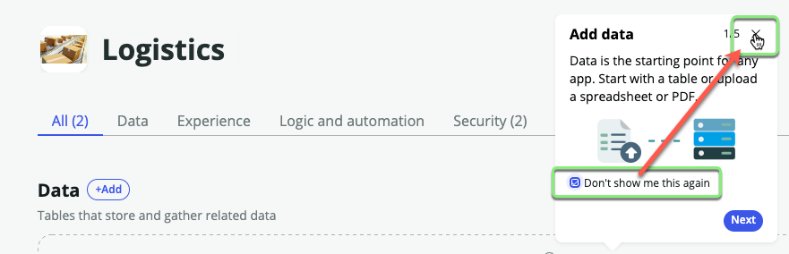
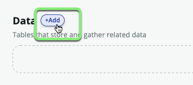
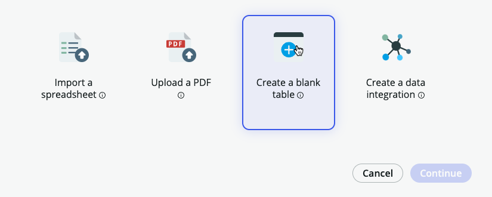
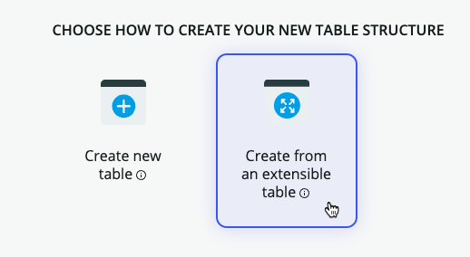
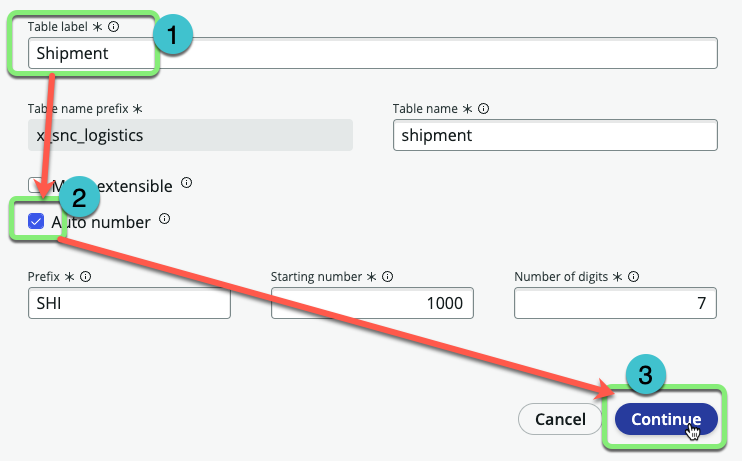
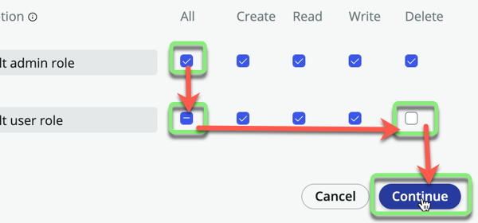
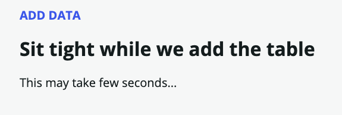
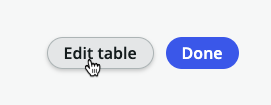

## Overview

Now that we have an application framework, we can start to fill in some of the details that will give our application purpose. In this step, we will create the core table that will act as the primary data container for our application.

## Instructions

1. **Close the guided tour.**
   * Check "Don't show me this again"
   * Click the 'X' in the corner.
  

2. Next to **Data**, click +Add.

3. - Select "Create a blank table".
   - Click Continue.   
   

4. - Select "Create from an extensible table".
   - Click Continue.   
  

5. **Select the Table**:
    1. Click in the search box.
    2. Click on the **Task** table.
    3. Click Continue.
    

6. **Table Configuration**:
    - Set the "Table label" to `Shipment`.
    - Check 'Auto number'.
    - Click Continue.
    

7. **Set Permissions**:
    - For the <strong>admin</strong> role, check <strong>All</strong>.
    - For the <strong>user</strong> role, check <strong>All</strong> and uncheck <strong>Delete</strong>.
    - Click Continue.
    

8. Click Edit table.

## Exercise Recap

Well done! You've have created a table to track shipments with.

This will help ensure data input consistency. 