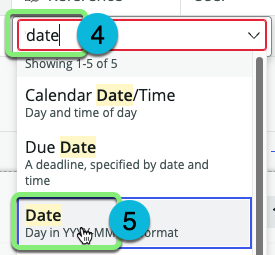

## Overview 

Table Builder is a powerful tool for designing and customizing tables, forms, and form elements within ServiceNow. In this exercise, you will learn how to edit the `Shipment` table using the **Spreadsheet** view in the **Data** tab of Table Builder. 

Additionally, you will explore the **Fields** view to modify the table properties and structure.

The **fulfiller users** of the **Logistics App** have asked that the following fields be added to the table:

| | Field Name | Type |
|--| --|--|
|1|Recipient | Reference |
|2|Destination | Reference |
|3|Delivery date | Date |
|4|Tracking Number | String |
|5|Carrier | Choice |
|6|Status | Choice |

## Instructions

1. Check the 'Do not show again' option and then click the 'x' to dismiss the next pop-up.

:::info
The default view in Table Builder is the "Spreadsheet" view. In this view, you can view and edit data.
:::

2. Click the three dots to the right of the **Data** pill, then click 'Fields'.

### You are now viewing the 'Fields' view in Table Builder. Each row represents the definition of a column in your table. 

### Since you extended from the `Task` table, you have a 'copy' of all of the columns from that table on your `Shipment` table. 

3. **Hide the extended fields.**
   1. Click 'Filter options'.
   2. Click 'Hide extended fields'.
   

### Hiding the extended fields means you are only viewing the custom fields you have added to the table of which there are not any yet. 

4. **Add a new 'Reference' column named 'Recipient' that refers to the User table .**
    - Click + Add new field.
    

    1. Type `Recipient` into the **Column label** field.
    2. Press ENTER.
    3. Click on the third column. 
    

    4. Type `Reference` in the box.
    5. Click **Reference** in the drop-down.
    

    6. Type `User` in the box.
    7. Click **User** in the drop-down.
    
    8. Press ENTER.

    9. Click Save in the top-right.
    

:::info
Reference fields are just one important method of unlocking the value of the Now Platform. By leveraging data from existing business processes, we streamline application creation and ensure data quality across all solutions that leverage shared data sets.
:::

### One field created... five more to go. 

| | Field Name | Type |
|--| --|--|
|~~1~~|~~Recipient~~ | ~~Reference~~ |
|**2**|**Destination** | **Reference** |
|3|Delivery date | Date |
|4|Tracking Number | String |
|5|Carrier | Choice |
|6|Status | Choice |

5. **Add a new 'Reference' column named 'Destination' that refers to the Location table.**
    - Click + Add new field.

    1. Type `Destination` into the **Column label** field.
    2. Press ENTER.
    3. Click on the third column. 
    

    4. Type `Reference` in the box.
    5. Click **Reference** in the drop-down.

    

    6. Type `Location` in the box.
    7. Click **Location** in the drop-down.
    
    8. Press ENTER.

    9. Click Save in the top-right.    
    

:::caution
At this point your screen should like like this. If it does not, please notify your instructor or a lab guru.

:::

### Two fields created... four more to go. 

| | Field Name | Type |
|--| --|--|
|~~1~~|~~Recipient~~ | ~~Reference~~ |
|~~2~~|~~Destination~~ | ~~Reference~~ |
|**3**|**Delivery date** | **Date** |
|4|Tracking Number | String |
|5|Carrier | Choice |
|6|Status | Choice |

6. **Add a new 'Date' column named 'Delivery date'.**
    - Click + Add new field.

    1. Type `Delivery date` into the **Column label** field.
    2. Press ENTER.
    3. Click on the third column. 
    

    4. Type `Date` in the box.
    5. Click **Date** in the drop-down.
    
    6. Press ENTER.

    7. Click Save in the top-right.    
    

### Three fields created... three more to go. 

| | Field Name | Type |
|--| --|--|
|~~1~~|~~Recipient~~ | ~~Reference~~ |
|~~2~~|~~Destination~~ | ~~Reference~~ |
|~~3~~|~~Delivery date~~ | ~~Date~~ |
|**4**|**Tracking Number** | **String** |
|5|Carrier | Choice |
|6|Status | Choice |

7. **Add a new 'String' column named 'Tracking number'.**
    - Click + Add new field.

    1. Type `Tracking number` into the **Column label** field.
    2. Press ENTER.
    

    7. Click Save in the top-right 
    

    9. Click

### Four fields created... two more to go. 

| | Field Name | Type |
|--| --|--|
|~~1~~|~~Recipient~~ | ~~Reference~~ |
|~~2~~|~~Destination~~ | ~~Reference~~ |
|~~3~~|~~Delivery date~~ | ~~Date~~ |
|~~4~~|~~Tracking Number~~ | ~~String~~ |
|**5**|**Carrier** | **Choice** |
|6|Status | Choice |

8. **Add a new 'Choice' column named 'Carrier'.**
    - Click + Add new field.

    1. Type `Carrier` into the **Column label** field.
    2. Press ENTER.
    3. Click on the third column. 
    

    4. Type `Choice` in the box.
    5. Click **Choice** in the drop-down.
    

    6. Click the **Choice Type** drop-down.
    7. Click **Dropdown with --None--**.
    

    8. Type `FedEx` in the **Choices** box.
    9. Press ENTER. 
    

    10. Type `UPS` in the **Choices** box.
    11. Press ENTER. 
    12. Type `DHL` in the **Choices** box.
    13. Press ENTER. 
    14. Click Done.
    15. Click Save in the top-right.

### Five fields created... one more to go. 

| | Field Name | Type |
|--| --|--|
|~~1~~|~~Recipient~~ | ~~Reference~~ |
|~~2~~|~~Destination~~ | ~~Reference~~ |
|~~3~~|~~Delivery date~~ | ~~Date~~ |
|~~4~~|~~Tracking Number~~ | ~~String~~ |
|~~5~~|~~Carrier~~ | ~~Choice~~ |
|**6**|**Status** | **Choice** |

9. **Add a new 'Choice' column named 'Status'.**
    - Click + Add new field.

    1. Type `Status` into the **Column label** field.
    2. Press ENTER.
    3. Click on the third column. 
    

    4. Type `Choice` in the box.
    5. Click **Choice** in the drop-down.
    

    6. Click the **Choice Type** drop-down.
    7. Click **Dropdown with --None--**.
    

    8. Type `New` in the **Choices** box.
    9. Click Add.
    

    10. Type `In Transit` in the **Choices** box.
    11. Press ENTER. 
    12. Type `Delivered` in the **Choices** box.
    13. Press ENTER. 
    14. Type `Delivery exception` in the **Choices** box.
    15. Press ENTER. 
    16. Click Done.
    17. Click Save in the top-right.

## Exercise Recap

In this exercise, you've learned how to use **Table Builder** to view and edit data in the **Spreadsheet view** and configure your Fields in the **Fields view**. The next exercise will involve using the **Form** feature to view and customize the form used to display individual records (rows) within the table.

For more information and advanced capabilities, you can refer to the [ServiceNow Product Documentation: Table Builder](https://docs.servicenow.com/csh?topicname=tb-landing-page.html&version=latest).