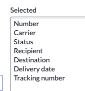

## Overview 

In the next few steps, you will set the default columns show in List view when people are viewing the list of records. 

## Instructions

1. Click Preview in the top right.

2. Click the three dots to the right of the **Number** column.

3. Hover over 'Configure'. When the menu opens,  click on 'List Layout'.

4. Click 'Priority', then click the left chevron button to move it to the left hand side. 

5. Repeat the same step to remove the following from the right side: 
   * Priority
   * Assigned to
   * Short description
   * Task type

6. Look for the following fields on the left side and use the right chevron button to move them to the right side. 
    * Carrier
    * Status
    * Recipient
    * Destination
    * Delivery date
    * Tracking number

    ### RESULT
    

    :::caution
    If your fields are not in the order above, use the up and down chevron buttons to rearrange them or notify the instructor.
    
    :::

7. Click Save.

8. Close the **Preview - Shipment** tab.

## Exercise Recap

In this exercise, you've have configure the default List layout that the **fulfiller users** will see when viewing the list of `Shipment` records throughout the Platform. 
