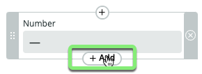
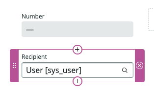
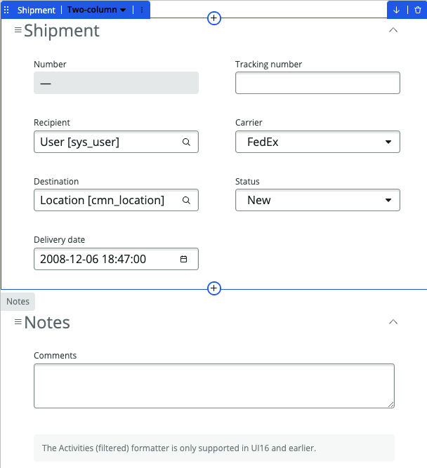

## Overview 

The **Forms** tab in Table Builder is your canvas for visually creating, configuring, and customizing form views for your **fulfiller** users without the need to navigate between different tools. 

In this exercise, we will focus on creating a new default form unique to the `Shipment` table.

This form view is the 'back-end' view that will be visible in the Platform to **fulfiller users** working on `Shipment` records. 

The **fulfiller users** of the **Logistics App** have asked that the following fields be added to the form:

* Destination
* Recipient
* Tracking Number
* Deliver Date
* Carrier
* Status

## Instructions

1. Click the **Forms** button in the center of the page.
   
   This is the default form view inherited from the `Task` table, which we'll customize for the `Shipment` table.

   You can see that the system added the new fields to the form as we created the new columns in the last exercise.
   

2. **Remove the following fields from the form:**
   * Assigned to
   * Priority
   * State

   * Click the **X** next to each field to remove it. 
   

   ### RESULT
   

3. **Add the 'Receipient' field below the 'Number' field.** 
   1. Click the **+ Add** button below the 'Number' box. 
   

   2. Type `Recipient` in the **Add form elements** box.
   3. Click the 'Recipient' box in the search results. 
   

   ### RESULT
   

4. Use the same method to add the fields in the layout of the table below. 

   |               |                 |
   |---------------|-----------------|
   | Number        | Tracking number | 
   | Recipient     | Carrier         | 
   | Destination   | Status          | 
   | Delivery date |                 | 

   

   * Click Save in the top-right.    

5. **Delete the section named 'Merged with Shipment section'.**
   * Click the trash can icon in the top-right of the section.
   

6. **Delete the section named 'Related Records'.**
   * Click the trash can icon in the top-right of the section.
   

7. Click Save in the top-right.

8. Close the **Data Table And Forms** tab.

### Your form should look like this. If it does not, please review the exercise steps again or notify the instructor or a lab guru. 

## Exercise Recap

In this exercise, we learned how to modify the form view.
