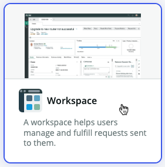
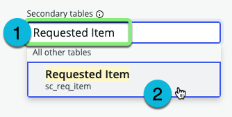

## Overview

Next you will create a Workspace experience for the Fulfiller users of the application.

## Instructions

1. On the application homepage, click the **Experience** tab.

2. Click +Add.

3. Click the **Workspace** tile.

4. Click Begin.

5. Leave the default values and click Continue.

6. **We want the Logistics Team to be able to seamlessly access information on Requested Items, since shipments may be related to those requests.**
    1. Type `Requested Item` in the 'Secondary tables' box.
    2. Click **Requested Item** in the drop-down.
    

7. Click Continue.

8. Click Edit.

### Your new Workspace should open in Workspace Builder.

## Exercise Recap
