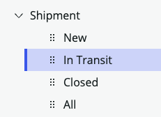

## Overview

You should now be viewing the interface called **Workspace Builder**.

In this section, learn how to adjust the automatically created Workspace configuration. This helps you adapt the experience of an application to the way your users work boosting productivity and user satisfaction with your solution.

## Instructions

1. Click **List** on the left side of page. 

### List Categories

Workspace Builder made two **List Categories** for each table based on the **State** field. This is because each field is an extension of the `Task` table where the **State** field lives. 

The **fulfiller users** would like for the **Shipment** List Category to be based on the **Status** field that was added earlier instead. 

### In the next steps you will reconfigure the Shipment List Category to use the "Status" field.

2. Click "Open" in the "Shipment" section.

3. On the right side of page in the 'Name' box, change `Open` to `New`.
    
    ### RESULT
    

4. Below that, click on the Apply conditions link.

5. Click and.

6. Click 'Select field'.

7. Scroll down and click on 'Status'. 

8. Click on the empty box to the right of 'Status'.

9. Click on 'New'.

10. Click Apply filter.

11. Click Save in the bottom-right of the page. 

### RESULT

### One down... three more to go. 

12. Click "Unassigned" in the "Shipment" section.

13. Rename it to "In Transit".

14. Below that, click on the Apply conditions link.

15. Click and at the end of the second row.

16. Click 'Select field' on the third row. 

17. Scroll down and click on 'Status'. 

18. Click on the empty box to the right of 'Status'.

19. Click on 'In Transit'.

20. Click Apply filter.

21. Click Save.

### RESULT

### Two down... two to go. 

22. Click "Closed" in the "Shipment" section.

23. Rename it to "In Transit".

## Exercise Recap

We have completed our configuration changes. 