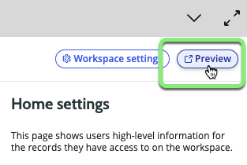

## Overview

In this section, we will review our configuration changes and test our newly created Logistics application.

## Instructions

## Old

1. Click Preview.

### This will open a new browser tab to the new Workspace experience. 

 
2.	Click the Lists button on the left side of the Workspace.

Here we see the listing of the items we selected during the workspace configuration – Shipments and Requested Items.

Next, click the All list under Shipments.

As you would expect, there is no data yet in our table, but what you might also notice is SysID is being displayed and the columns aren’t in the optimal order.  We will also want to adjust this when we configure the workspace.

Let’s close the preview by closing this browser tab or window and returning to App Engine Studio.

3.	From the Logistics App Home tab, click the ellipsis next to the preview link under the Experience section and select the Edit option.

This will launch the UI Builder in a new tab.

From the UI Builder, we can change any element of the interface to optimize   the user experience.
 

 

Here, we can see that there are a variety of changes we could make to the Workspace Homepage, including adding reports, dashboards, widgets, lists, or other content and controls.

For now, we will focus on updating the elements of the list view previously identified.

4.	Change the selected Page from Home to List by clicking the drop- down list at the top left and selecting List.

5.	This loads the list page configuration in the center content frame. Let’s start by fixing the order of the displayed list groups. To do this, click the Nav Frame element in the center of the workspace.

6.	In the right frame, we now see the Config properties of the List nav. To adjust the order, we’ll need to change the list configuration. Click the Configuration link under the Config panel tab on the bottom right of your screen.

This will open a new browser tab with the menu items for the Logistics Application.

7.	Open the menu configuration by clicking the record Logistics_menu_config.

This will open the configuration record for the Logistics navigation menu.
 
Important Note:
While this lab does not cover working with all the elements of UI Builder, we recommend returning later to test various configuration options and settings to familiarize yourself with the powerful tools available.
 

8.	On the configuration record under the UX List Categories tab at the bottom of the record, double click the Order field and change the value from 100 to1 for the Shipments record.

9.	Then click the green check mark to save your changes.

This will update the display order of the lists in your Workplace experience.

10.	Now, let’s update the list configuration for Shipments to make it easier for our users to view shipment information. From the same configuration record, click the UX Lists tab.

This displays a listing of all the configured lists linked to our workspace.

From here, we can see the All list for the category shipments showing only one displayed column (number).

Let’s add some additional columns now.

11.	Click the record All linked to the Shipments category.

This shows the list configuration. Let’s add
some columns to make the list more useful.

12.	Click the lock icon next to the Columns
data field.

This opens the column selector. Add the columns Number; Carrier; Status; Recipient; Destination; Deliver Date; and Tracking Number by selecting the value on the left column, then clicking the right arrow to move it to the selected column.
 

13.	Now, let’s save this and create a similar view of filtered data. Right-click on the grey header bar at the top of the window and click Save. (If you accidently click the Update button, simply reopen the record by clicking All again.

14.	Next, we’ll copy this record to a new record we can use to create a filtered view. Again, right-click on the grey header bar, but select Insert and Stay to create a new clone of the list configuration record.

Now that we have our record copy, let make some changes to create a new list view.

15.	Update the Title field value from All to Not Delivered

16.	Next, let’s filter the results so only undelivered items are shown. Under Conditions select the choose field drop down and select Status.

17.	Set the Operator drop-down to is one of.

18.	From the option selector, click New, and In Transit.

19.	Finally, click the Update button to save our new list configuration.

1.	Close the configuration record browser tab and return to our UI Builder window. Next, close the UI Builder tab to return to our Logistics App Home tab.

2.	Click the Preview link next to your Logistics Workspace Experience.

Now, when we click the lists tab on the left side of our workspace, we should see our newly made configuration changes.
 

 

We can see Shipments is now the first list, and the new filtered list for Not Delivered is displayed. Additionally, the columns we selected for our list view are displayed.

Let’s create some data to test out our work!

3.	Click the New button to create a new shipment record.
The Create New Shipments form is displayed.

4.	Enter the Recipient as Roger Seid

5.	Enter the Destination as 261 North Highway 101, Solana Beach, CA

6.	Enter the Tracking Number as 122816215025810

7.	Set the Carrier to FedEx

8.	Set the Status as New

9.	Click Save
 

10.	Close the record tab to return to your list view. You should now see your new record in the Shipments list.

The same record will also be available on the Not Delivered list. Try creating a new record with a status of Delivered to confirm that it does not appear on this filtered Not Delivered list.

## Recap

Congratulations, you have built a custom experience for your Logistics Team. They are now able to create and track digital records to manage the end-to-end Shipment Lifecycle.
