1. Navigate to **All > Service Requests > All**.
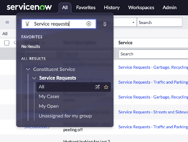

2.	On the list click on any service request
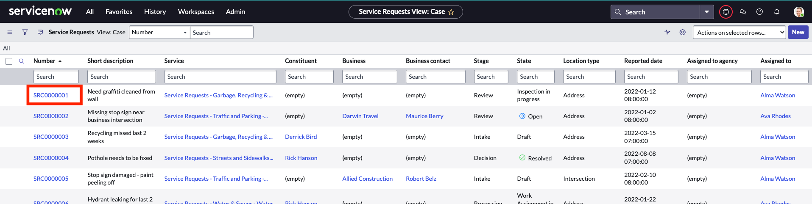

3.	Change the scope to **Service Request Playbook**.
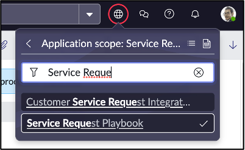

4.	Right click on the grey banner and hover over Configure, then select **Form Design**
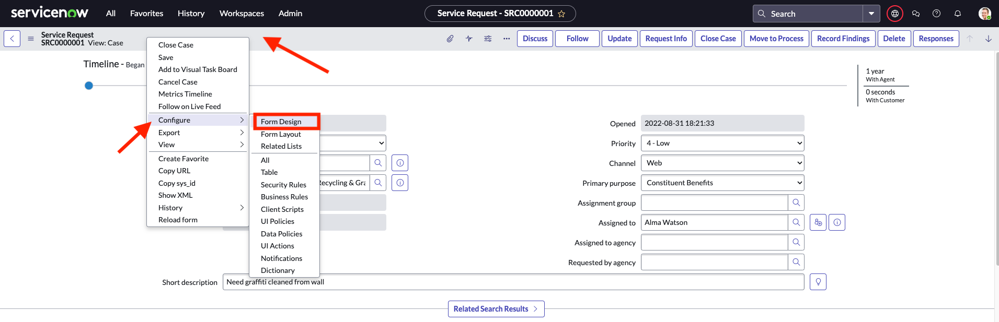

5.	On the form design select **Workspace** as show below:
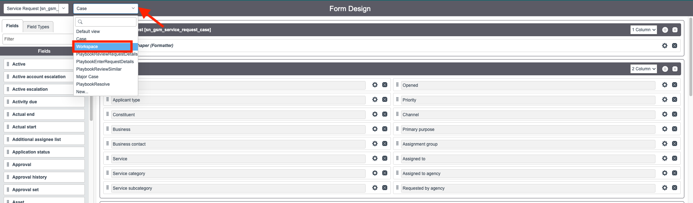

6.	Scroll down on the form and find **Request Details**. This is where we will add 3 new fields.
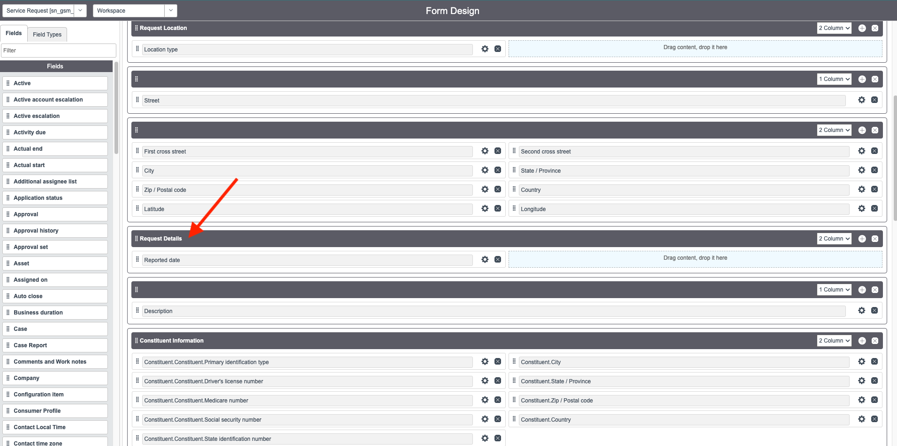

7.	Click on **Field Types** and search for **Choice**
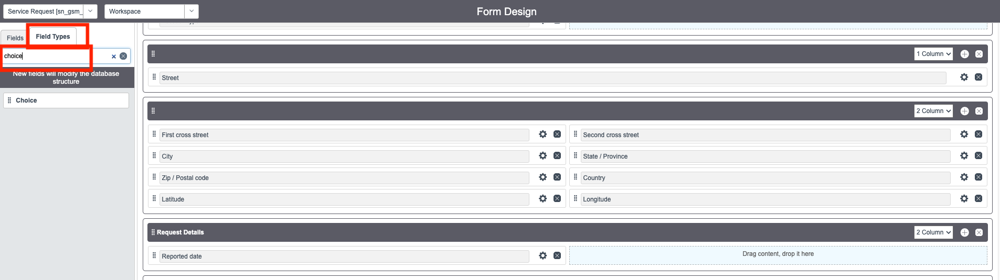

8.	Drag and drop the Choice field to the Request Details section.
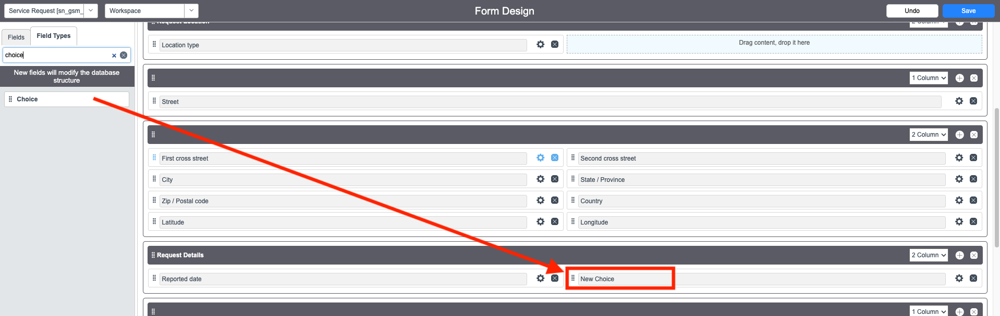

9.	Click on the **wheel icon** beside the New Choice field and enter **Type of street light request** as label.
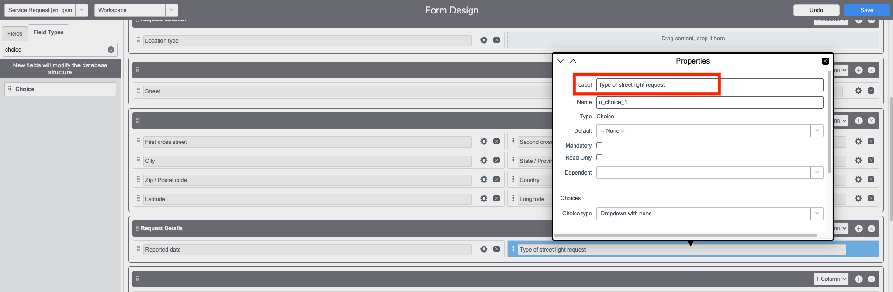

10.	Scroll down on the same pop-up screen and enter these choice values:

 |Field | Value 
 |---|---
 |**1** | Light out or continuous burning
 |**2**| New
 |**3** | Relocation
 You are done with this field. Close the pop up window.
 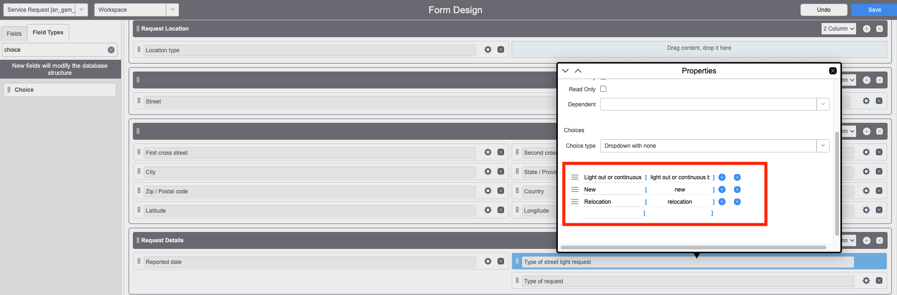

11.	Now drag and drop the Choice field again to the Request Details section to add a second one.
 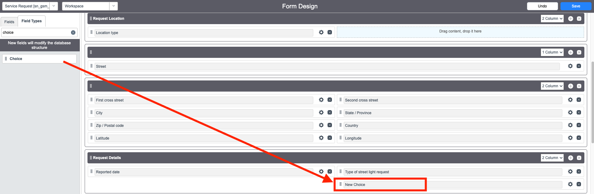

12. Click on the **wheel icon** beside the New Choice field and enter **Location of street light** as label.
 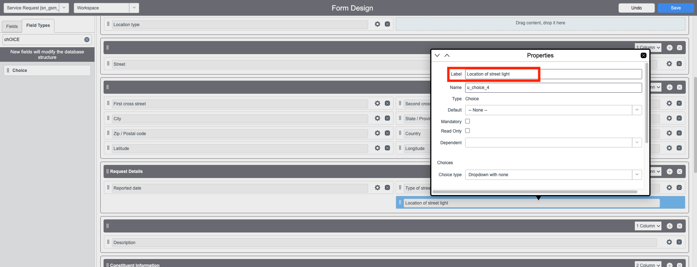

13.	Scroll down on the same pop-up screen and enter these choice values:

 |Field | Value 
 |---|---
 |**1** | Across the street from the address indicated
 |**2**| In the alley of the address indicated
 |**3** | In front of the address indicated
 You are done with this field. Close the pop up window.
 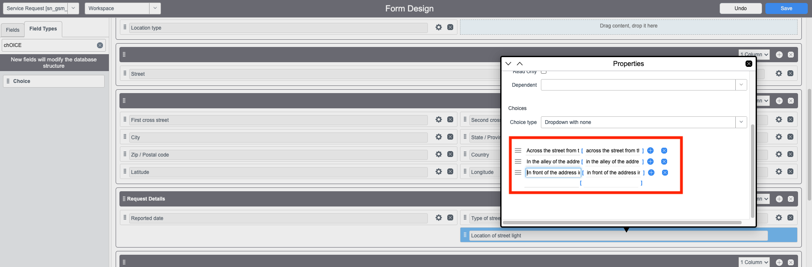

14. Now click again on **Field types** and search for **String**.
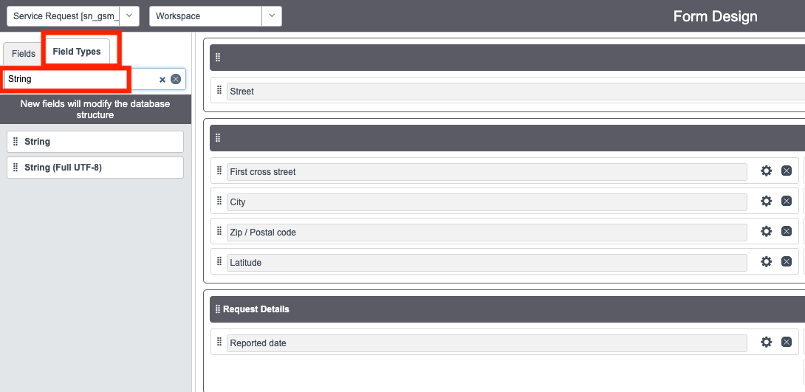

15. Just like you did previously, drag and drop the String field to Request Details tab.
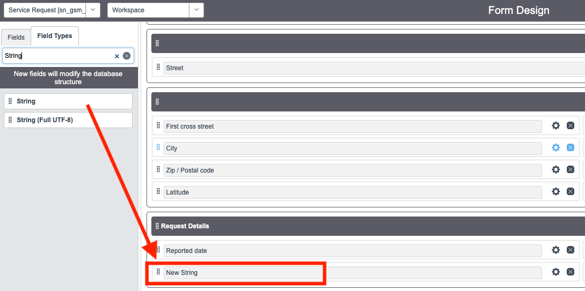

16.	Click on the **wheel icon** beside the New String field and enter **Number of lights affected** as label.
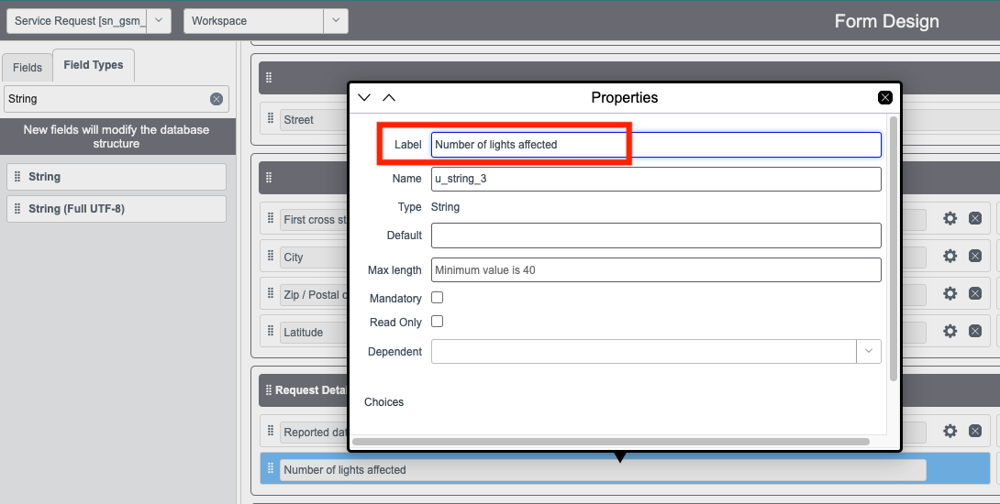

17.	Click **Save**
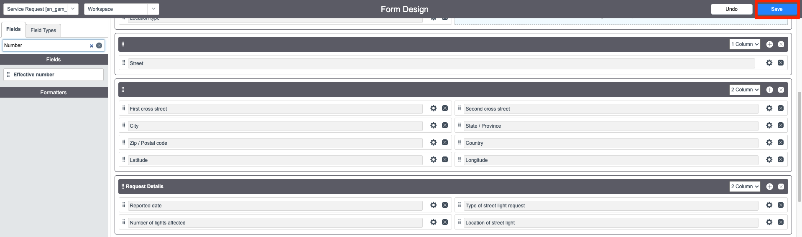
