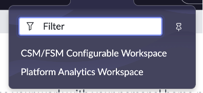
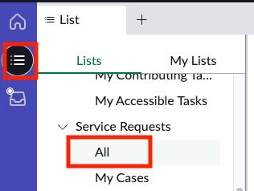
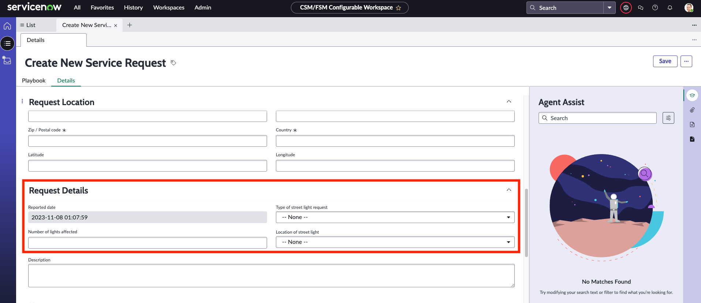

1.	Navigate to **Workspaces > CSM/FSM Configurable Workspace**.

2. Click on the list module and then navigate to **Service Requests > All**.

3. Click on **New** to open a new service request. 

4. Click on the **Details** tab to confirm if the fields are visible in the Request Details section

5. Close the tab and do not save the record used for the lab verification.